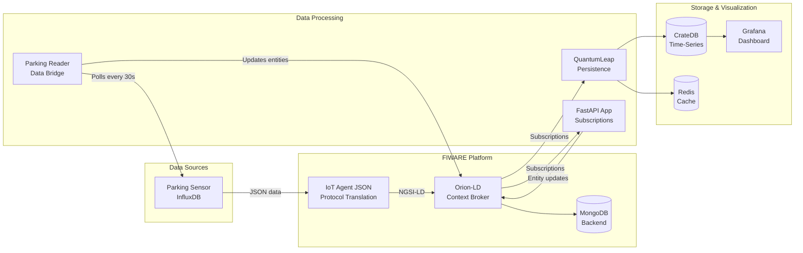
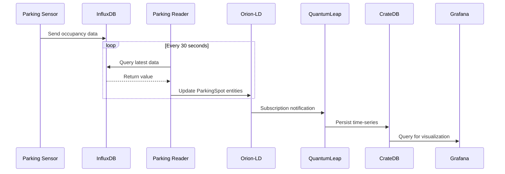

# IC2 Digital Twin - Smart Parking System

A FIWARE-based Digital Twin platform for monitoring and managing parking occupancy at the IC2 building, University of Campinas (UNICAMP), Brazil.


## Overview

This platform monitors 16 parking spots (14 general + 2 disabled) using NGSI-LD standards. It provides real-time occupancy tracking, historical data analysis, and predictive simulation capabilities.

## Architecture



## Directory Structure

```
IC2-digital-twin/
├── compose.yaml                    # Main Docker Compose orchestration
├── .env.example                    # Environment variables template
├── .env                            # Real environment variables (gitignored)
│
├── certs/                          # SSL certificates for NGINX
│   ├── grafana.crt                 # Example certificate (localhost)
│   ├── grafana.key                 # Example private key
│   └── README.md                   # Certificate generation instructions
│
├── conf/                           # Configuration files
│   └── mime.types                  # MIME types for Apache HTTPD
│
├── data-models/                    # NGSI-LD data model definitions
│   ├── datamodels.context-ngsi.jsonld
│   ├── json-context.jsonld
│   ├── ngsi-context.jsonld
│   └── user-context.jsonld
│
├── parking-reader/                 # InfluxDB to Orion bridge service
│   ├── app.py                      # Python polling service
│   ├── Dockerfile
│   └── requirements.txt
│
├── simulation/                     # Monte Carlo parking simulator
│   ├── app.py                      # Streamlit web UI
│   ├── llm_client.py               # LLM integration
│   ├── simulator_runner.py         # Simulation engine
│   ├── Dockerfile
│   ├── requirements.txt
│   ├── data/                       # Historical parking data
│   └── scripts/                    # Analysis scripts
│
├── scripts/
│   ├── orion-entities/             # Entity setup scripts
│   │   ├── run_ic2_poc.sh          # Main orchestrator
│   │   ├── validate_containers.sh  # Health checks
│   │   ├── create_*.sh             # Entity creation scripts
│   │   └── README.md
│   │
│   ├── coords_rects_geojson/       # GeoJSON processing tools
│   │   ├── subdivide_rectangles.py
│   │   ├── get_rect_center.py
│   │   └── README.md
│   │
│   └── grafana-user/               # Grafana dashboard config
│       ├── IC2_Parking.json        # Dashboard definition
│       ├── IC2_Parking.png         # Dashboard screenshot
│       ├── geojson_layer/          # Map visualization files
│       ├── queries/                # SQL queries and HTML templates
│       └── variables/              # Grafana template variables
│
├── nginx-reverse-proxy/            # NGINX configuration
│   └── nginx.conf                  # Reverse proxy rules
│
├── monitor-cloud/                  # Infrastructure monitoring
│   ├── prometheus-monitor.yaml     # Metrics collection
│   ├── cadvisor.yaml               # Container monitoring
│   ├── node-exporter.yaml          # Host metrics
│   ├── monitor-grafana.yaml        # Monitoring dashboard
│   └── prometheus.yml              # Scrape configuration
│
└── *.yaml / *.yml                  # Docker Compose service definitions
    ├── context.yaml                # JSON-LD context server
    ├── crate-db.yaml               # CrateDB time-series database
    ├── grafana.yaml                # Grafana dashboard
    ├── iot-agent.yaml              # FIWARE IoT Agent
    ├── mongo.yaml                  # MongoDB backend
    ├── networks.yaml               # Docker network
    ├── nginx-reverse-proxy.yaml    # NGINX reverse proxy
    ├── orion.yaml                  # Orion-LD Context Broker
    ├── parking-reader.yaml         # Parking reader service
    ├── quantumleap.yaml            # QuantumLeap persistence
    ├── redis-db.yaml               # Redis cache
    ├── simulation.yml              # Monte Carlo simulation
    └── volumes.yaml                # Docker volumes
```

## Services

<table>
<tr><th>Service</th><th>Image</th><th>Port</th><th>Description</th></tr>
<tr><td>Orion-LD</td><td>orion-ld:1.6.0</td><td>1026</td><td>NGSI-LD Context Broker</td></tr>
<tr><td>IoT Agent</td><td>iotagent-json:3.7.0</td><td>4041, 7896</td><td>IoT protocol translation</td></tr>
<tr><td>MongoDB</td><td>mongo:6.0</td><td>27017</td><td>Backend database</td></tr>
<tr><td>CrateDB</td><td>crate:5.8.2</td><td>4200, 4300</td><td>Time-series database</td></tr>
<tr><td>QuantumLeap</td><td>quantumleap:1.0.0</td><td>8668</td><td>Time-series persistence</td></tr>
<tr><td>Redis</td><td>redis:6</td><td>6379</td><td>Cache layer</td></tr>
<tr><td>Grafana</td><td>grafana:8.5.27</td><td>3002</td><td>Dashboard visualization</td></tr>
<tr><td>NGINX</td><td>nginx:1.28.0</td><td>80, 443</td><td>Reverse proxy with SSL</td></tr>
<tr><td>Apache HTTPD</td><td>httpd:alpine</td><td>3004</td><td>JSON-LD context server</td></tr>
<tr><td>Parking Reader</td><td>Python 3.11</td><td>-</td><td>InfluxDB to Orion bridge</td></tr>
<tr><td>Simulation</td><td>Python 3.10</td><td>8501</td><td>Monte Carlo simulator</td></tr>
</table>

## Quick Start

### 1. Configure Environment Variables

```bash
cp .env.example .env
# Edit .env with your real values
```

### 2. Generate SSL Certificates

```bash
cd certs/
source ../.env
openssl req -x509 -nodes -days 365 -newkey rsa:2048 \
  -keyout grafana.key -out grafana.crt \
  -subj "/CN=${DOMAIN_NAME}"
```

### 3. Start Infrastructure

```bash
docker compose up -d
```

### 4. Wait for Services

```bash
# Validate all containers are healthy
./scripts/orion-entities/validate_containers.sh
```

### 5. Setup Entities

```bash
# Run the complete setup
./scripts/orion-entities/run_ic2_poc.sh
```

### 6. Access Services

<table>
<tr><th>Service</th><th>URL</th></tr>
<tr><td>Grafana Dashboard</td><td><code>https://your-domain/grafana/</code></td></tr>
<tr><td>Monitoring Grafana</td><td><code>https://your-domain/monitor-grafana/</code></td></tr>
<tr><td>Orion Context Broker</td><td><code>http://localhost:1026</code></td></tr>
<tr><td>IoT Agent</td><td><code>http://localhost:4041</code></td></tr>
<tr><td>CrateDB Admin</td><td><code>http://localhost:4200</code></td></tr>
<tr><td>Simulation UI</td><td><code>http://localhost:8501</code></td></tr>
</table>

## Data Flow



1. **Sensor Data Ingestion**: Parking sensor (Raspberry Pi camera) sends data to InfluxDB
2. **Data Bridge**: `parking-reader` polls InfluxDB every 30 seconds and updates Orion-LD entities
3. **Subscription Chain**: Orion-LD triggers subscriptions to update related entities and persist to CrateDB
4. **Visualization**: Grafana queries CrateDB and displays real-time occupancy on dashboards

## NGSI-LD Entity Hierarchy


## Environment Variables

See `.env.example` for a complete list of configurable variables:

- `INFLUXDB_URL`, `INFLUXDB_TOKEN`, `INFLUXDB_ORG`, `INFLUXDB_BUCKET` - InfluxDB connection
- `ORION_URL` - Orion Context Broker endpoint
- `DOMAIN_NAME` - Public domain for NGINX and Grafana
- `GRAFANA_ROOT_URL`, `MONITOR_GRAFANA_ROOT_URL` - Grafana public URLs
- `API_KEY`, `API_URL`, `LLM_MODEL` - LLM simulation configuration

## Dependencies

- Docker and Docker Compose
- Python 3.10+ (for local development)
- InfluxDB (external, for parking sensor data)

## License

This project is part of the IC-DT-Smart-Parking-Architecture research at UNICAMP.
