# IC2 Digital Twin - Smart Parking System

A FIWARE NGSI-LD-based Digital Twin platform for monitoring and managing parking occupancy at the IC2 building, University of Campinas (UNICAMP), Brazil.

## Overview

This platform is the digital-twin extension of the long-running vision-based smart parking system deployed at UNICAMP's Institute of Computing. It bridges an existing edge sensor pipeline (Raspberry Pi + YOLO + InfluxDB) to a fully fledged **NGSI-LD context broker** that exposes 16 parking spots (14 general + 2 disabled) as Smart Data Model entities, persists historical data in CrateDB, visualises it on Grafana, and ships with a Monte Carlo simulator for "what-if" analysis.

## Background: the existing vision-based system

Since 2015, the IC-2 parking lot has been monitored by a layered computer-vision pipeline that has gone through several iterations. The current deployment captures a single image of the full lot, runs a compact YOLO model on a Raspberry Pi at the edge, and publishes the available-space count to a cloud-hosted InfluxDB where a totem and a Telegram bot consume it.

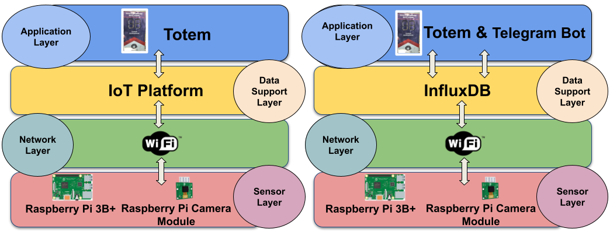

**Pipeline (edge to cloud):**

1. **Raspberry Pi 3B+** (32-bit ARM, Raspberry Pi OS) with a camera captures an image covering all 16 spots.
2. **YOLOv11m** (pre-trained on COCO, converted from PyTorch to float16 TFLite) is run via the TFLite Runtime interpreter. TFLite was chosen after benchmarking CPU usage, memory, and accuracy against alternative models.
3. Inference output passes through **Non-Maximum Suppression (NMS)** to remove redundant detections, then a **binary ROI mask** is applied *after* inference (better performance than pre-inference masking) to restrict the count to the parking area.
4. The resulting available-space count is sent over Wi-Fi to **InfluxDB** in the IC cloud.
5. An **ESP8266** reads the latest value from InfluxDB and displays it on the **LED totem** near the entrance.
6. A **Telegram bot** consumes the same data to answer driver queries.

The digital-twin architecture described in the rest of this document is the next layer: it consumes the same InfluxDB stream and exposes it as a live, queryable NGSI-LD context.

## IC-2 Parking Layout

The IC-2 lot is in front of the IC-2 building, has a single free entrance, a capacity of **16 vehicles**, and is reserved for **IC staff**. The two spaces at the bottom-left of the camera frame are reserved for individuals with disabilities, the elderly, etc.; in code they correspond to **`IC2-008` and `IC2-009`** (bits 8 and 9 of the 16-bit sensor word). The totem sits at the top-left of the frame, next to the entrance.

<p align="center">
  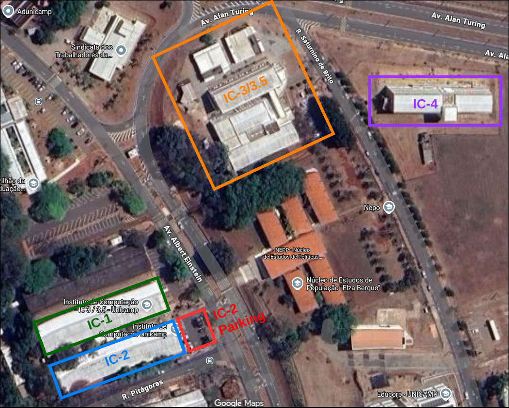
  &nbsp;
  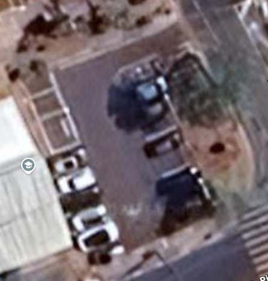
</p>

<p align="center">
  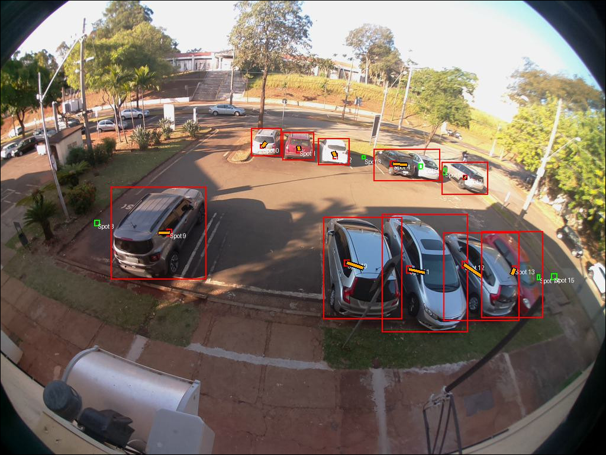
  &nbsp;
  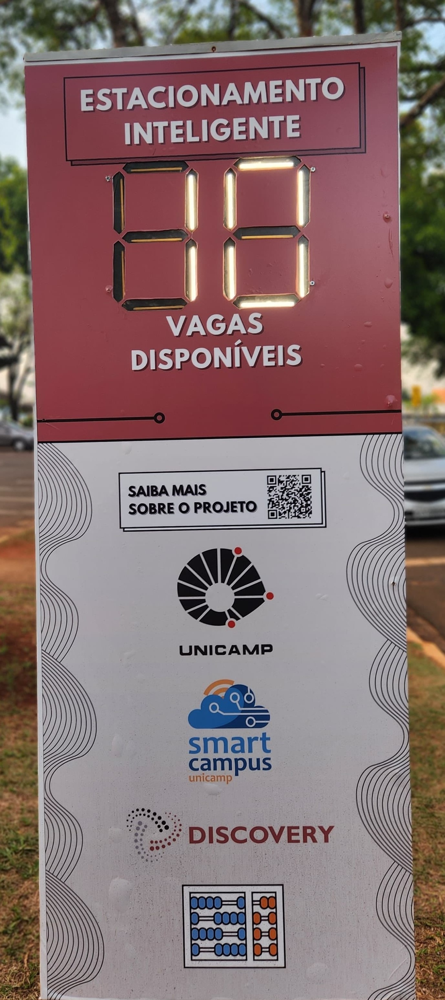
</p>

## Data Modeling

The digital twin follows the [Smart Data Models](https://github.com/smart-data-models) initiative. Every entity is NGSI-LD: a unique id, an entity type, descriptive metadata, temporal attributes, and a GeoJSON spatial representation.

| Entity | Role |
|---|---|
| [Building](https://github.com/smart-data-models/dataModel.Building/blob/master/Building/doc/spec.md) | The IC-2 building. Holds structured address (country, locality, region, street) and category. |
| [OffStreetParking](https://github.com/smart-data-models/dataModel.Parking/blob/master/OffStreetParking/doc/spec.md) | The IC-2 parking facility. Models total/available/occupied spot counts, `occupancy`, and relations to spots and groups. |
| [ParkingGroup](https://github.com/smart-data-models/dataModel.Parking/blob/master/ParkingGroup/doc/spec.md) | Logical subdivision (general vs. disabled). Aggregates `totalSpotNumber` / `availableSpotNumber`. |
| [ParkingSpot](https://github.com/smart-data-models/dataModel.Parking/blob/master/ParkingSpot/doc/spec.md) | One per physical space. Status: `free`, `occupied`, `unknown`. Linked to its group and device. |
| [Device](https://github.com/smart-data-models/dataModel.Device/blob/master/Device/doc/spec.md) | Generic hardware/software abstraction; base for `ParkingSensor` and `Totem`. |
| **ParkingSensor** | The Raspberry Pi 3B+ with camera. Reports numeric/textual measurements with units. |
| **Totem** | Multimedia device at the entrance; reports available spots and `deviceState`. |

**Entity layout on the parking lot:**

- 1× `Building` — the IC-2 building itself.
- 1× `OffStreetParking` — the facility as a whole.
- 2× `ParkingGroup` — general use + individuals with disabilities.
- 16× `ParkingSpot` — one per physical space, geolocated.
- 1× `Totem` — near the entrance.
- 1× `ParkingSensor` — at the building entrance.

<p align="center">
  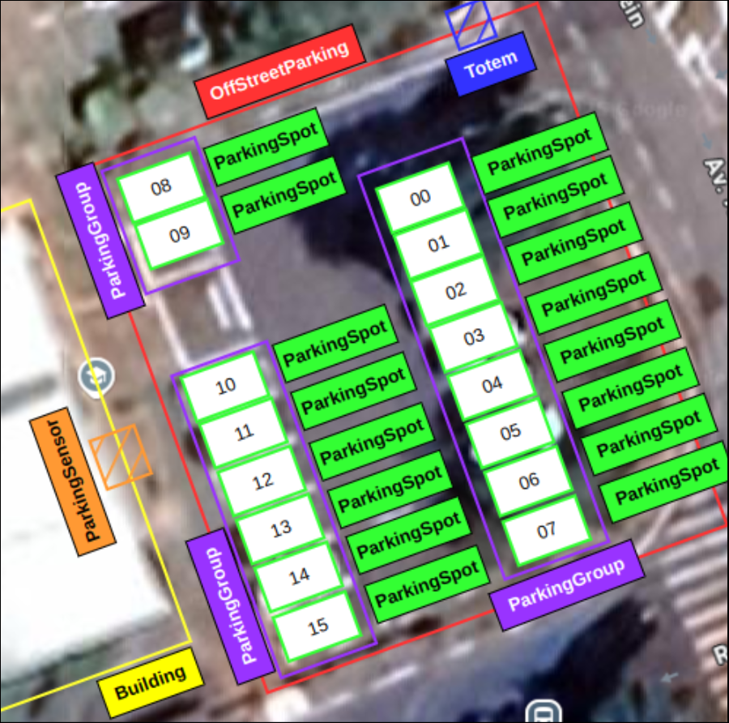
</p>

<p align="center">
  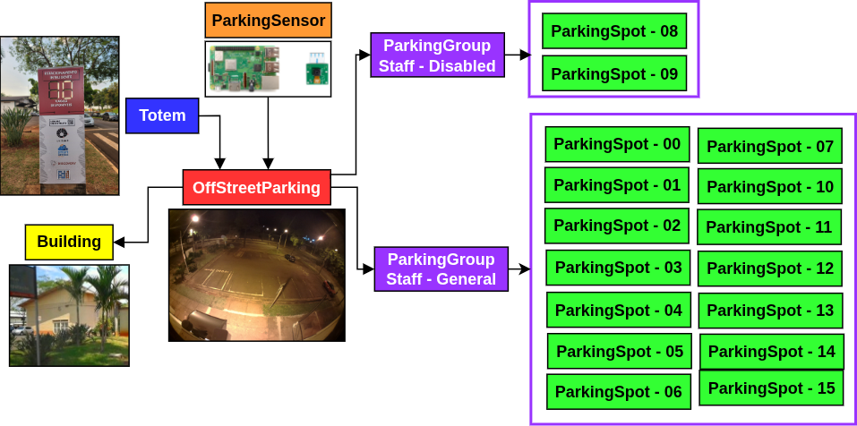
  &nbsp;
  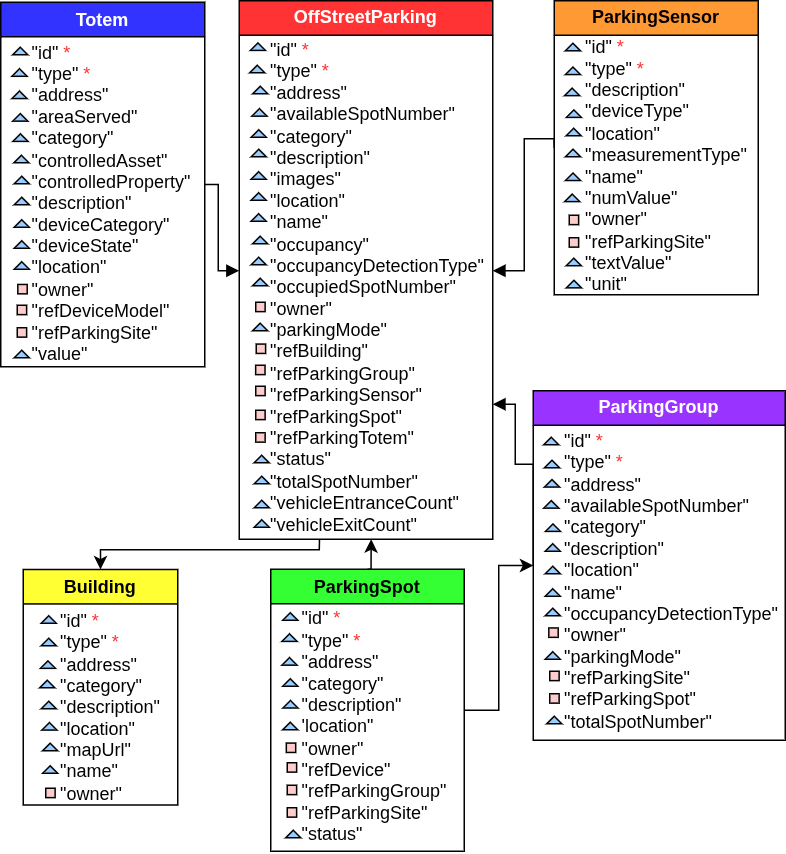
</p>

### NGSI-LD entity hierarchy

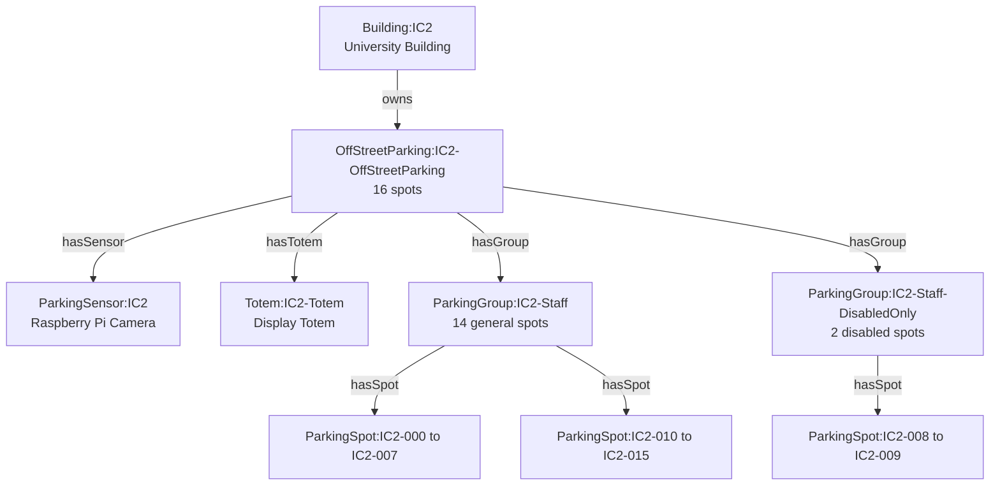

## Architecture

The DT-based Smart Parking Architecture is organized into **five** operational components plus a **Simulation** component, aligning with the thesis research objectives RO1.3 (FIWARE-based integration), RO1.4 (monitoring), and RO1.5 (simulation).

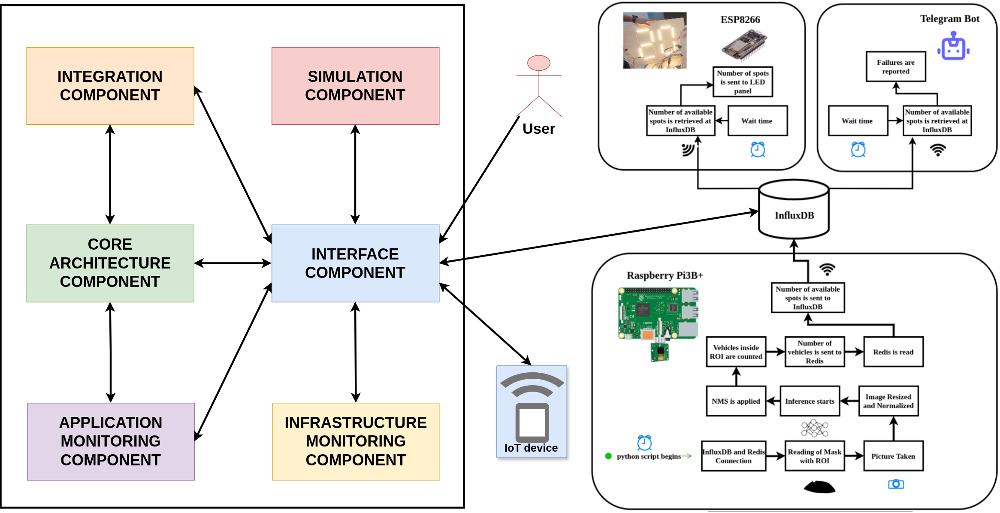

### 1. Interface Component

Single entry point for external traffic; converts HTTP to HTTPS, terminates SSL, and routes to the IoT Agent, Grafana, and the simulation UI by sub-path. Designed to handle many concurrent connections.

- **NGINX** — reverse proxy, SSL termination, internal HTTP between containers.

### 2. Integration Component

A temporary bridge to the existing vision-based pipeline. The Pi cannot talk NGSI-LD directly, so it keeps publishing to InfluxDB and this component pulls from there, decodes the 16-bit sensor word, and propagates the result to the DT every 30 s. It disappears in a future iteration once devices talk to the Interface directly.

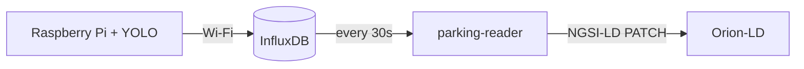

**Polling logic (every 30 s):**

1. Query InfluxDB for the latest sensor reading — a **single 16-bit integer** where each bit is a parking space (0 = free, 1 = occupied).
2. Decode the integer to binary, determine per-spot occupancy.
3. Classify spots by type (indices 8-9 are the disabled spots).
4. Aggregate occupancy at the `ParkingGroup` level and globally for the `OffStreetParking`.
5. Propagate to the DT through Orion-LD in one cycle at three granularities: per `ParkingSpot`, per `ParkingGroup`, and the whole `OffStreetParking`.

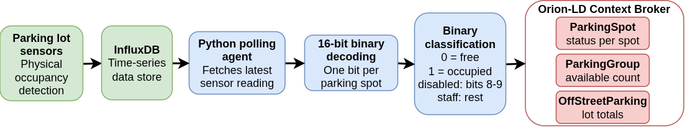

### 3. Core Architecture Component

Holds the live entity state of the digital twin; the central DT entity model.

- **Orion-LD Context Broker (OLDCB)** — core FIWARE NGSI-LD component (entity CRUD, subscriptions). Stores the latest context in MongoDB. Loads Smart Data Models from the `@context` container. Receives device data via the IoT Agent. Notifies QuantumLeap. Internal port `1026`.
- **`@context` container** — Apache HTTP server serving the customised UNICAMP `@context` file. Backed by the `data-models` volume. Internal port `3004`.
- **MongoDB** — latest values of all Smart Parking entities plus configuration. Volumes `mongo-db` and `mongo-config`. Image `mongo:6.0`. Internal port `3000`.
- **IoT Agent for JSON** — translates device protocols (LoRaWAN, Sigfox, OPC-UA) into NGSI-LD and routes them to OLDCB. Device port `7896`, Northbound API on `4041`. Devices reach it via NGINX.

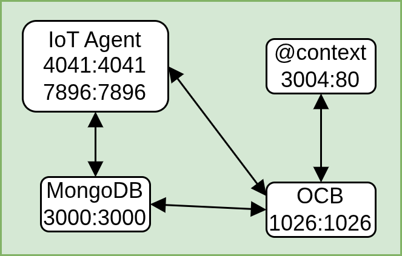

### 4. Application Monitoring Component

Near real-time visualisation of parking availability (aggregate and per-spot) over time.

- **QuantumLeap** — subscribes to OLDCB notifications and transforms NGSI-LD data for CrateDB and Redis. Internal port `8668`.
- **CrateDB** — time-series analytics DB. Admin UI on `4200`, QuantumLeap on `4300`. Volume `crate-db`.
- **RedisDB** — in-memory cache. Port `6379`. Volume `redis-db`.
- **Grafana** — dashboards backed by CrateDB. Internal port `3000`, exposed externally on `/grafana/`. Volume `grafana`.

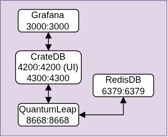

| Application dashboard (Grafana) |
|---|
| 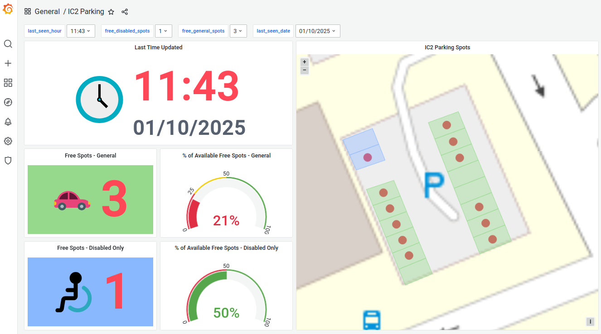 |

### 5. Infrastructure Monitoring Component

Near real-time visualisation of the host VM and the running containers.

- **Prometheus** — collects time-series metrics via PromQL. In this stack it scrapes cAdvisor and Node Exporter.
- **Grafana** — a second instance, used to display infrastructure metrics on `/monitor-grafana/`.
- **cAdvisor** — real-time container resource usage (CPU, memory, disk, network).
- **Node Exporter** — host-level metrics for the VM running the base architecture.

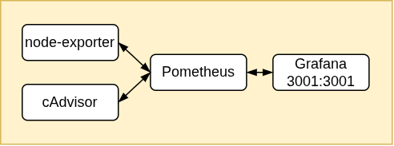

| Infrastructure dashboard (Grafana) |
|---|
| 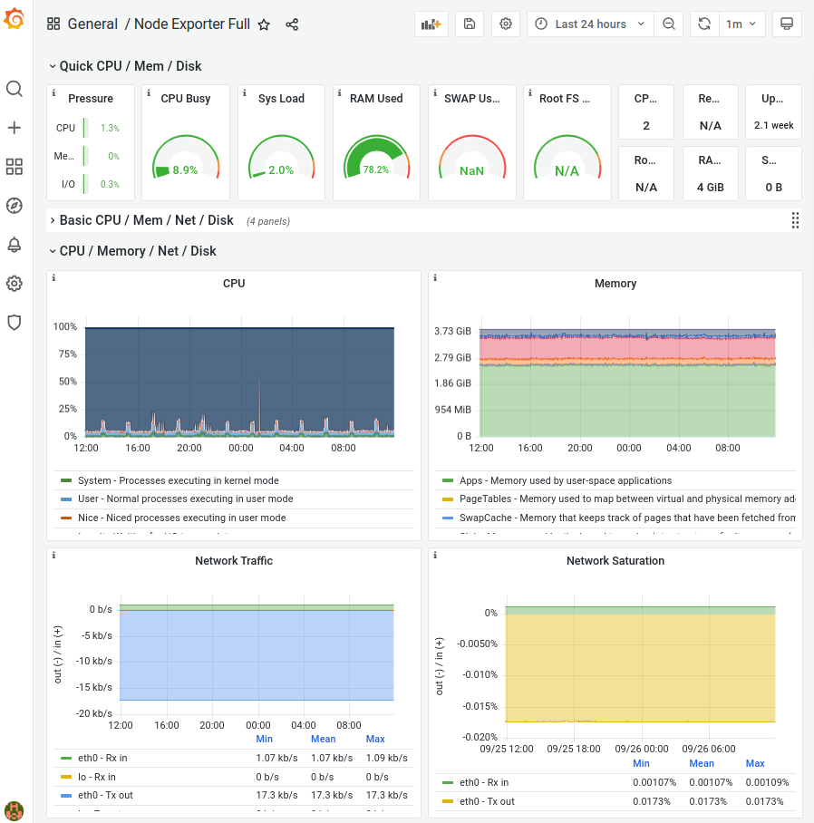 |

### 6. Simulation Component

Python service in a Docker container that runs Monte Carlo simulations of parking scenarios for "what-if" analysis. Three subcomponents:

**a. Simulation Web application (`app.py`, Streamlit).** Built on [Streamlit](https://streamlit.io/) with [Pandas](https://pandas.pydata.org/), [NumPy](https://numpy.org/), and [Matplotlib](https://matplotlib.org/). Two complementary interfaces:

- **Manual interface** — form-based: input fields, sliders, and selectors for every simulation parameter.
- **Conversational interface** — the user describes a scenario in natural language; an LLM interprets the intent and extracts the parameters automatically.

**b. IC LLM (Open WebUI).** The Institute of Computing hosts a set of LLMs at <https://llm.ic.unicamp.br/>. An Open WebUI instance acts as the intermediary: it receives requests from `llm_client.py`, exposes OpenAI-compatible API endpoints, and routes them to a model of the right size/capability for the question.

**c. Monte Carlo simulation (`simulator_runner.py`).** Receives parameters from either interface, runs the simulation, and returns the data to the Streamlit app for display.

**Inputs:** historical or estimated data on vehicle arrivals and dwell times; configuration parameters — parking capacity, bin size, number of simulation runs, optional demand adjustments.

**Algorithm (per simulated day):**

1. Model hourly vehicle arrivals as a stochastic process.
2. Distribute arrivals uniformly within each hour to produce individual timestamps.
3. For each arrival, check if a parking space is free at that time:
   - If yes, sample a dwell time from the corresponding distribution and mark the space occupied for that duration.
   - If no, the arrival is **blocked**.
4. Repeat for all arrivals throughout the day.

**Aggregation:** the simulation is run multiple times to capture variability. Iterations are aggregated into a mean-occupancy-per-arrival time series.

**Analysis capabilities:**

- Comparison between simulated and real-world occupancy data (model validation).
- **Confidence intervals** (reliability of the mean) and **prediction intervals** (expected variability of individual outcomes).
- Probability that the parking facility reaches **full capacity** at different times of the day.

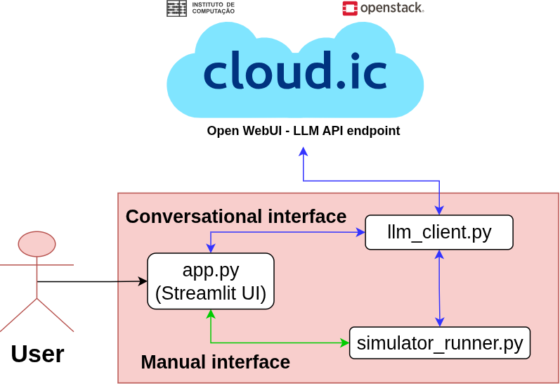

| Monte Carlo logic | Manual interface |
|---|---|
| 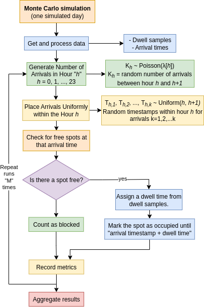 | 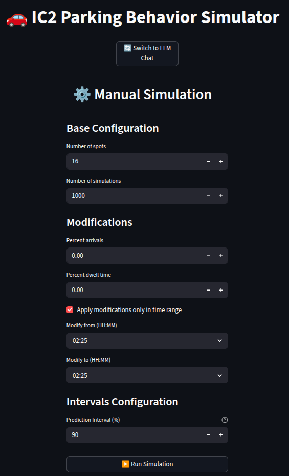 |

| Example: manual interface with results |
|---|
| 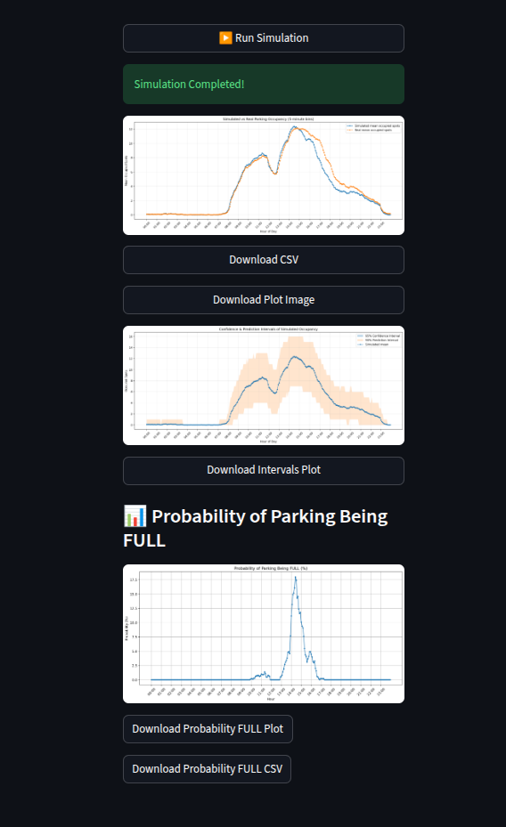 |

### Integrated view

All six components together:

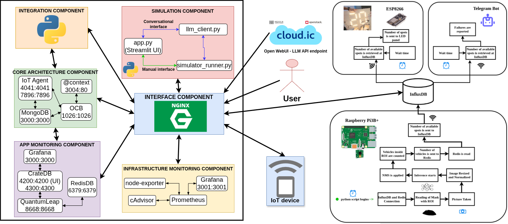

## Data flow

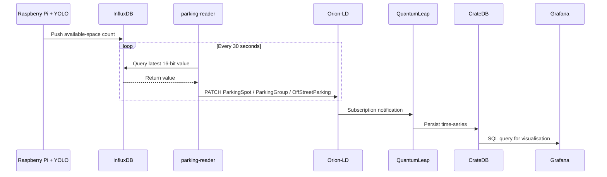

1. **Edge ingestion:** the Raspberry Pi publishes the available-space count to InfluxDB.
2. **Bridge:** `parking-reader` polls InfluxDB every 30 s and PATCHes the corresponding NGSI-LD entities in Orion-LD.
3. **Subscription chain:** Orion-LD notifies subscribers (QuantumLeap, custom FastAPI app) to keep related entities and the time-series store in sync.
4. **Visualisation:** Grafana queries CrateDB and renders real-time and historical occupancy on dashboards.

## Directory Structure

```
IC2-digital-twin/
├── compose.yaml                    # Main Docker Compose orchestration
├── .env.example                    # Environment variables template
├── .env                            # Real environment variables (gitignored)
│
├── certs/                          # SSL certificates for NGINX
│   ├── grafana.crt                 # Self-signed certificate (for DOMAIN_NAME)
│   ├── grafana.key                 # Private key
│   └── README.md                   # Certificate generation instructions
│
├── conf/                           # Configuration files
│   └── mime.types                  # MIME types for Apache HTTPD
│
├── data-models/                    # NGSI-LD data model definitions
│   ├── datamodels.context-ngsi.jsonld
│   ├── json-context.jsonld
│   ├── ngsi-context.jsonld
│   └── user-context.jsonld
│
├── images/                         # Thesis figures used by the README
│
├── parking-reader/                 # InfluxDB to Orion bridge service
│   ├── app.py                      # Python polling service
│   ├── Dockerfile
│   └── requirements.txt
│
├── simulation/                     # Monte Carlo parking simulator
│   ├── app.py                      # Streamlit web UI
│   ├── llm_client.py               # LLM integration
│   ├── simulator_runner.py         # Simulation engine
│   ├── Dockerfile
│   ├── requirements.txt
│   ├── data/                       # Historical parking data
│   └── scripts/                    # Analysis scripts
│
├── scripts/
│   ├── orion-entities/             # Entity setup scripts
│   │   ├── run_ic2_poc.sh          # Main orchestrator
│   │   ├── validate_containers.sh  # Health checks
│   │   ├── create_*.sh             # Entity creation scripts
│   │   └── README.md
│   │
│   ├── coords_rects_geojson/       # GeoJSON processing tools
│   │   ├── subdivide_rectangles.py
│   │   ├── get_rect_center.py
│   │   └── README.md
│   │
│   └── grafana-user/               # Grafana dashboard config
│       ├── IC2_Parking.json        # Dashboard definition
│       ├── IC2_Parking.png         # Dashboard screenshot
│       ├── geojson_layer/          # Map visualisation files
│       ├── queries/                # SQL queries and HTML templates
│       └── variables/              # Grafana template variables
│
├── nginx-reverse-proxy/            # NGINX configuration
│   └── nginx.conf                  # Reverse proxy rules
│
├── monitor-cloud/                  # Infrastructure monitoring
│   ├── prometheus-monitor.yaml     # Metrics collection
│   ├── cadvisor.yaml               # Container monitoring
│   ├── node-exporter.yaml          # Host metrics
│   ├── monitor-grafana.yaml        # Monitoring dashboard
│   └── prometheus.yml              # Scrape configuration
│
└── *.yaml / *.yml                  # Docker Compose service definitions
    ├── context.yaml                # JSON-LD context server
    ├── crate-db.yaml               # CrateDB time-series database
    ├── grafana.yaml                # Grafana dashboard
    ├── iot-agent.yaml              # FIWARE IoT Agent
    ├── mongo.yaml                  # MongoDB backend
    ├── networks.yaml               # Docker network
    ├── nginx-reverse-proxy.yaml    # NGINX reverse proxy
    ├── orion.yaml                  # Orion-LD Context Broker
    ├── parking-reader.yaml         # Parking reader service
    ├── quantumleap.yaml            # QuantumLeap persistence
    ├── redis-db.yaml               # Redis cache
    ├── simulation.yml              # Monte Carlo simulation
    └── volumes.yaml                # Docker volumes
```

## Services

| Service | Image | Port | Description |
|---|---|---|---|
| Orion-LD | `orion-ld:1.6.0` | `1026` | NGSI-LD Context Broker |
| IoT Agent | `iotagent-json:3.7.0` | `4041`, `7896` | IoT protocol translation |
| MongoDB | `mongo:6.0` | `27017` | Backend database |
| CrateDB | `crate:5.8.2` | `4200`, `4300` | Time-series database |
| QuantumLeap | `quantumleap:1.0.0` | `8668` | Time-series persistence |
| Redis | `redis:6` | `6379` | Cache layer |
| Grafana | `grafana:8.5.27` | `3002` | Application dashboard |
| Prometheus | `prom/prometheus` | `9090` | Metrics collection |
| cAdvisor | `gcr.io/cadvisor/cadvisor` | `8080` | Container metrics |
| Node Exporter | `prom/node-exporter` | `9100` | Host metrics |
| NGINX | `nginx:1.28.0` | `80`, `443` | Reverse proxy with SSL |
| Apache HTTPD | `httpd:alpine` | `3004` | JSON-LD context server |
| Parking Reader | Python 3.11 | — | InfluxDB to Orion bridge |
| Simulation | Python 3.10 | `8501` | Monte Carlo simulator |

## Quick Start

### 1. Configure environment variables

```bash
cp .env.example .env
# Edit .env with your real values
```

### 2. Generate SSL certificates

```bash
cd certs/
source ../.env
openssl req -x509 -nodes -days 365 -newkey rsa:2048 \
  -keyout grafana.key -out grafana.crt \
  -subj "/CN=${DOMAIN_NAME}"
```

> NGINX does **not** do env-var substitution. If you change `DOMAIN_NAME` in `.env`, you must also update the `server_name` line in `nginx-reverse-proxy/nginx.conf`.

### 3. Start the stack

```bash
docker compose up -d
```

`compose.yaml` is an aggregator that `include:`s every `*.yaml` / `*.yml` in the directory.

### 4. Wait for the services to become healthy

```bash
./scripts/orion-entities/validate_containers.sh
```

The script health-checks the FIWARE services with 20 retries spaced 5 s apart.

### 5. Bootstrap the entities

```bash
./scripts/orion-entities/run_ic2_poc.sh
```

This waits 60 s and then runs the six entity / subscription scripts that create the `Building`, `OffStreetParking`, `ParkingGroup`s, `ParkingSpot`s, IoT-Agent indices, and QuantumLeap subscriptions.

### 6. Access the services

| Service | URL |
|---|---|
| Application Grafana | `https://<DOMAIN_NAME>/grafana/` |
| Monitoring Grafana | `https://<DOMAIN_NAME>/monitor-grafana/` |
| Orion Context Broker | `http://localhost:1026` |
| IoT Agent (Northbound) | `http://localhost:4041` |
| CrateDB Admin | `http://localhost:4200` |
| Simulation UI | `http://localhost:8501` |
| `@context` server | `http://localhost:3004` |

## Environment Variables

See `.env.example` for the full template. The convention is `cp .env.example .env` and then edit; the real file is gitignored and must never be committed.

| Variable | Used by | Notes |
|---|---|---|
| `INFLUXDB_URL` | `parking-reader/app.py` | InfluxDB endpoint. |
| `INFLUXDB_TOKEN` | `parking-reader/app.py` | Read token for the parking bucket. |
| `INFLUXDB_ORG` | `parking-reader/app.py` | InfluxDB organisation. |
| `INFLUXDB_BUCKET` | `parking-reader/app.py` | Bucket with sensor data. |
| `ORION_URL` | `parking-reader/app.py` | Internal Docker URL for Orion-LD. |
| `DOMAIN_NAME` | NGINX, Grafana | Public domain. Also requires manual edit in `nginx.conf`. |
| `GRAFANA_ROOT_URL` | `grafana.yaml` | Public Grafana URL. |
| `MONITOR_GRAFANA_ROOT_URL` | `monitor-cloud/monitor-grafana.yaml` | Public monitoring Grafana URL. |
| `API_KEY` | `simulation/llm_client.py` | LLM API key. |
| `API_URL` | `simulation/llm_client.py` | LLM endpoint (OpenAI-compatible). |
| `LLM_MODEL` | `simulation/llm_client.py` | LLM model name. |

`llm_client.py` also accepts an `llm_api.key` file at the repo root as a fallback.

## Dependencies

- Docker and Docker Compose
- Python 3.10+ (for local development of `parking-reader` and `simulation`)
- An InfluxDB instance reachable from `parking-reader` with the parking bucket pre-populated
- For LLM-backed simulation: an OpenAI-compatible endpoint (the default targets <https://llm.ic.unicamp.br/>)

## Notes

- The two disabled spots `IC2-008` and `IC2-009` are hard-coded in `parking-reader/app.py` (bits 8 and 9 of the 16-bit sensor word). The other 14 spots are staff spots.
- Container image versions are pinned in the `image:` fields of the `*.yaml` compose files; do not bump them casually — that would change the experiment's behaviour.
