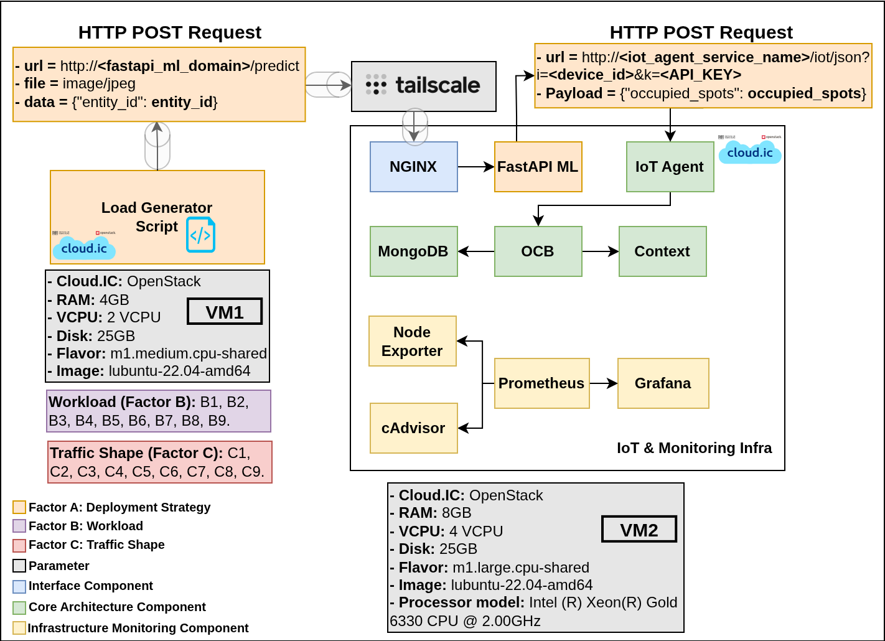

# cloud_deploy

This folder contains the complete artefact set that implements the
**Cloud deployment** of the multi-tier Digital-Twin Smart-Parking
experiment. It groups the dockerised FIWARE NGSI-LD stack that is
brought up for each load test on VM2, the **FastAPI-based ML inference
container** that runs **on VM2 itself** as a sibling of the rest of the
system, the load-generation harness that emulates the field devices on
VM1, and the VM-side provisioning and measurement scripts.

The cloud deployment is one of the four deployment strategies evaluated
in the experiment (`mist`, `fog`, `edge`, `cloud`); the other three
slices live in the sibling `mist_deploy/`, `edge_deploy/` and
`fog_deploy/` folders. The four strategies differ in **where the image
processing for vehicle counting is performed**, and consequently in
what the Load Generator Script sends on the wire:

- **mist** — the image is processed locally on the field device (a
  Raspberry Pi in the conceptual design; simulated by the Load Generator
  Script in this benchmark). Only the resulting payload
  (`{"occupied_spots": 10}`) is transmitted to the system.
- **edge** — the parking image is sent to a Jetson Nano co-located with
  the device, which performs the inference and returns the payload.
- **fog** — the parking image is sent to a GPU cluster in the fog tier,
  which performs the inference and returns the payload.
- **cloud** — the parking image is sent to a container in the cloud
  tier, which performs the inference and returns the payload. **In
  cloud, the inference container is co-located with the rest of the
  system on VM2 itself — there is no separate edge device or GPU host.**

The cloud tier, like edge and fog, shares the same
**image-in / count-out** contract with VM2: VM1 sends the raw parking
image to the inference endpoint, and the inferred count is forwarded
back using the standard IoT Agent endpoint. The mist tier is the one
exception — there, VM1 sends the pre-processed count directly with no
inference step.



*Figure 1 — Cloud deployment (official architecture view).*

## Defining difference: inference is co-located on VM2

The defining feature of the cloud tier is that **the inference service
runs on VM2 itself**, as a container in the same `docker compose`
stack as Orion-LD, the IoT Agent, MongoDB, NGINX, and the monitoring
exporters. The Load Generator → inference hop still crosses the
network (Tailscale, from VM1 to VM2), but the **inference → IoT Agent
hop is inter-container on VM2** — it never touches the network, let
alone Tailscale. This is the only tier where the inference service is
not a separate device or cluster node.

This reflects a realistic cloud scenario, where resources are typically
**consolidated rather than distributed** across dedicated instances, and
also reduces latency because inter-service communication happens
locally on the same host.

### Model: YOLOv11m → OpenVINO int8

The vision model is **YOLOv11m** (medium) exported to
[**OpenVINO**](https://github.com/openvinotoolkit/openvino) int8
format. OpenVINO was selected after comparison with PyTorch, ONNX,
TorchScript, and TensorFlow Lite, because it provided the **lowest
inference latency under CPU-only conditions** — relevant because the
IC Cloud VMs do not include GPUs.

> Why not TensorRT like edge/fog? TensorRT is NVIDIA-specific and would
> not help on a CPU-only host. Edge and fog used TensorRT because
> their inference hosts have NVIDIA GPUs (Jetson Nano, GTX 1080).
> Cloud uses OpenVINO because the VM has only a CPU.

The OpenVINO IR (`.xml` / `.bin`) is shipped pre-built inside
`infra/fastapi-ml/yolo11m_int8_openvino_model/`. The other model
formats considered during the selection process (and the experimental
artefacts that produced the latency comparison) are archived under
`model_comparison/` for reference.

## Deployment specifications

The two VMs (VM1 and VM2) are OpenStack virtual machines provisioned
on the **IC Cloud (cloud.ic)** of the Institute of Computing at
UNICAMP. The sections below make explicit which folder of this
repository runs on which VM.

> **Software required on both VM1 and VM2.** Before any scenario can
> be launched, the following must be installed and configured on
> **each** of the two VMs:
>
> - **Git** — used to clone this repository to the same path on both
>   VMs.
> - **Tailscale** — the mesh VPN that lets VM1 reach VM2 across the
>   IC Cloud without manual firewall rules; both VMs must be
>   authenticated to the same Tailscale network. Tailscale carries
>   the Load Generator → FastAPI-ML hop (VM1 → VM2); the
>   FastAPI-ML → IoT Agent hop is internal to VM2 and does not
>   traverse the VPN.
> - **Docker** (with the `docker compose` plugin) — VM2 uses it to
>   bring up the FIWARE stack **and the FastAPI-ML inference
>   container** via `infra/compose.yaml`; VM1 uses it implicitly
>   through the SSH-driven workflow.
>
> Detailed installation steps are listed in the [Quick start /
> Prerequisites](#prerequisites--on-both-vm1-and-vm2) section.

### VM1 — Load generator / orchestrator

| Field | Value |
|---|---|
| Cloud | IC Cloud / cloud.ic (OpenStack) |
| Flavor | `m1.medium.cpu-shared` |
| vCPU | 2 |
| RAM | 4 GB |
| Disk | 25 GB |
| Image | `ubuntu-22.04-amd64` |
| Role | Executes the Load Generator Script that simulates the field devices. |
| Runs | `onGeneratorScripts/` (orchestrator, load generator, metrics collector, Python venv). |

### VM2 — IoT, monitoring, and inference infrastructure (system under test)

| Field | Value |
|---|---|
| Cloud | IC Cloud / cloud.ic (OpenStack) |
| Flavor | `m1.large.cpu-shared` |
| vCPU | 4 |
| RAM | 8 GB |
| Disk | 25 GB |
| Image | `ubuntu-22.04-amd64` |
| Processor | Intel(R) Xeon(R) Gold 6330 CPU @ 2.00 GHz |
| Role | Hosts the system under test **and the inference service**: the FastAPI-ML container, the IoT Agent JSON, the OLDCB, MongoDB, NGINX, and the monitoring exporters — all in one `docker compose` stack. |
| Runs | `infra/` (Docker Compose stack) and `onVMScripts/` (provisioning, measurement, log processing). |

## Data flow

The Load Generator Script, executing on VM1, emulates a device by
sending an HTTP `POST` whose body is a **`multipart/form-data` upload**
of the raw parking image plus a form field carrying the NGSI-LD entity
id, addressed to the FastAPI-ML container on VM2:

```text
POST http://<vm2_tailscale>:8000/predict
Content-Type: multipart/form-data

file=@test.jpg
entity_id=urn:ngsi-ld:OffStreetParking:<device_id>
```

Inside VM2, the FastAPI-ML container runs inference (YOLOv11m,
OpenVINO int8) and returns a count. When `entity_id` is present, the
container then forwards the count to the IoT Agent JSON using the same
HTTP POST shape used by every other tier — the **inference → IoT Agent
hop stays on VM2** and crosses the internal Docker bridge, not
Tailscale:

```text
POST http://fiware-iot-agent:7896/iot/json?i=<device_id>&k=<API_KEY>
Content-Type: application/json

{"occupied_spots": N}
```

End-to-end, a single request traverses the following components:

```mermaid
flowchart LR
    LG["Load Generator Script (VM1)"]
    TS["Tailscale mesh VPN"]
    FAPI["FastAPI-ML :8000<br/>(inference, on VM2)"]
    NGX["Interface: NGINX reverse proxy (port 443)"]
    IOTA["IoT Agent JSON (port 4041 / 7896)"]
    OCB["OLDCB / Orion-LD Context Broker (port 1026)"]
    MONGO[("MongoDB (port 27017)")]

    LG -- "POST /predict (image + entity_id)" --> TS
    TS -- "encrypted tunnel" --> FAPI
    FAPI -- "occupied_spots = N (inter-container)" --> IOTA
    IOTA -- "NGSI-LD entity update" --> OCB
    OCB -- "persist state" --> MONGO

    classDef client fill:#87CEEB,stroke:#333,stroke-width:2px,color:darkblue
    classDef interface fill:#FFFACD,stroke:#333,stroke-width:2px,color:darkblue
    classDef inference fill:#FFE4B5,stroke:#333,stroke-width:2px,color:darkblue
    classDef core fill:#90EE90,stroke:#333,stroke-width:2px,color:darkgreen
    classDef store fill:#FFB6C1,stroke:#DC143C,stroke-width:2px,color:black

    class LG client
    class NGX interface
    class FAPI inference
    class IOTA,OCB core
    class MONGO store
```



The Interface component is implemented by the NGINX reverse proxy
(`infra/nginx-reverse-proxy/`), the OLDCB is the FIWARE Orion-LD
Context Broker (`infra/orion.yaml`), the IoT Agent JSON is the
`quay.io/fiware/iotagent-json:3.7.0` service (`infra/iot-agent.yaml`),
and the inference container is the locally built
`fastapi-ml_container` (`infra/fastapi-ml.yaml` + `infra/fastapi-ml/`).
The NGINX configuration also exposes a `/predict` reverse-proxy
location, but the Load Generator Script bypasses it (it hits the
container's port `8000` directly via Tailscale) so the experiment can
attribute latency to the inference hop without an extra proxy in the
way.

## Structural note (mist ↔ edge ↔ fog ↔ cloud)

| Tier | Inference host | Hardware | Model | Runtime |
|---|---|---|---|---|
| mist | (none) | — | — | — |
| edge | Jetson Nano (separate device) | ARM CPU + NVIDIA GPU | YOLOv11n | TensorRT |
| fog | IC Discovery Lab cluster node (separate machine) | x86 CPU + GTX 1080 GPU | YOLOv11m | TensorRT 8.6 + CUDA 11.8 |
| **cloud** | **Container on VM2 (co-located)** | **CPU-only** | **YOLOv11m** | **OpenVINO int8** |

The `image-in / count-out` contract with VM2 is the same across edge,
fog, and cloud; only the inference host and the model format change.
Mist is the only tier that skips inference entirely. The cloud tier is
the only one where the inference service shares the VM2 host with the
rest of the stack.

## Folder layout and VM assignment

| Folder | Runs on | Role |
|---|---|---|
| `infra/` | **VM2** | Docker Compose stack under test: the Interface component (NGINX), the IoT Agent JSON, the OLDCB (Orion-LD), MongoDB, the LD `@context` server, the **FastAPI-ML inference container** (cloud-only), and the Prometheus / Grafana / cAdvisor / Node Exporter monitoring exporters. |
| `onVMScripts/` | **VM2** | Numbered shell + Python helpers executed inside VM2 by the orchestrator: health checks, Mongo index creation, service-group registration, device provisioning, verification, log capture, and log post-processing (including the cloud-specific `process_logs.sh` for FastAPI-ML container logs). |
| `onGenScripts/` | **VM1** | The orchestrator (`cloud_deploy_runner.sh`), the load generator (`load_generator.py`), the post-test metrics collector (`get_metrics_posttest.py`), the configuration file (`cloud_deploy.conf`), and the sample image (`test.jpg`) uploaded with every request. |
| `model_comparison/` | reference only | Archived experimental artefacts (infra / onGenScripts / onVMScripts snapshots) for the model-format selection study that led to choosing **YOLOv11m → OpenVINO int8** for the cloud tier. Not used to run the campaign. |

```text
cloud_deploy/
├── README.md                              ← this file
├── cloud_deployment.png                   ← Figure 1 (architecture view)
├── AGENTS.md                              (gitignored, thesis context)
│
├── infra/                                 (VM2)
│   ├── README.md                          (stack reference, data flow, glossary)
│   ├── compose.yaml                       (aggregator; includes fastapi-ml.yaml)
│   ├── orion.yaml                         (OLDCB / Orion-LD)
│   ├── iot-agent.yaml                     (IoT Agent JSON)
│   ├── mongo.yaml                         (MongoDB back-end)
│   ├── context.yaml                       (LD @context server, Apache httpd)
│   ├── nginx-reverse-proxy.yaml           (Interface component)
│   ├── fastapi-ml.yaml                    (FastAPI-ML inference, cloud-only)
│   ├── networks.yaml                      (Docker bridge network)
│   ├── volumes.yaml                       (named volumes)
│   ├── .env.example                       (DOMAIN_NAME, MONITOR_GRAFANA_ROOT_URL)
│   ├── certs/                             (self-signed SSL — see ./README.md)
│   ├── conf/                              (Apache mime.types for @context)
│   ├── data-models/                       (JSON-LD contexts)
│   ├── monitor-cloud/                     (Prometheus / Grafana / exporters)
│   ├── nginx-reverse-proxy/               (nginx.conf: TLS + /predict)
│   └── fastapi-ml/                        (FastAPI app, OpenVINO IR, Dockerfile — see ./README.md)
│
├── onVMScripts/                           (VM2)
│   ├── README.md                          (per-script reference + execution order)
│   ├── 0_healthy_waiting.sh
│   ├── 1_create_IoT_Agent_indices_MongoDB.sh
│   ├── 2_create_service_group.sh
│   ├── 3_provision_devices.sh
│   ├── 4_verify_provisioned_devices.sh
│   ├── 7_process_iot_agent_logs.sh
│   ├── process_logs.sh                    (FastAPI-ML log → CSV, cloud-specific)
│   ├── collector_logs.sh
│   ├── cpu_baseline.sh
│   └── docker_logs_collector.py
│
├── onGenScripts/                          (VM1)
│   ├── README.md                          (orchestrator / load gen / metrics reference)
│   ├── cloud_deploy_runner.sh             (main entry point)
│   ├── load_generator.py                  (POSTs images to VM2 :8000/predict)
│   ├── get_metrics_posttest.py            (Prometheus query_range collector)
│   ├── mean_inference_time.sh             (one-off inference latency helper)
│   ├── cloud_deploy.conf                  (real VM credentials — never commit)
│   ├── cloud_deploy.conf.example
│   ├── requirements.txt
│   └── test.jpg                           (sample image uploaded by the load gen)
│
└── model_comparison/                      (reference only)
    ├── ONNX/
    ├── open-vino/
    ├── Pytorch/
    ├── TF-Serving/
    └── TorchScript/
```

## Glossary — thesis terminology → on-disk artifacts

| Thesis term | On-disk artefact |
|---|---|
| Interface component | `infra/nginx-reverse-proxy.yaml` + `infra/nginx-reverse-proxy/nginx.conf` (incl. `/predict` → `fastapi-ml:8000`) |
| OLDCB (Orion-LD Context Broker) | `infra/orion.yaml` |
| IoT Agent JSON | `infra/iot-agent.yaml` |
| Context broker (LD context server) | `infra/context.yaml` + `infra/data-models/*.jsonld` |
| Monitoring infrastructure | `infra/monitor-cloud/*` (Prometheus, Grafana, cAdvisor, node-exporter) |
| **Inference component (cloud-specific)** | `infra/fastapi-ml.yaml` + `infra/fastapi-ml/` (YOLOv11m + OpenVINO int8) |
| Load Generator Script | `onGenScripts/load_generator.py` |
| Orchestrator | `onGenScripts/cloud_deploy_runner.sh` |
| VM2 provisioning / measurement | `onVMScripts/*` |
| VM2 inference log processor | `onVMScripts/process_logs.sh` (cloud-specific) |
| Model-format selection study | `model_comparison/` (archived comparison artefacts) |
| Factor A (Deployment Strategy) | Held constant at `cloud` for this folder. |

## Quick start

### Prerequisites — on both VM1 and VM2

The two VMs must be prepared identically before any scenario can run:

1. Install **Tailscale** and authenticate both VMs to the same
   Tailscale network. This is the mesh VPN that lets VM1 reach VM2
   across the IC Cloud without manual firewall rules, and it is also
   what `cloud_deploy.conf` references via `VM_tailscale_domain_name` /
   `VM_tailscale_IPv4`. Tailscale carries the Load Generator → FastAPI-ML
   hop; the FastAPI-ML → IoT Agent hop is internal to VM2 and does not
   traverse the VPN.
2. Install **Docker** (with the `docker compose` plugin) and add the
   operating user to the `docker` group so `docker compose` can run
   without `sudo`. VM2 needs Docker because `infra/compose.yaml` is
   brought up there — and that stack **also builds and runs the
   FastAPI-ML inference container** from `infra/fastapi-ml/Dockerfile`.
3. Install **git** and clone this repository to the same path on both
   VMs. The path used here, `~/IC-DT-Smart-Parking-Architecture/`, is
   the one referenced by the `VM_dir` / `LM_dir` / `onVM_dir` /
   `onGen_dir` / `onInfra_dir` variables in `cloud_deploy.conf` — if
   you clone to a different location, update those variables
   accordingly.
4. On VM1 only, also install the Python dependencies required by the
   orchestrator. Unlike the mist tier, this folder does **not** ship a
   pre-built `venv/`; create one locally from `requirements.txt` (see
   [`onGenScripts/README.md`](./onGenScripts/README.md) for the
   exact commands).

### Running a scenario — on VM1

```bash
# On VM1, from the repo root
cd multi-tier-deployment/cloud_deploy/onGenScripts

# 1. Create your local config (never commit)
cp cloud_deploy.conf.example cloud_deploy.conf
$EDITOR cloud_deploy.conf          # fill in Tailscale VM2 credentials
                                  # and the (M, N, seed, alpha, beta) tuple

# 2. Build the Python venv
python3 -m venv venv
source venv/bin/activate
pip install -r requirements.txt

# 3. Run a single experiment
./cloud_deploy_runner.sh
```

Each run creates a timestamped output directory under
`onGeneratorScripts/cloud_deploy_test_M_*_N_*_seed_*_alpha_*_beta_*/`
that holds the response-time CSVs, the metrics CSVs, the load-generator
logs, the FastAPI-ML inference CSVs, and the `scp`d VM2 artefacts.

## Subfolder documentation

- [`infra/README.md`](./infra/README.md) — the VM2 Docker Compose
  stack: services, data flow, configuration deltas vs. the mist
  baseline, the `/predict` NGINX location, and the `infra/fastapi-ml/`
  container reference.
- [`infra/fastapi-ml/README.md`](./infra/fastapi-ml/README.md) — the
  FastAPI-ML inference service: HTTP API, request lifecycle,
  configuration env vars, resource characteristics, and the rationale
  for **YOLOv11m → OpenVINO int8** on CPU.
- [`infra/certs/README.md`](./infra/certs/README.md) — SSL certificate
  generation for the Interface component.
- [`onGeneratorScripts/README.md`](./onGenScripts/README.md) — full
  reference for the runner, load generator, metrics collector, and
  per-run output directory layout.
- [`onVMScripts/README.md`](./onVMScripts/README.md) — full reference
  for the VM2 provisioning and measurement scripts, including the
  cloud-specific `process_logs.sh` and the inline `docker logs`
  pattern used by the runner, plus troubleshooting.
