# cloud_deploy/infra

This folder contains the **Docker Compose stack that runs on VM2** for the
**Cloud deployment** of the multi-tier Digital-Twin Smart-Parking
experiment. It groups the FIWARE NGSI-LD services (Orion-LD Context
Broker, IoT Agent JSON, MongoDB, the LD `@context` server), the NGINX
Interface component that fronts them, the **FastAPI-based ML inference
container** that runs the on-host vehicle-counting model (the defining
piece of the cloud tier), and the Infrastructure Monitoring stack
(Prometheus, Grafana, cAdvisor, Node Exporter) used to observe the
system under test.

The cloud deployment is one of the four deployment strategies evaluated
in the experiment (`mist`, `fog`, `edge`, `cloud`); the other three
slices live in the sibling `mist_deploy/`, `edge_deploy/` and
`fog_deploy/` folders. The four strategies differ in **where the image
processing for vehicle counting is performed**, and consequently in
what the Load Generator Script sends on the wire:

- **mist** — the image is processed locally on the field device (a
  Raspberry Pi in the conceptual design; simulated by the Load Generator
  Script in this benchmark). Only the resulting payload
  (`{"occupied_spots": 10}`) is transmitted to the system.
- **edge** — the parking image is sent to a Jetson Nano co-located with
  the device, which performs the inference and returns the payload.
- **fog** — the parking image is sent to a GPU cluster in the fog tier,
  which performs the inference and returns the payload.
- **cloud** — the parking image is sent to a container in the cloud
  tier, which performs the inference and returns the payload. **In
  cloud, the inference container is co-located with the rest of the
  system on VM2 itself — there is no separate edge device or GPU host.**

The cloud tier, like edge and fog, shares the same
**image-in / count-out** contract with VM2: VM1 sends the raw parking
image to the inference endpoint (in cloud, a container on the same
`docker compose` stack), and the inference result is forwarded back to
the rest of the pipeline using the standard IoT Agent endpoint. The
mist tier is the one exception — there, VM1 sends the pre-processed
count directly to VM2 with no inference step.

## Scope of the experimental deployment

The experimental deployment (mist, edge, fog, cloud) deliberately
excludes several components defined in the complete DT architecture:

- **Integration component** — omitted because it is a temporary
  mechanism for accessing legacy databases; in the target architecture
  IoT devices communicate directly through the Interface component.
- **Simulation component** — operates independently of the system's
  *operational behavior* and does not contribute to computational load
  under traffic or workload conditions.
- **Application Monitoring component** — focuses on domain-specific
  visualization of the IC-2 parking facility rather than
  infrastructure-level performance metrics; out of scope for the
  evaluation.

The stack shipped in this folder therefore retains only:

- **Interface component** — NGINX reverse proxy.
- **Core component** — Orion-LD Context Broker, IoT Agent JSON,
  MongoDB, and the LD `@context` server (Apache httpd).
- **Inference component (cloud-specific)** — FastAPI-based ML service
  exposing `POST /predict`, running a CPU-only YOLOv11m model exported
  to OpenVINO int8, and forwarding the count to the IoT Agent JSON on
  VM2 itself.
- **Infrastructure Monitoring component** — Prometheus, Grafana,
  cAdvisor, Node Exporter.

This streamlined configuration isolates the system's fundamental data
ingestion, state management, processing, and inference layers, so the
evaluation precisely measures how different deployment tiers impact
the system under varying workloads and traffic patterns. By excluding
non-essential components, the observed metrics directly capture the
impact of the multi-tier deployment strategy, and experimental
complexity is reduced.

## Stack identity with mist, edge and fog

The VM2 side of the cloud stack **extends the mist / edge / fog
baseline with a `fastapi-ml` service**. The FIWARE core
(Orion-LD + IoT Agent JSON + MongoDB + `@context`), the NGINX
Interface, and the Prometheus / Grafana / cAdvisor / Node Exporter
monitoring stack are otherwise the same as the other tiers; the
defining delta is that **inference is just another container in the
same `docker compose` stack** — co-located with the OLDCB, the IoT
Agent, and the back-end store.

Holding the rest of VM2 constant across tiers is what makes the
4 × 9 × 9 full-factorial campaign comparable: only the inference host
changes between tiers, so the latency and resource measurements
collected on VM2 reflect the deployment strategy under test rather
than incidental stack drift.

A small set of configuration deltas is intentional and is documented
under [Differences from mist, edge and fog](#differences-from-mist-edge-and-fog)
below. They are part of the experiment's reproducibility envelope and
**must not be reverted** as part of unrelated cleanup.

## What runs here — VM2, the system under test

Everything in this folder runs on **VM2**, the system under test. VM1
(load generator + orchestrator) lives in its own folder
(`../onGenScripts/`) and is documented in the parent `cloud_deploy/`
README. The FastAPI-ML service is **not** a separate device; it is
deployed **on VM2 itself** as a container in this same stack.

| Component | Thesis term | Container | Image | Port(s) | Service file |
|---|---|---|---|---|---|
| NGINX reverse proxy | Interface | `nginx-reverse-proxy` | `nginx:1.28.0` | `80`, `443` | `nginx-reverse-proxy.yaml` |
| IoT Agent JSON | Core (north port) | `fiware-iot-agent` | `quay.io/fiware/iotagent-json:3.7.0` | `4041`, `7896` | `iot-agent.yaml` |
| Orion-LD Context Broker | OLDCB / Core | `fiware-orion` | `quay.io/fiware/orion-ld:1.6.0` | `1026` | `orion.yaml` |
| MongoDB | Core (back-end) | `db-mongo` | `mongo:6.0` | `27017` | `mongo.yaml` |
| LD `@context` server | Core (LD context) | `fiware-ld-context` | `httpd:alpine` | `3004` | `context.yaml` |
| **FastAPI ML inference** | **Inference (cloud)** | `fastapi-ml_container` | local build (`fastapi-ml/Dockerfile`) | `8000` | `fastapi-ml.yaml` + `fastapi-ml/` |
| Prometheus | Infrastructure Monitoring | `prometheus-monitor` | `prom/prometheus:v3.3.0` | `9090` | `monitor-cloud/prometheus-monitor.yaml` |
| Grafana | Infrastructure Monitoring | `monitor-grafana` | `grafana/grafana:8.5.27` | `3001` | `monitor-cloud/monitor-grafana.yaml` |
| cAdvisor | Infrastructure Monitoring | `cadvisor` | `gcr.io/cadvisor/cadvisor:v0.49.1` | `8080` | `monitor-cloud/cadvisor.yaml` |
| Node Exporter | Infrastructure Monitoring | `node-exporter` | `prom/node-exporter:v1.9.1` | `9100` | `monitor-cloud/node-exporter.yaml` |

> **Pinned versions are part of the experiment.** The container images
> above are pinned to specific versions to keep the four
> `multi-tier-deployment/<tier>/infra/` stacks comparable. Do not bump
> them as part of routine cleanup — version drift across tiers would
> invalidate the full-factorial campaign. The FastAPI-ML image is
> built locally from `fastapi-ml/Dockerfile`; its contents
> (Ultralytics, OpenVINO 2024.6.0, `openvino-dev[onnx]==2023.3.0`,
> YOLOv11m int8 IR) are part of the experiment's reproducibility
> envelope.

## Data flow

Externally, the Load Generator Script on VM1 sends a raw parking
image to VM2's FastAPI-ML container at `POST /predict`. Inside VM2,
the inference container returns the car count and, when an entity id
is provided, forwards the same count to the FIWARE IoT Agent JSON
using the same `?i=<device>&k=<API_KEY>` URL shape that the mist
deployment uses directly. From there the request is a regular FIWARE
flow: IoT Agent → OLDCB → MongoDB.

Unlike edge and fog, the **inference → IoT Agent hop never crosses
the network** — both containers live on VM2 and talk over the
internal Docker bridge. The Load Generator → FastAPI hop, by
contrast, still crosses the Tailscale tunnel between VM1 and VM2
(the runner addresses VM2 by its Tailscale domain on port `8000`).

```mermaid
flowchart LR
    LG["Load Generator Script (VM1)"]
    TS["Tailscale mesh VPN"]
    FAPI["FastAPI-ML :8000<br/>(inference, this stack)"]
    NGX["Interface: NGINX reverse proxy (port 443)"]
    IOTA["IoT Agent JSON (port 4041 / 7896)"]
    CTX["LD @context server (Apache httpd, port 3004)"]
    OCB["OLDCB / Orion-LD Context Broker (port 1026)"]
    MONGO[("MongoDB (port 27017)")]

    LG -- "POST /predict<br/>(image + entity_id)" --> TS
    TS -- "encrypted tunnel" --> FAPI
    FAPI -- "occupied_spots = N" --> IOTA
    NGX -. "/predict reverse proxy" .-> FAPI
    IOTA -- "fetch @context (datamodels.context-ngsi.jsonld)" --> CTX
    IOTA -- "NGSI-LD entity update" --> OCB
    OCB -- "persist state" --> MONGO

    classDef client fill:#87CEEB,stroke:#333,stroke-width:2px,color:darkblue
    classDef interface fill:#FFFACD,stroke:#333,stroke-width:2px,color:darkblue
    classDef inference fill:#FFE4B5,stroke:#333,stroke-width:2px,color:darkblue
    classDef core fill:#90EE90,stroke:#333,stroke-width:2px,color:darkgreen
    classDef store fill:#FFB6C1,stroke:#DC143C,stroke-width:2px,color:black

    class LG client
    class NGX interface
    class FAPI inference
    class IOTA,OCB,CTX core
    class MONGO store
```



The Interface component is implemented by the NGINX reverse proxy
(`nginx-reverse-proxy.yaml` + `nginx-reverse-proxy/nginx.conf`), the
OLDCB is the FIWARE Orion-LD Context Broker (`orion.yaml`), the IoT
Agent JSON is the `quay.io/fiware/iotagent-json:3.7.0` service
(`iot-agent.yaml`), and the inference container is the locally built
`fastapi-ml_container` (`fastapi-ml.yaml` + `fastapi-ml/`). The NGINX
configuration also exposes a `/predict` location that reverse-proxies
to the FastAPI-ML container, but the Load Generator Script bypasses
it (it hits the container's port `8000` directly via Tailscale) so
the experiment can attribute latency to the inference hop without an
extra proxy in the way.

The Infrastructure Monitoring stack sits alongside the request path
and does not participate in it: Prometheus scrapes cAdvisor and Node
Exporter on a 5-second interval (see `monitor-cloud/prometheus.yml`),
and Grafana reads Prometheus to render the host- and container-level
dashboards during each load-test run.

## Differences from mist, edge and fog

A `diff -r` between this folder and `mist_deploy/infra/` (which is
the closest baseline) returns a small, intentional set of
configuration deltas. They are part of the cloud experiment's
reproducibility envelope and **must not be reverted** as part of
unrelated cleanup:

| File | Delta | Why it is intentional |
|---|---|---|
| `compose.yaml` | Adds `fastapi-ml.yaml` to the `include:` list | The defining difference: inference is a container in the same stack on VM2, not a separate device. |
| `nginx-reverse-proxy.yaml` | `depends_on: fastapi-ml` added | NGINX waits for the inference container to exist before starting, so the `/predict` reverse-proxy location is always resolvable. |
| `nginx-reverse-proxy/nginx.conf` | New `location /predict { ... }` block | NGINX exposes a TLS-terminated `/predict` reverse-proxy entrypoint. The Load Generator Script does not use it (it addresses `:8000` directly), but the location is kept for parity with the HTTPS API surface. |
| `iot-agent.yaml` | `depends_on: orion` added | The IoT Agent explicitly waits for the OLDCB to come up before starting, avoiding early-startup race conditions with the Mongo indices script. |
| `volumes.yaml` | `prometheus_data: ~` named volume | Backing volume for Prometheus' 2-day retention. The other tiers declare the same volume; this row is explicit here for readability. |
| `fastapi-ml/` | New sibling folder | Build context, FastAPI app, OpenVINO IR, sample image, and per-service README. See [`fastapi-ml/README.md`](./fastapi-ml/README.md). |
| `fastapi-ml.yaml` | New service file | Composes the `fastapi-ml_container` (4 Gunicorn/uvicorn workers, `MODEL_DIR=yolo11m_int8_openvino_model/`, `IOT_URL=http://fiware-iot-agent:7896/iot/json`, `IOT_KEY=12345`). |
| `.env.example` | Section header comment | "Multi-Tier Cloud Deploy" instead of "Multi-Tier Mist Deploy" — a label, not a config change. |

The on-disk layout, all pinned container versions, the network
subnet, the named volumes, the NGINX configuration (apart from the
new `/predict` location), the data-models JSON-LD files, and the
Prometheus scrape configuration are otherwise identical to the mist
baseline.

### Inference-side differences (cloud ↔ edge ↔ fog)

The defining deployment-level difference is where the inference
service lives and which model format it uses. **The
`image-in / count-out` contract with VM2 is the same across edge,
fog and cloud; only the inference host and the model format change.
Mist is the only tier that skips inference entirely.**

| Tier | Inference host | Hardware | Model | Runtime |
|---|---|---|---|---|
| mist | (none) | — | — | — |
| edge | Jetson Nano | ARM CPU + NVIDIA GPU | YOLOv11n | TensorRT |
| fog | IC Discovery Lab cluster node | x86 CPU + GTX 1080 GPU | YOLOv11m | TensorRT 8.6 + CUDA 11.8 |
| **cloud** | **Container on VM2** | **CPU-only** | **YOLOv11m** | **OpenVINO int8** |

The cloud tier deliberately uses **OpenVINO** rather than TensorRT
because TensorRT is NVIDIA-specific and would not help on a CPU-only
host. OpenVINO was selected after comparison with PyTorch, ONNX,
TorchScript and TensorFlow Lite because it provided the lowest
inference latency under CPU-only conditions. Edge and fog, in
contrast, run TensorRT because their inference hosts have NVIDIA GPUs.

## Folder layout

```text
cloud_deploy/infra/
├── README.md                              ← this file
├── compose.yaml                           (Docker Compose aggregator)
├── .env.example                           (DOMAIN_NAME, MONITOR_GRAFANA_ROOT_URL)
│
├── orion.yaml                             (OLDCB / Orion-LD)
├── iot-agent.yaml                         (IoT Agent JSON)
├── mongo.yaml                             (MongoDB back-end)
├── context.yaml                           (LD @context server, Apache httpd)
├── nginx-reverse-proxy.yaml               (Interface component)
├── fastapi-ml.yaml                        (FastAPI-ML inference service, cloud-only)
├── networks.yaml                          (Docker bridge network, 172.18.1.0/24)
├── volumes.yaml                           (named volumes)
│
├── certs/                                 (self-signed SSL)
│   ├── README.md                          (cert generation, see Quick start)
│   ├── grafana.crt
│   └── grafana.key
│
├── conf/
│   └── mime.types                         (Apache MIME types for the @context server)
│
├── data-models/                           (JSON-LD @context files)
│   ├── datamodels.context-ngsi.jsonld
│   ├── json-context.jsonld
│   ├── ngsi-context.jsonld
│   └── user-context.jsonld
│
├── monitor-cloud/                         (Prometheus / Grafana / exporters)
│   ├── cadvisor.yaml
│   ├── monitor-grafana.yaml
│   ├── node-exporter.yaml
│   ├── prometheus-monitor.yaml
│   └── prometheus.yml
│
├── nginx-reverse-proxy/
│   └── nginx.conf                         (TLS termination + reverse proxy,
│                                           incl. /predict -> fastapi-ml:8000)
│
└── fastapi-ml/                            (FastAPI-ML service, cloud-only)
    ├── README.md                          (per-service reference)
    ├── app.py                             (FastAPI /predict handler)
    ├── start.sh                           (Gunicorn entrypoint)
    ├── Dockerfile                         (python:3.11-slim + OpenVINO)
    ├── requirements.txt                   (pinned versions)
    ├── test.jpg                           (sample image)
    └── yolo11m_int8_openvino_model/       (OpenVINO IR for YOLOv11m)
        ├── yolo11m.xml
        ├── yolo11m.bin
        └── metadata.yaml
```

## Glossary — thesis terminology → on-disk artifacts

| Thesis term | On-disk artefact |
|---|---|
| Interface component | `nginx-reverse-proxy.yaml` + `nginx-reverse-proxy/nginx.conf` |
| OLDCB (Orion-LD Context Broker) | `orion.yaml` |
| IoT Agent JSON | `iot-agent.yaml` |
| LD `@context` server (Context broker) | `context.yaml` + `data-models/*.jsonld` |
| MongoDB back-end | `mongo.yaml` |
| FastAPI-based ML inference (cloud) | `fastapi-ml.yaml` + `fastapi-ml/` (app, OpenVINO IR, Dockerfile) |
| "YOLOv11m → OpenVINO int8" model | `fastapi-ml/yolo11m_int8_openvino_model/` (set via `MODEL_DIR` in `fastapi-ml.yaml`) |
| "Simplified POST to IoT Agent JSON" return path | `IOT_URL` + `IOT_KEY` env vars in `fastapi-ml.yaml` (handled in `fastapi-ml/app.py`) |
| Infrastructure Monitoring | `monitor-cloud/*` (Prometheus, Grafana, cAdvisor, Node Exporter) |
| Docker Compose aggregator | `compose.yaml` (top-level `include:` of every other `*.yaml`, plus `fastapi-ml.yaml`) |
| Environment template | `.env.example` (DOMAIN_NAME, MONITOR_GRAFANA_ROOT_URL) |
| SSL material for the Interface | `certs/grafana.crt` + `certs/grafana.key` |
| Reverse proxy configuration | `nginx-reverse-proxy/nginx.conf` (incl. `/predict` → `fastapi-ml:8000`) |

## Quick start

The stack in this folder is brought up on **VM2 only**. The load
generator lives on VM1; see the parent `cloud_deploy/` README for the
end-to-end workflow (VM1 + VM2).

### Prerequisites on VM2

- **Docker** (with the `docker compose` plugin) and the operating user
  in the `docker` group so `docker compose` can run without `sudo`.
- **Git** (only if you have not already cloned this repository onto
  VM2).
- The locally built `fastapi-ml_container` image: the `compose.yaml`
  builds it from `fastapi-ml/Dockerfile` the first time the stack is
  brought up. No pre-built image is required.

### Bring the stack up

```bash
# On VM2, from the repo root
cd multi-tier-deployment/cloud_deploy/infra

# 1. Create your local environment file (never commit)
cp .env.example .env
$EDITOR .env                       # set DOMAIN_NAME to your Tailscale domain

# 2. Generate the self-signed SSL certificate for NGINX
#    (see ./certs/README.md for the full procedure)
source .env
openssl req -x509 -nodes -days 365 -newkey rsa:2048 \
  -keyout certs/grafana.key -out certs/grafana.crt \
  -subj "/CN=${DOMAIN_NAME}"

# 3. NOTE: NGINX does not support environment variable substitution
#    in config files. Replace the literal "DOMAIN_NAME" on the two
#    `server_name` lines of ./nginx-reverse-proxy/nginx.conf with the
#    value of DOMAIN_NAME from your .env.

# 4. Bring the stack up (this also builds the fastapi-ml image)
docker compose up -d
```

After the stack is up, the health endpoints below should answer
`200 OK`:

| Service | Health URL |
|---|---|
| Orion-LD | `http://localhost:1026/version` |
| IoT Agent JSON | `http://localhost:4041/iot/about` |
| MongoDB | `localhost:27017` (via `mongosh`) |
| LD `@context` | `http://localhost:3004/datamodels.context-ngsi.jsonld` |
| FastAPI-ML | `http://localhost:8000/docs` (Swagger UI) |
| Prometheus | `http://localhost:9090/-/healthy` |
| Grafana | `http://localhost:3001/api/health` |

> The full end-to-end validation (including the container healthcheck
> loop, Mongo indices creation, service-group registration, device
> provisioning, and verification) is automated by the scripts in
> `../onVMScripts/`. They are driven from VM1 by
> `../onGenScripts/cloud_deploy_runner.sh`; the per-script reference
> lives in the parent `cloud_deploy/` README.

### Smoke-test the FastAPI-ML service

Once the stack is up, the FastAPI-ML container can be exercised in
isolation against the bundled `test.jpg`:

```bash
# On VM2
curl -s -F file=@fastapi-ml/test.jpg \
        -F entity_id=urn:ngsi-ld:OffStreetParking:001 \
     http://localhost:8000/predict
# -> {"car_objects": <N>, "inference_time": <s>, "cpu_usage": <%>, "memory": <MB>}
```

Drop the `-F entity_id=...` flag to exercise the count-only path
(useful when the IoT Agent is not yet up); in that case the count is
returned but the forwarding to the IoT Agent is skipped and a warning
is logged.

## Subfolder documentation

- [`fastapi-ml/README.md`](./fastapi-ml/README.md) — full reference
  for the FastAPI-ML inference service: HTTP API, request lifecycle,
  configuration env vars, resource characteristics, and the rationale
  for YOLOv11m → OpenVINO int8.
- [`certs/README.md`](./certs/README.md) — SSL certificate generation
  for the Interface component, including the `cp .env.example .env`
  step.

## Related documentation

- The parent `cloud_deploy/` README documents the end-to-end cloud
  experiment: VM1 (load generator + orchestrator) and VM2 (this stack
  with co-located inference).
- The companion tier READMEs ship the same VM2 stack under different
  per-tier config deltas: `../mist_deploy/README.md`,
  `../edge_deploy/README.md`, and `../fog_deploy/README.md`. The
  `../fog_deploy/infra/README.md` describes the closest baseline
  (same VM2 components, no `fastapi-ml`).
- The per-folder `AGENTS.md` (gitignored, root of the project) holds
  the relevant thesis excerpts for the cloud tier, including the
  YOLOv11m → OpenVINO int8 rationale, the four-tier structural note
  (mist ↔ edge ↔ fog ↔ cloud), and the rationale for co-locating the
  inference service on VM2 itself.
