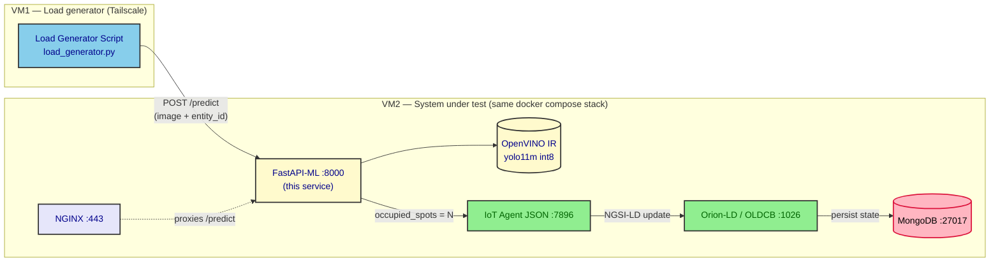
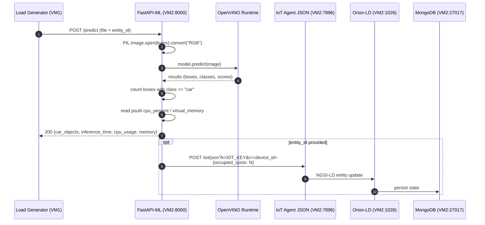

# fastapi-ml

This folder contains the **FastAPI-based ML inference service** that
backs the **Cloud deployment** of the multi-tier Digital-Twin Smart-Parking
experiment.

In the Cloud tier, image processing for vehicle counting happens
**co-located with the rest of the system on VM2**, as a container in
the same `docker compose` stack — there is no separate edge device or
GPU host. The Load Generator Script on VM1 sends raw parking images
to this service over the network; the service returns the detected
car count and (when an entity id is provided) forwards the count to
the FIWARE IoT Agent JSON so the rest of the NGSI-LD pipeline
(Orion-LD + MongoDB) updates exactly as in the other tiers.

The image-in / count-out contract with the load generator is the same
as the `edge` and `fog` tiers; only the inference host and the model
format change (CPU-only OpenVINO IR, vs. GPU-accelerated TensorRT).
`mist` is the only tier that skips inference entirely.

## What this service does

The service exposes a single HTTP endpoint, `POST /predict`, that:

1. Accepts a JPEG image and (optionally) the NGSI-LD entity id of the
   device that owns the image.
2. Runs object detection with a **YOLOv11m** model exported to the
   **OpenVINO int8** Intermediate Representation (IR), and counts how
   many of the detected boxes belong to the COCO `car` class.
3. Returns the count plus three self-measured resource signals:
   `inference_time` (seconds), `cpu_usage` (%), and `memory` (MB).
4. When an `entity_id` is provided, forwards the same count to the
   **FIWARE IoT Agent JSON** using the same `?i=<device>&k=<API_KEY>`
   URL shape that the mist deployment uses directly. The IoT Agent
   then turns it into a full NGSI-LD entity update, the OLDCB
   persists it in MongoDB, and the loop closes.

The end-to-end request is a single, mostly in-process operation: the
load generator → FastAPI hop crosses the network, but the
FastAPI → IoT Agent → OLDCB → MongoDB chain is **internal to VM2**
and never touches Tailscale.

## Why OpenVINO

The vision model is **YOLOv11m** exported to **OpenVINO int8** format.
[OpenVINO](https://github.com/openvinotoolkit/openvino) is Intel's
open-source toolkit for optimizing and deploying AI inference, with
particular strength on Intel CPUs. It was selected after comparison
with PyTorch, ONNX, TorchScript, and TensorFlow Lite because it
provided the **lowest inference latency under CPU-only conditions** —
relevant because the IC cloud VMs do not include GPUs. Edge and fog
use TensorRT because their inference hosts have NVIDIA GPUs; TensorRT
would not help on a CPU-only host, which is why the cloud tier
deliberately diverges from the other two image-processing tiers.

## File layout

| File | Role |
|---|---|
| `app.py` | FastAPI application. Loads the OpenVINO IR once at startup, exposes `POST /predict`, counts COCO `car` boxes, and (when an entity id is provided) forwards the count to the IoT Agent JSON. |
| `start.sh` | Gunicorn entrypoint. Spawns `$WORKERS` `UvicornWorker` processes (default 4) bound to `0.0.0.0:8000` with a 300 s timeout. |
| `Dockerfile` | Container build. `python:3.11-slim` + OpenCV runtime libs (`libgl1`, `libglib2.0-0`), `openvino-dev[onnx]==2023.3.0`, the model folder, and the app. Exposes port 8000. |
| `requirements.txt` | Pinned versions: `ultralytics==8.3.11`, `torch==2.1.2`, `openvino==2024.6.0`, `fastapi==0.110.1`, `gunicorn`, `uvicorn`, `python-multipart`, `pillow==10.2.0`, `psutil==5.9.8`, `networkx==3.1`, `numpy<2`. |
| `yolo11m_int8_openvino_model/` | OpenVINO IR export of YOLOv11m: `yolo11m.xml` (graph), `yolo11m.bin` (weights), `metadata.yaml` (Ultralytics export metadata — 640×640 input, int8 quantized, COCO 80 classes, AGPL-3.0). |
| `test.jpg` | Sample parking image used by the Load Generator Script and for ad-hoc testing of the container. |

## Container build context

This folder is the **build context** referenced by
`../infra/fastapi-ml.yaml`, which is in turn included by
`../infra/compose.yaml`. The compose fragment is short:

```yaml
services:
  fastapi-ml:
    build:
      context: ./fastapi-ml
    container_name: fastapi-ml_container
    ports:
      - "8000:8000"
    environment:
      WORKERS: 4
      MODEL_DIR: yolo11m_int8_openvino_model/
      IOT_URL: "http://fiware-iot-agent:7896/iot/json"
      IOT_KEY: "12345"
    networks:
      - default
```

In the Cloud tier the container is brought up together with the rest
of the stack (Orion-LD, IoT Agent JSON, MongoDB, NGINX, the
Prometheus / Grafana / cAdvisor / node-exporter monitoring
exporters). NGINX is also configured to reverse-proxy `/predict` to
this container; the Load Generator Script, however, hits the
container port `8000` directly because the runner already addresses
VM2 by its Tailscale name and the experiment needs to attribute
latency to the inference hop without an extra proxy in the way.

### Where this service sits in the cloud_deploy stack



## HTTP API

### `POST /predict`

**Request** — `multipart/form-data`:

| Field | Type | Required | Meaning |
|---|---|---|---|
| `file` | file | yes | JPEG image of the parking lot. |
| `entity_id` | string | no | NGSI-LD entity id of the device (e.g. `urn:ngsi-ld:OffStreetParking:001`). When provided, the service extracts the trailing colon-separated segment and uses it as the IoT Agent `i=<device_id>` query parameter. When omitted, the count is still returned but the IoT Agent update is skipped (and a warning is logged). |

**Response (200)**:

```json
{
  "car_objects": 7,
  "inference_time": 0.2143,
  "cpu_usage": 38.2,
  "memory": 412.7
}
```

**Error (500)**:

```json
{ "error": "<exception message>" }
```

### `/predict` request lifecycle



## Configuration

All knobs are environment variables; the production defaults are
baked into `infra/fastapi-ml.yaml` and can be overridden there.

| Env var | Default in compose | Used for |
|---|---|---|
| `WORKERS` | `4` | Number of Gunicorn worker processes (one `UvicornWorker` each). Increase to scale CPU inference parallelism — at the cost of proportionally more resident memory, because every worker loads the OpenVINO IR independently. |
| `MODEL_DIR` | `yolo11m_int8_openvino_model/` | Path to the OpenVINO IR folder, passed to `YOLO(...)`. |
| `IOT_URL` | `http://fiware-iot-agent:7896/iot/json` | IoT Agent JSON north-port base URL. |
| `IOT_KEY` | `12345` | API key for the IoT Agent (`?k=...`). Matches the key provisioned by `onVMScripts/3_provision_devices.sh`. |

The `/predict` handler also has two derived parameters it computes at
request time: the **`inference_time`** (seconds, from
`time.time()` around the `model.predict` call) and the **`cpu_usage`**
/ **`memory`** sampled via `psutil` immediately afterwards. These are
returned to the caller and also written to the service's INFO log
for post-test analysis.

## Build and run standalone

The container is normally brought up by `infra/compose.yaml` on VM2,
but it can be exercised in isolation for development:

```bash
# From this folder
docker build -t fastapi-ml-cloud .

# Local sanity check (no IoT Agent reachable, the forwarding step is skipped)
docker run --rm -p 8000:8000 fastapi-ml-cloud &
curl -s -F file=@test.jpg \
        -F entity_id=urn:ngsi-ld:OffStreetParking:001 \
     http://localhost:8000/predict
```

Drop the `-F entity_id=...` flag to exercise the count-only path
(useful when the IoT Agent is not up).

## Resource characteristics

- **Container base:** `python:3.11-slim` — keeps the image small;
  OpenCV runtime libs (`libgl1`, `libglib2.0-0`) are added because
  Ultralytics / Pillow import them transitively.
- **Workers:** 4 Gunicorn workers by default. Each worker loads the
  same OpenVINO IR into memory at startup, so total RSS grows
  roughly linearly with `WORKERS`. The model files themselves are
  ~20 MB on disk (`yolo11m.bin` ≈ 19.4 MB, `yolo11m.xml` ≈ 0.8 MB).
- **CPU-only:** The OpenVINO IR is dispatched onto the host CPU; no
  GPU device is required. This is the deliberate trade-off that
  motivates the CPU-friendly int8 quantization.
- **Timeouts:** The `/predict` route is allowed up to the
  `--timeout 300` configured in `start.sh`; the load generator
  default timeout is 60 s (overridable via `--timeout`), so very
  slow runs would surface as request failures in the response-time
  CSV produced by the load generator.

## Glossary — this folder ↔ cloud_deploy ↔ thesis

| This folder | Cloud-tier artefact | Thesis term |
|---|---|---|
| `app.py` (the `predict` route) | `infra/fastapi-ml.yaml` | "FastAPI-based ML inference container" |
| `yolo11m_int8_openvino_model/` | `infra/fastapi-ml.yaml` (`MODEL_DIR`) | "YOLOv11m → OpenVINO int8" |
| `IOT_URL` + `IOT_KEY` env vars | `infra/fastapi-ml.yaml` | "simplified POST to IoT Agent JSON" |
| `test.jpg` | `onGenScripts/test.jpg`, used by `load_generator.py` | "raw parking image" sent over the network |

For the full VM1+VM2 topology, the 4×9×9 full-factorial campaign, and
the per-tier shuffle seeds, see the cloud_deploy README
and `multi-tier-deployment/mist_deploy/README.md`.
