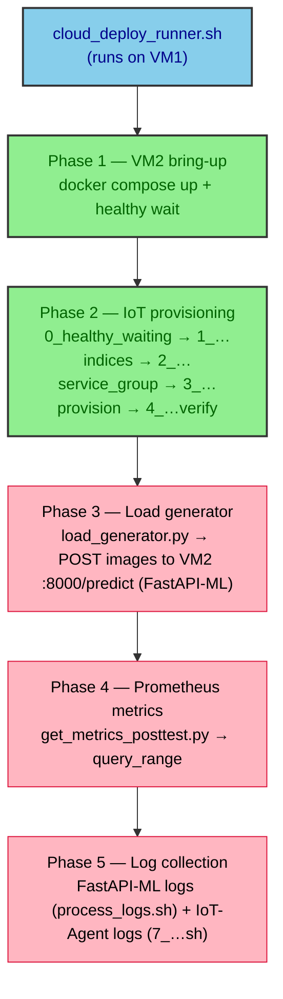

# onGenScripts

This folder is the **VM1 / load-generator host** side of the
[cloud deployment](../README.md) campaign. The shell script in here is the
main entry point: it brings the **VM2** FIWARE NGSI-LD stack up (which, in
this tier, also includes the **FastAPI-based ML inference container** as
a sibling of Orion-LD, IoT Agent JSON, MongoDB, NGINX, and Prometheus),
runs the load generator that sends raw parking images to that inference
container over Tailscale, then pulls Prometheus metrics and per-container
logs (FastAPI-ML and IoT-Agent) back for offline analysis. All
orchestrated phases are driven by `cloud_deploy_runner.sh`; the other
files in the folder are the pieces it composes.

> Unlike the fog tier, there is **no separate inference host**: in the
> cloud deployment the FastAPI-ML service is just another container in
> VM2's `infra/` compose stack, so the runner only talks to VM2 over
> Tailscale and never to a Discovery cluster node.

The full data-flow narrative and the experimental design live in the
parent [`../README.md`](../README.md); this README is a developer
reference for the scripts in this folder only.

## Orchestrator pipeline



## File reference

The subsections below are ordered by when each file runs at runtime.

### `cloud_deploy_runner.sh`

Main entry point. Usage: `./cloud_deploy_runner.sh [config_file]` (defaults
to `./cloud_deploy.conf`).

Behaviour:

- `set -euo pipefail` and `IFS=$'\n\t'`.
- Sources the config via a filtered `grep … | source` so that only lines
  matching `^[A-Za-z_][A-Za-z0-9_]*=` are evaluated (comments and blanks
  are skipped).
- Validates that every required variable is set: `M N seed alpha beta
  VM_tailscale_domain_name VM_tailscale_IPv4 VM_username VM_password
  VM_dir LM_dir onVM_dir onGen_dir onInfra_dir`. Note: there is **no**
  `Cluster_tailscale_domain_name` — the cloud tier has no separate
  inference host.
- Builds the per-run output directory
  `cloud_deploy_test_M_{M}_N_{N}_seed_{seed}_alpha_{alpha}_beta_{beta}`
  under `${LM_dir}/${onGen_dir}/` and `tee`s every line of stdout+stderr
  into `<DIRNAME>.log` inside it.
- Runs the orchestrated phases in order, over `sshpass` to VM2, then
  `scp`s the per-target artefacts back into the per-run directory. The
  file's "CLUSTER SIDE" / "DISCOVERY CLUSTER" section banners are kept
  as `It's gone` placeholders to keep the structure parallel to the
  other tiers' runners.

The phases correspond exactly to the mermaid diagram above. The
log-collection phase stops the VM2 compose stack, then on VM2:

1. Greps `docker ps -a --format '{{.Names}}' | grep 'fastapi-ml_container'`
   to find the FastAPI-ML container, dumps its logs to
   `raw_logs_<container>_…log-inference`, and runs
   `onVMScripts/process_logs.sh` against them. If no matching container
   is found, the runner prints a warning and continues.
2. Greps `docker ps -a --format '{{.Names}}' | grep 'fiware-iot-agent'`
   to find the IoT-Agent container, dumps its logs to
   `raw_logs_<container>_…log-agent`, and runs
   `onVMScripts/7_process_iot_agent_logs.sh` against them. Same
   fail-soft behaviour if no match is found.

After the SSH block returns, the runner `scp`s everything under
`${VM_dir}/${onVM_dir}/${DIRNAME}/` back to
`${LM_dir}/${onGen_dir}/${DIRNAME}/`.

### `cloud_deploy.conf` / `cloud_deploy.conf.example`

Shell-sourceable config. `cloud_deploy.conf` is the real, gitignored file
with Tailscale IPs and SSH credentials; `cloud_deploy.conf.example` is
the committed template.

```bash
# Template workflow (do NOT edit the .example in place)
cp cloud_deploy.conf.example cloud_deploy.conf
$EDITOR cloud_deploy.conf
```

Variables (grouped):

| Group | Key | Meaning |
|---|---|---|
| Test | `M` | Number of virtual devices simulated per cycle. |
| Test | `N` | Number of seconds (bins) the cycle is spread over. |
| Test | `seed` | RNG seed for the Beta-distribution allocation (1..`seed` cycles are run). |
| Test | `alpha` | Beta-distribution α (workload shape). |
| Test | `beta` | Beta-distribution β (workload shape). |
| VM2 Tailscale | `VM_tailscale_domain_name` | Tailscale MagicDNS name of VM2 (used in URLs and Prometheus target). |
| VM2 Tailscale | `VM_tailscale_IPv4` | Tailscale IPv4 of VM2 (used for `sshpass ssh`). |
| VM2 Tailscale | `VM_username` / `VM_password` | SSH credentials for VM2. |
| Paths | `VM_dir` | Repo root on VM2 (parent of `onVMScripts/`, `infra/`). |
| Paths | `LM_dir` | Repo root on the VM1 / load-generator host (parent of `onGenScripts/`). |
| Paths | `onVM_dir` | VM2-side scripts dir, relative to `VM_dir`. |
| Paths | `onGen_dir` | This folder, relative to `LM_dir`. |
| Paths | `onInfra_dir` | VM2 Compose stack dir, relative to `VM_dir`. |

There is intentionally **no** `Cluster_tailscale_domain_name` variable
here, unlike the fog tier: the cloud tier has no separate cluster node,
and the inference container lives inside VM2's compose stack.

### `load_generator.py`

Multi-threaded HTTP load generator that uploads a parking image to the
FastAPI-ML container on VM2 for every simulated device. CLI flags:

| Flag | Default | Meaning |
|---|---|---|
| `--M` | required | Number of virtual devices. |
| `--N` | required | Number of seconds (bins) per cycle. |
| `--seeds` | required | Number of cycles. Uses seeds `1..seeds`. |
| `--alpha` | `5.0` | Beta-distribution α. |
| `--beta` | `5.0` | Beta-distribution β. |
| `--max-workers` | `100` | Max threads in the `ThreadPoolExecutor`. |
| `--out-dir` | `.` | Output directory. |
| `--url` | `http://localhost:7896/iot/json` | Target URL. **In the cloud runner this is overridden to `<vm2_tailscale>:8000/predict` (the FastAPI-ML container on VM2).** |
| `--key` | `12345` | API key value for query param `k` (declared for future use; not currently appended to the request). |
| `--timeout` | `60` | Per-request timeout in seconds. The cloud runner overrides this to `300`. |
| `--image` | required | Path to the image uploaded with every request. |

Behaviour worth knowing about for the cloud deployment:

- The HTTP body is a **`multipart/form-data`** upload, not a JSON body.
  The image is sent as the `file` field and the NGSI-LD entity id as a
  form field:
  ```text
  POST <vm2_tailscale>:8000/predict
  Content-Type: multipart/form-data
  file=@test.jpg
  entity_id=urn:ngsi-ld:OffStreetParking:<device_id>
  ```
  This is what makes the FastAPI-ML container on VM2 able to forward
  the inferred count to the right IoT-Agent device downstream.
- For each seed the script draws a Beta-distribution across `N` seconds,
  rounds to integer request counts, and rebalances the rounding residual
  using `np.random.default_rng(seed=seed_val)`.
- The CSV is opened once per seed and flushed per second; a sentinel
  row `Seed=0, Status=200, ResponseTime=0` is prepended at start and
  appended at end so timestamp range parsing by
  `get_metrics_posttest.py` is robust to early/late out-of-order events.
- On exit, fires a desktop notification via `notify-send -u critical
  "The program  ended."` (failures swallowed; this is the only place
  the binary is invoked).

Outputs (under `--out-dir`):

- `response_times_M_{M}_N_{N}_seed_{seeds}_alpha_{alpha}_beta_{beta}.csv`
  with columns `Seed, Timestamp, DeviceID, EntityID, Status, ResponseTime(ms)`.
- `load_generator_M_{M}_N_{N}_seed_{seeds}_alpha_{alpha}_beta_{beta}.log`
  with full DEBUG-level request traces.

### `get_metrics_posttest.py`

Post-test Prometheus scraper. CLI flags:

| Flag | Default | Meaning |
|---|---|---|
| `--out-dir` | `./results` | Directory containing `response_times_*.csv` and the destination for `metrics_*.csv`. |
| `--prom-url` | `http://localhost:9090` | Prometheus base URL. **In the cloud runner this is overridden to `<vm2_tailscale>:9090`.** |
| `--interval` | `15s` | Rate / irate window used inside the PromQL templates. |
| `--containers` | (built-in default) | Comma-separated container names to monitor. Overrides the built-in default. |
| `--max-workers` | `16` | Max parallel `query_range` calls per file. |
| `--step` | `1s` | Query resolution step for `query_range`. |
| `--max-points` | `11000` | Prometheus max points per timeseries; the time window is split into chunks so each chunk has at most this many points. |

Behaviour:

- Discovers the **Node Exporter** `instance`/`job` pair and the
  **cAdvisor** `instance` from Prometheus via `/api/v1/series`.
- Builds PromQL for ~40 host-level metrics (CPU usage, load, PSI, RAM,
  swap, disk reads/writes/queue/flush/TRIM, network Rx/Tx and
  utilisation) plus per-container cAdvisor metrics for the default
  container list:
  `nginx-reverse-proxy, fiware-orion, fiware-iot-agent, fiware-ld-context, db-mongo, cadvisor, node-exporter, prometheus-monitor, fastapi-ml_container`.
  **`fastapi-ml_container` is included by default in the cloud tier**
  because the inference container runs on VM2 in the same compose stack
  as the rest of the system. The fog/edge tiers, where inference runs
  on a separate host, do not include it.
- For each `response_times_*.csv` under `--out-dir`, derives the window
  `[first_timestamp - 10s, last_timestamp + 10s]`, splits that window
  into chunks of `<= step_seconds * (max_points - 1)` so each
  timeseries stays under Prometheus's point cap, fans them out across
  the thread pool, then writes one row per second.
- One `metrics_{M_x_N_x_seed_x_TR_x_alpha_x_beta_x}.csv` per response
  file; the `TR` segment in the key is expected by the regex but is
  not part of the cloud filename — the script falls back to a copy of
  the response-file stem if no key is matched.

### `mean_inference_time.sh`

Single-purpose helper. Usage:

```bash
./mean_inference_time.sh path/to/inference_times.csv
```

Averages column 1 of the CSV (skipping the header) with `awk -F','` and
prints `Mean inference_time_s: <value>`. Returns `NaN` if the file is
empty. Intended for one-off sanity checks on FastAPI-ML container
inference latencies that arrive in a separate CSV; the orchestrator
does not call it.

### `requirements.txt`

Pinned Python dependencies for the load-generator host venv:

```text
numpy==1.26.4
requests==2.31.0
scipy==1.13.1
pandas
```

Install inside a fresh venv on the load-generator host:

```bash
python3 -m venv "${LM_dir}/${onGen_dir}/venv"
source "${LM_dir}/${onGen_dir}/venv/bin/activate"
pip install -r "${LM_dir}/${onGen_dir}/requirements.txt"
```

> Unlike `mist_deploy/onGeneratorScripts/`, this folder does **not** ship
> a pre-built `venv/`; you are expected to create it locally.

### `test.jpg`

Sample parking image uploaded as the `file` field of every request by
`load_generator.py` (the runner passes `--image ./test.jpg`). It is kept
in the repo so the harness works out of the box without the operator
having to provision their own fixture; replace it with a different
fixture if you need a specific camera angle or resolution for a
particular test.

## Quick start

```bash
# On the load-generator host, from this folder
cd multi-tier-deployment/cloud_deploy/onGenScripts

# 1. Create your local config (never commit)
cp cloud_deploy.conf.example cloud_deploy.conf
$EDITOR cloud_deploy.conf           # fill in Tailscale + SSH credentials

# 2. Build the Python venv
python3 -m venv venv
source venv/bin/activate
pip install -r requirements.txt

# 3. Run a single experiment
./cloud_deploy_runner.sh
```

## Run output

A successful run creates a single timestamped directory named
`cloud_deploy_test_M_{M}_N_{N}_seed_{seed}_alpha_{alpha}_beta_{beta}/`
under this folder. It contains:

- `<DIRNAME>.log` — `tee`'d stdout+stderr of the whole runner.
- `response_times_*.csv` / `load_generator_*.log` — load-generator
  output, written by `load_generator.py`.
- `metrics_*.csv` — Prometheus host + per-container metrics for the
  load window, written by `get_metrics_posttest.py` (includes
  `fastapi-ml_container` per-container metrics in addition to the
  shared infra metrics).
- `raw_logs_fastapi-ml_container_*.log-inference` — FastAPI-ML
  container logs collected over SSH from VM2, processed by
  `onVMScripts/process_logs.sh`.
- `raw_logs_fiware-iot-agent_*.log-agent` — IoT-Agent container logs
  collected over SSH from VM2, processed by
  `onVMScripts/7_process_iot_agent_logs.sh`.

The exact `DIRNAME` template is significant: downstream helpers glob on
that prefix, so do not rename it.

## See also

- [`../README.md`](../README.md) — cloud_deploy campaign overview,
  data-flow diagram, and experimental design.
- [`../onVMScripts/`](../onVMScripts/) — the numbered
  `0_..4_/7_` provisioning and measurement scripts that the runner
  invokes over SSH on VM2, plus `process_logs.sh` (FastAPI-ML log
  processor) and the rest of the VM2-side helpers.
- [`../infra/`](../infra/) — the VM2-side Docker Compose stack
  (Orion-LD, IoT Agent JSON, MongoDB, NGINX, Prometheus, Grafana,
  cAdvisor, node-exporter, **and the FastAPI-ML inference container**
  via `fastapi-ml.yaml` / `fastapi-ml/`).
