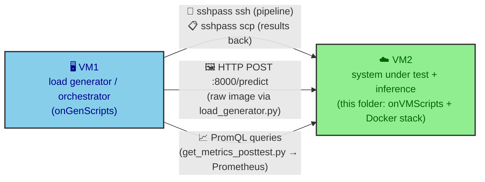
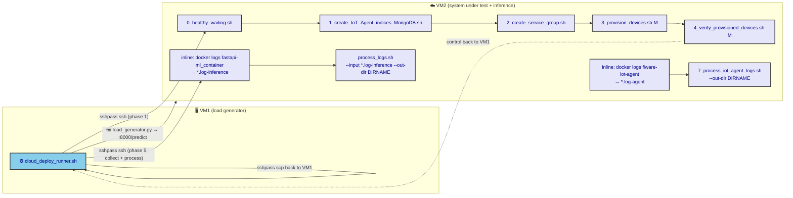
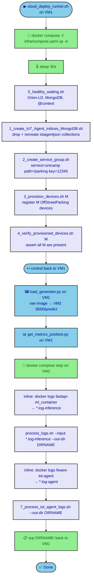
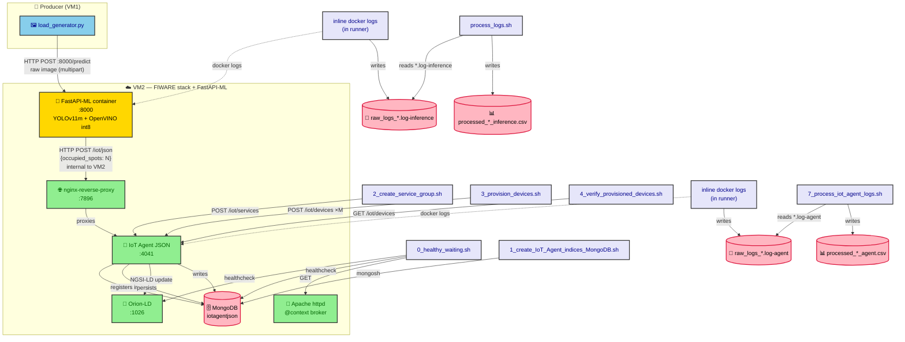
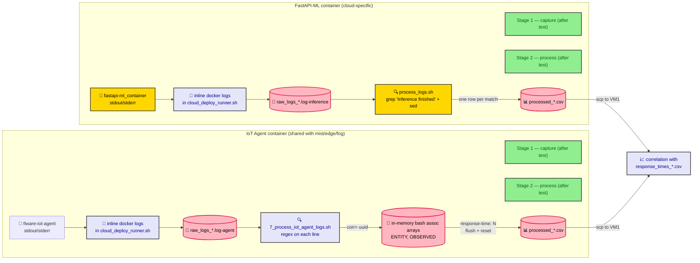

# onVMScripts — VM2 provisioning & measurement scripts

This directory holds the scripts that are executed **inside VM2**, the
remote VM that hosts the Docker Compose stack (Orion-LD, IoT Agent JSON,
MongoDB, Prometheus, the nginx reverse proxy, **and the FastAPI-based ML
inference container**) during a **cloud-tier** load test. The companion
orchestrator `../onGenScripts/cloud_deploy_runner.sh` runs on VM1 and
invokes these scripts over SSH as part of the end-to-end test pipeline.

The scripts are intentionally numbered (`0_`…`4_` and `7_`) so the
orchestrator can run them in the correct order. The unnumbered files
(`collector_logs.sh`, `docker_logs_collector.py`, `process_logs.sh`,
`cpu_baseline.sh`) are independent utilities — only `process_logs.sh` is
part of the runner-driven pipeline; the others are kept for ad-hoc
debugging.

> **TL;DR** — `0` waits for the stack to be healthy, `1` prepares Mongo,
> `2`/`3`/`4` register and verify the IoT devices, the load test runs
> from VM1 against the FastAPI-ML container on VM2, and the runner then
> SSHes back into VM2 to run **`process_logs.sh`** over the FastAPI-ML
> container log and **`7_process_iot_agent_logs.sh`** over the IoT Agent
> log, both piped back to VM1 via `scp`. `cpu_baseline.sh` is meant to
> be run on VM2 **before** each test run, after a VM reset, to capture
> a CPU baseline.

## Table of contents

- [Overview — VM1 and VM2](#overview--vm1-and-vm2)
- [How this folder fits in the pipeline](#how-this-folder-fits-in-the-pipeline)
- [Execution order](#execution-order)
- [Architecture map — which script touches which component](#architecture-map--which-script-touches-which-component)
- [Script reference](#script-reference)
  - [0. `0_healthy_waiting.sh`](#0-0_healthy_waitingsh)
  - [1. `1_create_IoT_Agent_indices_MongoDB.sh`](#1-1_create_iot_agent_indices_mongodbsh)
  - [2. `2_create_service_group.sh`](#2-2_create_service_groupsh)
  - [3. `3_provision_devices.sh`](#3-3_provision_devicessh)
  - [4. `4_verify_provisioned_devices.sh`](#4-4_verify_provisioned_devicessh)
  - [5. `collector_logs.sh`](#5-collector_logssh)
  - [6. `docker_logs_collector.py`](#6-docker_logs_collectorpy)
  - [7. `process_logs.sh`](#7-process_logssh)
  - [8. `7_process_iot_agent_logs.sh`](#8-7_process_iot_agent_logssh)
  - [9. `cpu_baseline.sh`](#9-cpu_baselinesh)
- [Log processing data flow](#log-processing-data-flow)
- [Running the scripts by hand](#running-the-scripts-by-hand)
- [Outputs produced on VM2](#outputs-produced-on-vm2)
- [Troubleshooting](#troubleshooting)

## Overview — VM1 and VM2

The cloud-tier load-test setup spans two OpenStack VMs from the
Institute of Computing Cloud, plus a single inference container that
sits on VM2 itself (unlike the edge and fog tiers, which delegate
inference to a separate device or cluster node):

- **VM1 — load generator / orchestrator.** Runs
  `../onGenScripts/cloud_deploy_runner.sh`, `load_generator.py`,
  `get_metrics_posttest.py`, and the local Python virtual environment.
  It does *not* host any FIWARE component or any inference service; it
  only generates traffic (sending raw parking images) and collects
  metrics.
- **VM2 — system under test + inference.** Runs the Docker Compose
  stack that includes Orion-LD, the IoT Agent JSON, MongoDB, the nginx
  reverse proxy, Prometheus / cAdvisor / node-exporter / Grafana, **and
  the FastAPI-based ML inference container** (`fastapi-ml_container`,
  YOLOv11m exported to OpenVINO int8). The scripts in this folder are
  executed on this VM.



The Load Generator Script on VM1 sends a raw parking image plus the
corresponding entity id to the FastAPI-ML container at
`http://<vm2_tailscale>:8000/predict`; that container runs inference,
counts vehicles, and then issues its own `POST` to the IoT Agent JSON at
`http://fiware-iot-agent:7896/iot/json` with body
`{"occupied_spots": N}` — the **inference → IoT Agent step is internal
to VM2** and crosses the Docker network, not Tailscale.

## How this folder fits in the pipeline

The VM1-side orchestrator
(`multi-tier-deployment/cloud_deploy/onGenScripts/cloud_deploy_runner.sh`)
opens an SSH session into VM2 and runs the numbered scripts in this
folder during the bring-up phase, then SSHes back in after the load
test to collect the FastAPI-ML and IoT Agent container logs and run
the corresponding processors. The directory layout on VM2 is assumed
to be `$VM_dir/onVMScripts/` (the path is read from
`cloud_deploy.conf` via the `onVM_dir` variable).



`cpu_baseline.sh`, `collector_logs.sh` and `docker_logs_collector.py`
are not part of this pipeline — see their own sections below.

## Execution order

The numbered prefix on each script is the order in which the
orchestrator runs them. The flowchart below mirrors the exact call
sequence in `cloud_deploy_runner.sh`.



> **Why the gap between 4 and 7?** There is no `5_` or `6_` script on
> disk. The pipeline was restructured at some point (steps that used to
> live in their own files were either folded into another step or
> dropped entirely), but the numeric prefixes of the remaining files
> were left untouched so that the calling code in
> `cloud_deploy_runner.sh` did not have to be modified. The post-test
> log collection in the cloud tier is intentionally inline in the
> runner (one-shot `docker logs` per container, not a backgrounded
> streaming collector as in `mist_deploy`); the runner then runs the
> two log processors on VM2 to produce the inference and IoT-Agent
> CSVs and `scp`s the whole per-test directory back to VM1.

> **Why the `.log-inference` / `.log-agent` extensions?** Both
> log files are produced by inline `docker logs > …` calls in the
> runner and use the suffix `_<container>_M{}_N{}_seeds{}_alpha{}_beta{}.log-{kind}`,
> where `{kind}` is one of `inference` (for the FastAPI-ML container)
> or `agent` (for the IoT Agent). The two suffixes are what let
> `process_logs.sh` (which expects a `*.log-inference` file) and
> `7_process_iot_agent_logs.sh` (which globs `*.log-agent`) only ever
> pick up the file they are responsible for, never the other one.
> If you collect IoT Agent logs with `collector_logs.sh` instead — that
> helper writes a plain `.log` file — the agent processor will not pick
> it up. This mismatch is why the runner does the collection itself
> rather than calling either helper.

## Architecture map — which script touches which component



## Script reference

### 0. `0_healthy_waiting.sh`

**Purpose:** Block until every external dependency is actually serving
traffic, not just *up*. Without this step, `2_create_service_group.sh` and
`3_provision_devices.sh` would race against container startup and fail
with connection-refused errors.

**What it waits for:**

| Dependency | How it checks | Endpoint |
|---|---|---|
| Orion-LD container | Docker healthcheck status | `docker inspect fiware-orion` |
| MongoDB container | Docker healthcheck status | `docker inspect db-mongo` |
| NGSI-LD core `@context` | HTTP `200` from ETSI | `https://uri.etsi.org/ngsi-ld/v1/ngsi-ld-core-context-v1.8.jsonld` |
| User `@context` (Apache) | HTTP `200` via curl in `quay.io/curl/curl` | `http://context/user-context.jsonld` |

**Notes**

- Assumes the default Docker network is named `default` (it uses
  `docker run --network default` for the curl probes).
- `set -e` is **not** active — failures fall through to retries
  rather than aborting the whole pipeline.
- Prints a friendly progress dot every 3 seconds so you can see it is
  alive.

**Parameters:** none.

### 1. `1_create_IoT_Agent_indices_MongoDB.sh`

**Purpose:** Prepare the `iotagentjson` MongoDB database the first time
the stack is brought up. Idempotent only in the sense that it is meant to
be run once; on a non-empty database it **drops every collection first**
and recreates the two required ones (`devices`, `groups`) with the
correct indexes.

> [!WARNING]
> Running this on a populated database wipes all registered devices and
> service groups. Only do this on a fresh stack or when you explicitly
> want to start over.

**What it does:**

1. `mongosh` into the `iotagentjson` DB.
2. Drop every collection (`getCollectionNames().forEach(c => db[c].drop())`).
3. Recreate `devices` with three indexes:
   - `{_id.service, _id.id, _id.type}` (compound)
   - `{_id.type}`
   - `{_id.id}`
4. Recreate `groups` with two indexes:
   - `{_id.resource, _id.apikey, _id.service}` (compound)
   - `{_id.type}`

It also blocks until the `fiware-iot-agent` container is reported
healthy by Docker.

**Parameters:** none.

### 2. `2_create_service_group.sh`

**Purpose:** Register the FIWARE service / subservice / API-key triple
that the IoT Agent uses to route incoming `iot/json` payloads to the
right Orion-LD context broker.

**Hard-coded values** (edit the script if you need to change them):

| Variable | Value |
|---|---|
| `IOTA_HOST` | `http://localhost:4041` |
| `FIWARE_SERVICE` | `unicamp` |
| `FIWARE_SERVICEPATH` | `/parking` |
| `API_KEY` | `12345` |
| `CBROKER` | `http://orion:1026` |
| `ENTITY_TYPE` | `OffStreetParking` |
| `RESOURCE` | `/iot/json` |

**What it does:**

1. `POST /iot/services` to the IoT Agent with the JSON body shown in
   the file, declaring the `apikey`/`cbroker`/`entity_type`/`resource`
   quadruple.
2. `GET /iot/services` to confirm the registration, printing the
   response to stdout.

**Parameters:** none.

### 3. `3_provision_devices.sh`

**Purpose:** Pre-register `M` virtual parking entities with the IoT
Agent so that, after each `POST /predict` inference, the FastAPI-ML
container can forward the inferred count as
`POST /iot/json?k=12345&i=NN` for each one without the IoT Agent
having to lazily create entities on the fly. In the cloud tier, the
**FastAPI-ML container on VM2** is the producer that posts to the IoT
Agent — the load generator on VM1 only sends raw images to the
FastAPI-ML container, never to the IoT Agent directly.

**Why `OffStreetParking` and not `ParkingSensor`?** To keep the test
simple, the device is provisioned as a single `OffStreetParking`
entity and the inference result posts the *number of detected cars*
directly to it. There is no intermediate `ParkingSensor` entity: in a
real setup a `ParkingSensor` would report the presence of a single
parking spot, and the IoT Agent would then propagate the update to a
parent `OffStreetParking` entity (which would itself trigger a chain
of further updates). For benchmarking, that chain is unnecessary — a
single camera snapshot already counts the total number of vehicles in
the lot, so posting that count straight into `OffStreetParking` is
enough and lets us measure the IoT Agent / Orion-LD pipeline in
isolation.

**Usage**

```bash
./3_provision_devices.sh <M>
```

- `M` — number of devices to provision. They are numbered with leading
  zeros (`01`, `02`, …, `0M`).
- Each `device_id` maps to a `urn:ngsi-ld:OffStreetParking:<id>` entity.
- Each device exposes a single attribute: `occupiedSpotNumber`
  (object id `occupied_spots`, NGSI-LD `Property`).

**Loop output:** every iteration prints the HTTP status code returned
by `POST /iot/devices` (e.g. `201` on success).

**Parameters:** `M` (positional, required). The script does not
validate that the argument is a positive integer; an empty or
non-numeric `M` will either skip the loop or fail in `seq -w`.

### 4. `4_verify_provisioned_devices.sh`

**Purpose:** Sanity-check that all `M` devices provisioned by
`3_provision_devices.sh` are actually present in the IoT Agent
registry. The runner aborts on failure because of `set -euo pipefail`.

**Usage**

```bash
./4_verify_provisioned_devices.sh <M>
```

- Validates that `M` is a positive integer (exits `2` if not).
- Fetches every device with `GET /iot/devices` (no `?limit=…`, so very
  large `M` may need raising the per-page limit on the IoT Agent
  side).
- Greps the JSON for each expected `device_id` and prints `[✔]` /
  `[✘]` per device.
- Exits `0` if all are present, otherwise prints how many are missing
  and exits `0` (the orchestrator relies on the printed summary, not
  the exit code, for the verdict — it has its own `set -e` at a higher
  level).

**Parameters:** `M` (positional, required).

### 5. `collector_logs.sh`

**Purpose:** One-shot helper that copies the current stdout/stderr of a
named Docker container into a single raw log file, parameterised by the
`M`, `N`, `seeds`, `alpha` and `beta` values of the current test
scenario. It is a stand-alone utility — **it is not invoked by
`cloud_deploy_runner.sh`**, which collects the IoT Agent and FastAPI-ML
container logs inline instead (see "Execution order" above and the note
about the `*.log-agent` / `*.log-inference` extensions).

The reason it is shipped in this folder anyway is to make ad-hoc
inspection of a container's log trivial when you are debugging a
stack without wanting to drive a full load test:

```bash
./collector_logs.sh \
  --container fiware-iot-agent \
  --M 136 --N 30 --seeds 2 --alpha 5 --beta 5 \
  --out-dir ./cloud_deploy_test_M_136_N_30_seed_2_alpha_5_beta_5
```

**Arguments**

| Flag | Default | Meaning |
|---|---|---|
| `--container` | required | Docker container name or ID to read logs from. |
| `--M` | required | Number of devices — used in the filename suffix. |
| `--N` | required | Number of seconds per seed — used in the filename suffix. |
| `--seeds` | required | Number of seed cycles — used in the filename suffix. |
| `--alpha` | required | Beta distribution α — used in the filename suffix. |
| `--beta` | required | Beta distribution β — used in the filename suffix. |
| `--out-dir` | `./results` | Directory to write the log file into. |

**Output file**

```
raw_logs_<container>_M<M>_N<N>_seeds<seeds>_alpha<alpha>_beta<beta>.log
```

> [!WARNING]
> If you collect IoT Agent logs with `collector_logs.sh` and then run
> `7_process_iot_agent_logs.sh` on the same directory, the processor
> will not pick them up: it globs on `*.log-agent` (the extension the
> runner uses), not `*.log` (the extension this helper uses). Either
> rename the file, symlink it, or rerun the runner's inline
> collection. This mismatch is the reason the runner does the
> collection itself rather than calling this helper.

**Parameters:** see the table above.

### 6. `docker_logs_collector.py`

**Purpose:** Stream the stdout/stderr of a Docker container into a
single raw log file, anchored to a `T0` timestamp. It is a
stand-alone utility — **it is not invoked by `cloud_deploy_runner.sh`**
either; the cloud runner does a one-shot `docker logs` per container
after the test has finished, the same way the edge and fog runners do.
It is shipped in this folder to keep the same toolbox available across
all four tiers (mist uses it actively; edge, fog and cloud do not).

**Usage**

```bash
python3 docker_logs_collector.py \
  --M 136 --N 30 --seeds 2 --alpha 5 --beta 5 \
  --container fiware-iot-agent \
  --out-dir ./cloud_deploy_test_M_136_N_30_seed_2_alpha_5_beta_5
```

**Arguments**

| Flag | Default | Meaning |
|---|---|---|
| `--M` | required | Number of devices — used in the filename suffix. |
| `--N` | required | Number of seconds per seed — used in the filename suffix. |
| `--seeds` | required | Number of seed cycles — used in the filename suffix. |
| `--alpha` | `1.0` | Beta distribution α — used in the filename suffix. |
| `--beta` | `1.0` | Beta distribution β — used in the filename suffix. |
| `--container` | `fiware-iot-agent` | Docker container to follow. |
| `--out-dir` | `./results` | Directory to write the log file into. |

**Output file**

```
raw_docker_logs_<container>_M_<M>_N_<N>_seed_<seeds>_alpha_<alpha>_beta_<beta>.log
```

- Captures the start timestamp with `datetime.utcnow().isoformat()` and
  uses it as `--since` for `docker logs -f`, so only lines emitted from
  that moment on are written.
- Stop with **Ctrl+C**; the script sends `SIGINT` to `docker logs`,
  waits up to 5 s, then `SIGKILL`s it if needed.
- As with `collector_logs.sh`, `7_process_iot_agent_logs.sh` will not
  pick this file up either (it globs on `*.log-agent`).

**Parameters:** see the table above.

### 7. `process_logs.sh`

**Purpose:** Walk a raw FastAPI-ML container log (produced by the
inline `docker logs` call in the runner) and emit a tidy CSV with one
row per inference, extracting the four numbers the FastAPI-ML
container prints on its `Inference finished` lines:

| Field | Source in the log |
|---|---|
| `inference_time_s` | `… sec` |
| `cars_detected` | `cars=<int>` |
| `cpu_usage_percentage` | `CPU=<float>%` |
| `memory_usage_MB` | `MEM=<float>MB` |

**Usage**

```bash
./process_logs.sh \
  --input ./cloud_deploy_test_M_136_N_30_seed_2_alpha_5_beta_5/raw_logs_fastapi-ml_container_M_136_N_30_seeds_2_alpha_5_beta_5.log-inference \
  --out-dir ./cloud_deploy_test_M_136_N_30_seed_2_alpha_5_beta_5
```

- Strips the last extension off `--input` (`${INPUT%.*}`) and writes
  `processed_<basename>.csv` in `--out-dir`. For the example above
  that is `processed_raw_logs_fastapi-ml_container_M_136_N_30_seeds_2_alpha_5_beta_5.csv`.
- Builds the CSV with one header row plus one row per `grep -F
  "Inference finished"` match. Lines that do not match the
  `…: <t> sec, cars=<n>, CPU=<p>%, MEM=<m>MB` shape are silently
  dropped (the awk-style extraction is a single `sed -E` substitution,
  so unmatched lines become empty and are not emitted as rows).
- `set -Eeuo pipefail` and `IFS=$'\n\t'` are active — input validation
  failures (missing `--input`, non-existent file) exit `1` with a
  friendly error.

**Output columns**

```
inference_time_s,cars_detected,cpu_usage_percentage,memory_usage_MB
```

**Parameters:** `--input <log_file>` (required), `--out-dir <dir>`
(optional, defaults to `./results`).

### 8. `7_process_iot_agent_logs.sh`

**Purpose:** After the test finishes, walk the raw IoT Agent log
produced by the runner's inline `docker logs` and emit a tidy CSV with
one row per processed update, joining the three pieces of information
that the IoT Agent logs in different lines:

| Field | Source in the log |
|---|---|
| `correlationID` | `corr=<uuid>` |
| `entity_id` | `"id": "urn:ngsi-ld:OffStreetParking:..."` |
| `observedAt` | `"observedAt": "2026-..."` |
| `response_time_ms` | `response-time: <integer>` |

**Usage**

```bash
./7_process_iot_agent_logs.sh --out-dir ./cloud_deploy_test_M_136_N_30_seed_2_alpha_5_beta_5
```

- Picks the first `*.log-agent` file in `--out-dir` and produces
  `processed_<basename>.csv` next to it.
- Uses two associative arrays (`ENTITY`, `OBSERVED`) keyed by the
  current `correlationID` so the final row is emitted only when *all
  three* fields have been seen for that correlation.
- Exits `1` if no matching raw log is found.

**Output columns**

```
correlationID,entity_id,observedAt,response_time_ms
```

**Parameters:** `--out-dir <dir>` (optional, defaults to `.`).

### 9. `cpu_baseline.sh`

**Purpose:** Run this on VM2 **before** a test scenario to capture a
host-side CPU baseline (lscpu, sysbench single- and multi-thread,
`openssl speed`, `mpstat` for `%steal`, a small Python FP microbench,
and current `cpu MHz`). The intent is that, when comparing different
test scenarios against each other, VM2 is reset between runs and this
script is used to confirm that the underlying CPU performance is
comparable — i.e. to rule out hardware / virtualization noise as a
confounding factor in the comparison. In the cloud tier in particular,
where the FastAPI-ML container also runs on VM2 and competes for CPU
with the rest of the stack, capturing a baseline before each run makes
the cross-scenario comparison honest.

**Usage**

```bash
./cpu_baseline.sh [OUTDIR]   # default: ./baseline_results
```

Each run produces a timestamped prefix `host_<UTC-timestamp>.txt` and
drops several sibling files next to it.

**Files written**

| File | Contents |
|---|---|
| `host_<ts>.txt.lscpu` | Full `lscpu` output. |
| `host_<ts>.txt.model` | First `model name` line from `/proc/cpuinfo`. |
| `host_<ts>.txt.cpuinfo` | Full `/proc/cpuinfo`. |
| `host_<ts>.txt.sysbench_s1` | 10 s sysbench CPU run, 1 thread. |
| `host_<ts>.txt.sysbench_mt` | 10 s sysbench CPU run, `nproc` threads. |
| `host_<ts>.txt.openssl` | `openssl speed aes-128-cbc`. |
| `host_<ts>.txt.mpstat` | 3 × 1 s `mpstat -P ALL` samples. |
| `host_<ts>.txt.cpumhz_before` | First 4 `cpu MHz` lines. |
| `host_<ts>.txt.pybench` | 2 000 000 Python `math.sqrt` calls. |

**Dependencies**

- `sysbench` (auto-installed via `apt-get` if missing).
- `sysstat` (auto-installed for `mpstat`).
- `openssl` and `python3` (only used if present).
- `sudo` is required for the apt-get calls — run as a sudoer or
  preinstall the packages.

**Parameters:** `OUTDIR` (positional, optional, default
`./baseline_results`).

## Log processing data flow

The cloud tier runs **two parallel two-stage ETLs**, one per container
of interest: the FastAPI-ML container and the IoT Agent container.
Both capture stages are inline in `cloud_deploy_runner.sh`; both
process stages are dedicated scripts in this folder.



The FastAPI-ML pipeline is the cloud-tier-specific piece: it is what
lets the evaluation separate the time spent inside the inference
container from the time spent inside the FIWARE stack.

## Running the scripts by hand

You rarely need to invoke these directly — `cloud_deploy_runner.sh`
does it for you — but if you are debugging, here is the exact order.
Run each on VM2, **after** `docker compose -f infra/compose.yaml up -d`:

```bash
# 0. wait for everything to be ready
./0_healthy_waiting.sh

# 1. prepare Mongo (CAUTION: drops existing collections in iotagentjson)
./1_create_IoT_Agent_indices_MongoDB.sh

# 2. register the service group
./2_create_service_group.sh

# 3. provision M devices
./3_provision_devices.sh 136

# 4. verify they are all there
./4_verify_provisioned_devices.sh 136

# (5. load test is driven from VM1: load_generator.py POSTs raw
#     images to http://<vm2_tailscale>:8000/predict; the FastAPI-ML
#     container runs inference and POSTs the count to the IoT Agent
#     on the same VM2 — no SSH needed for that step)

# 6. after the test, stop the stack and collect the two log files
docker compose -f ../infra/compose.yaml stop
sleep 15
mkdir -p ./cloud_deploy_test_M_136_N_30_seed_2_alpha_5_beta_5
docker logs fastapi-ml_container > \
  ./cloud_deploy_test_M_136_N_30_seed_2_alpha_5_beta_5/raw_logs_fastapi-ml_container_M_136_N_30_seeds_2_alpha_5_beta_5.log-inference 2>&1
docker logs fiware-iot-agent > \
  ./cloud_deploy_test_M_136_N_30_seed_2_alpha_5_beta_5/raw_logs_fiware-iot-agent_M_136_N_30_seeds_2_alpha_5_beta_5.log-agent 2>&1

# 7. process the FastAPI-ML log into an inference CSV
./process_logs.sh \
  --input ./cloud_deploy_test_M_136_N_30_seed_2_alpha_5_beta_5/raw_logs_fastapi-ml_container_M_136_N_30_seeds_2_alpha_5_beta_5.log-inference \
  --out-dir ./cloud_deploy_test_M_136_N_30_seed_2_alpha_5_beta_5

# 8. process the IoT Agent log into a per-update CSV
./7_process_iot_agent_logs.sh \
  --out-dir ./cloud_deploy_test_M_136_N_30_seed_2_alpha_5_beta_5
```

> **Prerequisites inside VM2**
> - `docker` on the path and the user in the `docker` group.
> - `curl` (or just rely on the `quay.io/curl/curl` image, which is
>   what `0_healthy_waiting.sh` does).
> - `mongosh` reachable through the `db-mongo` container
>   (`docker exec db-mongo mongosh`).
> - `python3` on the host for `cpu_baseline.sh`.

## Outputs produced on VM2

For a single test run with parameters `M=136 N=30 seed=2 alpha=5 beta=5`
VM2 ends up with this directory:

```text
onVMScripts/cloud_deploy_test_M_136_N_30_seed_2_alpha_5_beta_5/
├── raw_logs_fastapi-ml_container_M_136_N_30_seeds_2_alpha_5_beta_5.log-inference
├── processed_raw_logs_fastapi-ml_container_M_136_N_30_seeds_2_alpha_5_beta_5.csv
├── raw_logs_fiware-iot-agent_M_136_N_30_seeds_2_alpha_5_beta_5.log-agent
└── processed_raw_logs_fiware-iot-agent_M_136_N_30_seeds_2_alpha_5_beta_5.csv
```

The `cloud_deploy_runner.sh` script then `scp`s the whole directory
back to VM1's `onGenScripts/`, where it is joined with
`response_times_*.csv` (written by `load_generator.py`) and
`metrics_*.csv` (written by `get_metrics_posttest.py`) for offline
analysis.

## Troubleshooting

| Symptom | Likely cause | Fix |
|---|---|---|
| `0_healthy_waiting.sh` hangs on `@context HTTP state: 000` | The VM has no outbound internet access to `uri.etsi.org`, or the Apache httpd context broker container is not running. | Confirm `docker ps` shows the context broker up; if you are in an air-gapped environment, pre-cache the JSON-LD contexts. |
| `2_create_service_group.sh` returns `404` | The IoT Agent container is not on the `default` network, or you are not running from VM2. | Run from inside VM2 (`ssh` then execute), and confirm `docker network inspect default` lists `fiware-iot-agent`. |
| `3_provision_devices.sh` reports non-`201` codes | Service group from step 2 is missing, or `M` is `0`/non-numeric. | Re-run `2_create_service_group.sh`. The script does not validate its argument. |
| `4_verify_provisioned_devices.sh` says devices are missing | IoT Agent limit reached (default `1000`) for very large `M`, or provision step silently failed. | Lower the per-page `limit` query or split provisioning. Check step 3's HTTP status output. |
| Load generator cannot reach `:8000/predict` | The FastAPI-ML container is not up, or VM1's `VM_tailscale_domain_name` is wrong, or VM2's port `8000` is blocked. | Confirm `docker ps` on VM2 shows `fastapi-ml_container` healthy; from VM1, `curl http://<vm2_tailscale>:8000/predict` should respond (it will reject a `GET`, but the connection must succeed). |
| `process_logs.sh` exits with `No matching log file found` | The FastAPI-ML container was never logged (no `*.log-inference` file) or the glob is wrong. | Confirm the file exists in `--input`; the inline `docker logs` in the runner writes to a `.log-inference` file inside `$DIRNAME`. |
| `process_logs.sh` writes a CSV with the header row only | The `Inference finished` log line shape changed, so the regex does not match. | Update the `sed -E` substitution in `process_logs.sh` to match the new shape; the expected format is `: <t> sec, cars=<n>, CPU=<p>%, MEM=<m>MB`. |
| `7_process_iot_agent_logs.sh` exits with `No matching log file found` | The runner's inline `docker logs` did not run, or `--out-dir` does not match what was passed to the runner, or you used `collector_logs.sh` / `docker_logs_collector.py` (which produce `.log` files, not `.log-agent` ones). | Confirm the `.log-agent` file exists in the directory you pass to `--out-dir`; if you used one of the helpers, rename the file or rerun via the runner. |
| `cpu_baseline.sh` aborts on `apt-get` | The user cannot `sudo`. | Preinstall `sysbench` and `sysstat`, or run the script as root. |
