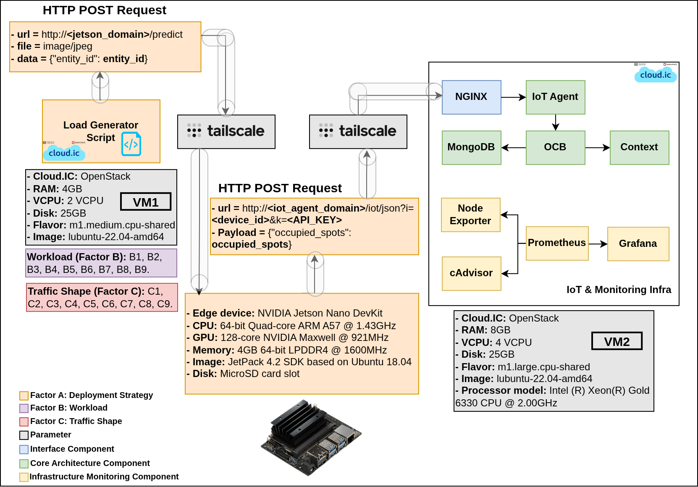

# edge_deploy

This folder contains the complete artifact set that implements the **Edge
deployment** of the multi-tier Digital-Twin Smart-Parking experiment. It
groups the dockerised FIWARE NGSI-LD stack that is brought up for each
load test on VM2, the load-generation harness that emulates the field
devices on VM1, the inference service and tegrastats pipeline that runs
on the **NVIDIA Jetson Nano** edge device, the VM-side provisioning and
measurement scripts, and the deterministic schedule of experiments that
drove the campaign.

The edge deployment is one of the four deployment strategies evaluated
in the experiment (`mist`, `fog`, `edge`, `cloud`); the other three
slices live in the sibling `mist_deploy/`, `fog_deploy/` and
`cloud_deploy/` folders. The four strategies differ in **where the
image processing for vehicle counting is performed**, and consequently
in what the Load Generator Script sends on the wire:

- **mist** — the image is processed locally on the field device (a
  Raspberry Pi in the conceptual design; simulated by the Load Generator
  Script in this benchmark). Only the resulting payload
  (`{"occupied_spots": 10}`) is transmitted to the system.
- **edge** — the parking image is sent to a Jetson Nano co-located with
  the device, which performs the inference and returns the payload.
- **fog** — the parking image is sent to a GPU cluster in the fog tier,
  which performs the inference and returns the payload.
- **cloud** — the parking image is sent to a container in the cloud
  tier, which performs the inference and returns the payload.

In the edge deployment, the Load Generator Script therefore sends the
**raw parking image** (as a `multipart/form-data` upload) to the Jetson
Nano at `http://<jetson_domain>/predict`. The Jetson runs inference and
returns the count, which is then forwarded to VM2 using the **same HTTP
POST structure as mist**:

```
POST http://<iot_agent_domain>/iot/json?i=<device_id>&k=<API_KEY>
Content-Type: application/json

{"occupied_spots": N}
```

The IoT Agent JSON on VM2 translates that payload into a full NGSI-LD
entity update and forwards it to the OLDCB, exactly as in mist.

The experiment spans **two Virtual Machines (VM1 and VM2) plus a Jetson
Nano edge device**, all provisioned on the **IC Cloud (cloud.ic)** — the
OpenStack cloud of the Institute of Computing at UNICAMP. VM1 acts as
the load generator and orchestrator; VM2 hosts the system under test
(the FIWARE stack plus the monitoring exporters); the Jetson Nano runs
the inference service that bridges the two. Communication between the
three nodes is mediated by a **Tailscale** mesh VPN, a software-defined
networking layer that establishes a secure peer-to-peer tunnel between
cloud instances without manual firewall configuration.



*Figure 1 — Edge deployment (official architecture view).*

## Deployment specifications

The two VMs (VM1 and VM2) are OpenStack virtual machines provisioned on
the **IC Cloud (cloud.ic)** of the Institute of Computing at UNICAMP.
The Jetson Nano is the field-edge hardware target. The sections below
make explicit which folder of this repository runs on which node.

> **Software required on VM1, VM2 and the Jetson.** Before any scenario
> can be launched, the following must be installed and configured on
> each of the three nodes:
>
> - **Git** — used to clone this repository to the same path on every
>   node.
> - **Tailscale** — the mesh VPN that lets VM1 reach VM2 and the Jetson
>   across the IC Cloud without manual firewall rules; all three nodes
>   must be authenticated to the same Tailscale network.
> - **Docker** (with the `docker compose` plugin) — VM2 uses it to bring
>   up the FIWARE stack via `infra/compose.yaml`; the Jetson uses it to
>   bring up the inference service via `onJetson/compose.yml`; VM1 uses
>   it implicitly through the SSH-driven workflow.
> - **JetPack 4.x** (Jetson only) — the Jetson Nano's last supported
>   environment (Ubuntu 18.04, Python 3.6) and the NVIDIA runtime that
>   the TensorRT inference engine needs.
>
> Detailed installation steps are listed in the [Quick start /
> Prerequisites](#prerequisites--on-vm1-vm2-and-the-jetson) section.

### VM1 — Load generator / orchestrator

| Field | Value |
|---|---|
| Cloud | IC Cloud / cloud.ic (OpenStack) |
| Flavor | `m1.medium.cpu-shared` |
| vCPU | 2 |
| RAM | 4 GB |
| Disk | 25 GB |
| Image | `ubuntu-22.04-amd64` |
| Role | Executes the Load Generator Script that simulates the field devices and the orchestrator that drives the end-to-end test pipeline. |
| Runs | `onGenScripts/` (orchestrator, load generator, metrics collector, Python venv). The `tests_execution_order/` CSV is consulted manually from VM1 to decide the order in which the experiments are launched. |

### VM2 — IoT & Monitoring infrastructure (system under test)

| Field | Value |
|---|---|
| Cloud | IC Cloud / cloud.ic (OpenStack) |
| Flavor | `m1.large.cpu-shared` |
| vCPU | 4 |
| RAM | 8 GB |
| Disk | 25 GB |
| Image | `ubuntu-22.04-amd64` |
| Processor | Intel(R) Xeon(R) Gold 6330 CPU @ 2.00 GHz |
| Role | Hosts the system under test: the Interface component, the IoT Agent JSON, the OLDCB, MongoDB, and the monitoring exporters. |
| Runs | `infra/` (Docker Compose stack) and `onVMScripts/` (provisioning, measurement, log processing). |

### Edge device — NVIDIA Jetson Nano DevKit

| Field | Value |
|---|---|
| CPU | 64-bit Quad-Core ARM Cortex-A57 @ 1.43 GHz |
| GPU | 128-core NVIDIA Maxwell @ 921 MHz |
| Memory | 4 GB 64-bit LPDDR4 @ 1600 MHz |
| OS | JetPack 4.x (Ubuntu 18.04-based) |
| Storage | MicroSD card |
| NVIDIA runtime | JetPack 4.6.x (latest supported for this device) |
| Role | Receives raw parking images, runs YOLOv11n inference, and forwards the occupancy count to VM2. |
| Runs | `onJetson/` — the FastAPI inference service (TensorRT engine) and the tegrastats log-capture pipeline. |

### Field devices

The edge deployment assumes **more than 100 parking facilities at the
UNICAMP campus**. In the conceptual design, each parking would be
associated with a Raspberry Pi that captures a raw image and sends it
to the co-located Jetson Nano; the Jetson performs the inference and
returns the count, which the device then forwards to the system. In the
benchmark harness used in this experiment, no Raspberry Pi is actually
deployed: every field device is **simulated** by the Load Generator
Script running on VM1, which uploads the same parking image
(`onGenScripts/test.jpg`) as a `multipart/form-data` payload to the
Jetson's `/predict` endpoint.

## Data flow

The Load Generator Script, executing on VM1, emulates a device by
sending an HTTP `POST` request whose target is the **Jetson Nano** at
`<jetson_domain>:8000/predict`. The body is a `multipart/form-data`
upload that carries the raw parking image as the `file` field and the
target NGSI-LD entity id as a form field. The Jetson runs inference and
forwards the resulting count to the IoT Agent on VM2.

```text
POST http://<jetson_domain>:8000/predict
Content-Type: multipart/form-data

file=@test.jpg
entity_id=urn:ngsi-ld:OffStreetParking:<device_id>
```

The Jetson's FastAPI service translates the inference result into the
same `{"occupied_spots": N}` shape that mist uses, and posts it to
VM2's IoT Agent:

```text
POST http://<iot_agent_domain>/iot/json?i=<device_id>&k=<API_KEY>
Content-Type: application/json

{"occupied_spots": N}
```

The IoT Agent JSON then translates the payload into a complete entity
update that is forwarded to the OLDCB, and the OLDCB overwrites the
entity in MongoDB with the latest value received for each one.

End-to-end, a single request traverses the following components:

```mermaid
flowchart LR
    LG["Load Generator Script"]
    TS["Tailscale mesh VPN"]
    JET["Jetson Nano — FastAPI /predict (port 8000)"]
    NGX["Interface: NGINX reverse proxy (port 443)"]
    IOTA["IoT Agent JSON (port 4041 / 7896)"]
    OCB["OLDCB / Orion-LD Context Broker (port 1026)"]
    MONGO[("MongoDB (port 27017)")]

    LG -- "HTTP POST /predict (multipart image)" --> TS
    TS -- "encrypted tunnel" --> JET
    JET -- "YOLOv11n inference → HTTP POST /iot/json (occupied_spots payload)" --> TS
    TS -- "encrypted tunnel" --> NGX
    NGX -- "reverse proxy 443 to 7896" --> IOTA
    IOTA -- "NGSI-LD entity update" --> OCB
    OCB -- "persist state" --> MONGO

    classDef client fill:#87CEEB,stroke:#333,stroke-width:2px,color:darkblue
    classDef edge fill:#FFFACD,stroke:#333,stroke-width:2px,color:darkblue
    classDef interface fill:#FFFACD,stroke:#333,stroke-width:2px,color:darkblue
    classDef core fill:#90EE90,stroke:#333,stroke-width:2px,color:darkgreen
    classDef store fill:#FFB6C1,stroke:#DC143C,stroke-width:2px,color:black

    class LG client
    class JET edge
    class NGX interface
    class TS,IOTA,OCB core
    class MONGO store
```



The Interface component is implemented by the NGINX reverse proxy
(`infra/nginx-reverse-proxy/`), the OLDCB is the FIWARE Orion-LD Context
Broker (`infra/orion.yaml`), the IoT Agent JSON is the
`quay.io/fiware/iotagent-json:3.7.0` service (`infra/iot-agent.yaml`),
and the Jetson inference service is the FastAPI/TensorRT stack in
`onJetson/jetson-ml/`.

## Edge device specifics

The edge tier is the only slice of the campaign in which a **neural
network is executed on field hardware** (the Jetson Nano). The full
inference service, the TensorRT export procedure, the rationale for
choosing YOLOv11n over the larger variants, and the tegrastats
log-capture pipeline are documented in
[`onJetson/README.md`](./onJetson/README.md). The short version is:

- The model is exported to **TensorRT** (`.engine`) format, which is
  the only YOLOv11 export that combines a working GPU runtime with
  adequate performance on JetPack 4.6.x. Other formats (PyTorch, ONNX,
  TorchScript, OpenVINO, TensorFlow Lite) either run only on CPU or do
  not work with the JetPack 4 NVIDIA runtime.
- The TensorRT engine is **device-locked**: it must be exported on the
  same Jetson Nano where inference will run.
- Of the three YOLOv11 variants originally considered (`n` nano, `s`
  small, `m` medium), only **YOLOv11n** exports successfully within the
  4 GB memory budget of the Nano. The larger variants fail during
  conversion.
- A container image compatible with JetPack 4 is extended with a
  FastAPI server (`onJetson/jetson-ml/`) that loads the engine, runs a
  warmup prediction on container start, and exposes `/predict` over
  HTTP on port `8000`.
- The service forwards the inference count to VM2's IoT Agent
  internally — VM1 only ever talks to the Jetson; it never posts to
  the IoT Agent directly.

## Experimental design

The campaign is a **4 × 9 × 9 full-factorial design** that probes how
the FIWARE smart-parking stack behaves under different deployment
topologies, traffic intensities, and inter-arrival shapes. The edge
folder is the *edge* slice of that design.

| Factor | Levels | Count | Variable |
|---|---|---|---|
| **A — Deployment Strategy** | `mist`, `fog`, `edge`, `cloud` | 4 | Where the IoT Agent / OLDCB / MongoDB stack lives, and where the inference runs. *This folder holds the `edge` slice.* |
| **B — Workload** | 9 Beta-distribution pairs `(α, β)`: (1,1), (1,5), (5,1), (5,5), (2,5), (5,2), (2,2), (10,10), (100,100) | 9 | Shape used by `load_generator.py` to spread `M` requests across `N` seconds. Labelled B1..B9. |
| **C — Traffic Shape** | 9 `(M, N)` pairs: 136/30, 136/60, 136/120, 136/180, 136/240, 136/300, 250/60, 500/60, 1000/60 | 9 | `M` virtual devices, each posting every `N` seconds. Labelled C1..C9. |

The full design yields **4 × 9 × 9 = 324** experiments, of which
**81 (9 × 9) are the edge slice** driven by `tests_execution_order/`.
For each unitary experiment, **100 internal repetitions were
performed** to ensure statistical robustness.

The 81 edge scenarios are deterministically shuffled (seed 8) into the
committed file
[`randomized_load_test_scenario_seed_8.csv`](./tests_execution_order/randomized_load_test_scenario_seed_8.csv).
The shuffle is reproducible and independent from the seeds used by the
mist, fog and cloud tiers, since those tiers are operated on different
hardware. Full design details and the rationale for per-deployment
randomization are documented in
[`tests_execution_order/README.md`](./tests_execution_order/README.md).

## Folder layout and node assignment

| Folder | Runs on | Role |
|---|---|---|
| `infra/` | **VM2** | Docker Compose stack under test: the Interface component (NGINX), the IoT Agent JSON, the OLDCB (Orion-LD), MongoDB, the LD context broker, and the Prometheus / Grafana / cAdvisor / Node Exporter monitoring exporters. |
| `onVMScripts/` | **VM2** | Numbered shell + Python helpers executed inside VM2 by the orchestrator: health checks, Mongo index creation, service-group registration, device provisioning, verification, log capture, and log post-processing. |
| `onJetson/` | **Jetson Nano** | The edge inference service (`jetson-ml/` — FastAPI + TensorRT/YOLOv11n) and the tegrastats log-capture + CSV-parser pipeline (`scripts/`). |
| `onGenScripts/` | **VM1** | The orchestrator (`edge_deploy_runner.sh`), the load generator (`load_generator.py`), the post-test metrics collector (`get_metrics_posttest.py`), the inference-time helper (`mean_inference_time.sh`), the configuration file (`edge_deploy.conf`), the test image (`test.jpg`) and the Python virtual environment. |
| `tests_execution_order/` | **VM1** (consulted manually by the operator) | Generator and committed seed-8 list of the 81 `(M, N, α, β)` scenarios that make up the edge slice of the full-factorial campaign. The CSV is the source of truth for the order in which the experiments are launched; the operator reads the rows manually and invokes `edge_deploy_runner.sh` for each one. |

```text
edge_deploy/
├── README.md                              ← this file
├── edge_deployment.png                    ← Figure 1 (architecture view)
│
├── infra/                                 (VM2)
│   ├── compose.yaml                       (Docker Compose aggregator)
│   ├── orion.yaml                         (OLDCB / Orion-LD)
│   ├── iot-agent.yaml                     (IoT Agent JSON)
│   ├── mongo.yaml                         (MongoDB back-end)
│   ├── context.yaml                       (LD @context server, Apache httpd)
│   ├── nginx-reverse-proxy.yaml           (Interface component)
│   ├── networks.yaml                      (Docker bridge network)
│   ├── volumes.yaml                       (named volumes)
│   ├── .env.example                       (DOMAIN_NAME, MONITOR_GRAFANA_ROOT_URL)
│   ├── certs/                             (self-signed SSL)
│   │   ├── README.md
│   │   ├── grafana.crt
│   │   └── grafana.key
│   ├── conf/
│   │   └── mime.types                     (Apache MIME types)
│   ├── data-models/                       (JSON-LD contexts)
│   │   ├── datamodels.context-ngsi.jsonld
│   │   ├── json-context.jsonld
│   │   ├── ngsi-context.jsonld
│   │   └── user-context.jsonld
│   ├── monitor-cloud/                     (Prometheus / Grafana / exporters)
│   │   ├── cadvisor.yaml
│   │   ├── monitor-grafana.yaml
│   │   ├── node-exporter.yaml
│   │   ├── prometheus-monitor.yaml
│   │   └── prometheus.yml
│   └── nginx-reverse-proxy/
│       └── nginx.conf                     (TLS termination + reverse proxy)
│
├── onVMScripts/                           (VM2)
│   ├── README.md                          (per-script reference)
│   ├── 0_healthy_waiting.sh
│   ├── 1_create_IoT_Agent_indices_MongoDB.sh
│   ├── 2_create_service_group.sh
│   ├── 3_provision_devices.sh
│   ├── 4_verify_provisioned_devices.sh
│   ├── 7_process_iot_agent_logs.sh
│   ├── collector_logs.sh                  (stand-alone, not in main pipeline)
│   └── cpu_baseline.sh                    (pre-test host CPU baseline)
│
├── onJetson/                              (Jetson Nano)
│   ├── README.md                          (edge service + tegrastats pipeline)
│   ├── compose.yml                        (one-service stack: the FastAPI inference server)
│   ├── .env.example                       (IOT_URL, IOT_KEY)
│   ├── .env                               (gitignored; real values)
│   ├── jetson-ml/                         (inference service)
│   │   ├── app.py                         (FastAPI server: loads yolo11n.engine, /predict)
│   │   ├── Dockerfile                     (ultralytics/ultralytics:latest-jetson-jetpack4 + deps)
│   │   ├── start.sh                       (Gunicorn entry point)
│   │   ├── yolo11n.engine                 (TensorRT engine, device-locked)
│   │   ├── test.jpg                       (warmup image)
│   │   └── README.md                      (full reference for the inference service)
│   └── scripts/                           (tegrastats log capture + CSV parser)
│       ├── log_tegrastats.sh
│       ├── parse_tegrastats_to_csv.sh
│       ├── process_jetson_logs.sh
│       └── README.md                      (full reference for the log pipeline)
│
├── onGenScripts/                          (VM1)
│   ├── README.md                          (orchestrator / load gen / metrics)
│   ├── edge_deploy_runner.sh              (main entry point)
│   ├── load_generator.py
│   ├── get_metrics_posttest.py
│   ├── mean_inference_time.sh             (helper: mean of a Jetson inference CSV)
│   ├── edge_deploy.conf                   (real VM + Jetson credentials — never commit)
│   ├── edge_deploy.conf.example
│   ├── test.jpg                           (sample parking image uploaded to /predict)
│   └── requirements.txt
│
└── tests_execution_order/                 (VM1)
    ├── README.md                          (campaign schedule)
    ├── generate_scenarios.sh              (seeded randomizer)
    └── randomized_load_test_scenario_seed_8.csv
```


## Glossary — thesis terminology → on-disk artifacts

| Thesis term | On-disk artefact |
|---|---|
| Interface component | `infra/nginx-reverse-proxy.yaml` + `infra/nginx-reverse-proxy/nginx.conf` |
| OLDCB (Orion-LD Context Broker) | `infra/orion.yaml` |
| IoT Agent JSON | `infra/iot-agent.yaml` |
| Context broker (LD context server) | `infra/context.yaml` + `infra/data-models/*.jsonld` |
| Monitoring infrastructure | `infra/monitor-cloud/*` (Prometheus, Grafana, cAdvisor, node-exporter) |
| Edge device / inference node | `onJetson/compose.yml` + `onJetson/jetson-ml/` (FastAPI + TensorRT/YOLOv11n) |
| Edge device log pipeline | `onJetson/scripts/` (tegrastats capture, CSV parser, log processor) |
| Load Generator Script | `onGenScripts/load_generator.py` |
| Orchestrator | `onGenScripts/edge_deploy_runner.sh` |
| VM2 provisioning / measurement | `onVMScripts/*` |
| Experimental design / campaign schedule | `tests_execution_order/*` |
| Factor A (Deployment Strategy) | Held constant at `edge` for this folder. |
| Factor B (Workload, B1..B9) | The 9 `(α, β)` Beta-distribution pairs in `generate_scenarios.sh`. |
| Factor C (Traffic Shape, C1..C9) | The 9 `(M, N)` pairs in `generate_scenarios.sh`. |

## Quick start

### Prerequisites — on VM1, VM2 and the Jetson

The three nodes must be prepared before any scenario can run:

1. Install **Tailscale** and authenticate VM1, VM2 and the Jetson to
   the same Tailscale network. This is the mesh VPN that lets VM1
   reach VM2 and the Jetson across the IC Cloud without manual
   firewall rules, and it is also what `edge_deploy.conf` references
   via `VM_tailscale_domain_name` / `VM_tailscale_IPv4` and
   `Jetson_tailscale_domain_name` / `Jetson_tailscale_IPv4`.
2. Install **Docker** (with the `docker compose` plugin) and add the
   operating user to the `docker` group so `docker compose` can run
   without `sudo`. VM2 needs Docker because `infra/compose.yaml` is
   brought up there; the Jetson needs it because
   `onJetson/compose.yml` is brought up there.
3. Install **git** and clone this repository to the same path on all
   three nodes. The path used here, `~/IC-DT-Smart-Parking-Architecture/`,
   is the one referenced by the `VM_dir` / `Jetson_dir` / `LM_dir` /
   `onVM_dir` / `onJetson_dir` / `onGen_dir` / `onInfra_dir` variables
   in `edge_deploy.conf` — if you clone to a different location,
   update those variables accordingly.
4. On the Jetson only, also install **JetPack 4.x** and the NVIDIA
   container runtime. Re-export the `yolo11n.engine` TensorRT engine
   on the exact Jetson unit that will run inference, because TensorRT
   engines are device-locked (see
   [`onJetson/README.md`](./onJetson/README.md)).
5. On VM1 only, also install the Python dependencies required by the
   orchestrator (the runner creates a venv and installs
   `requirements.txt` on first run; this folder does **not** ship a
   pre-built venv).

### Running the campaign — on VM1

```bash
# On VM1, from the repo root
cd multi-tier-deployment/edge_deploy/onGenScripts

# 1. Create your local config (never commit)
cp edge_deploy.conf.example edge_deploy.conf
$EDITOR edge_deploy.conf            # fill in Tailscale VM2 + Jetson credentials

# 2. (optional) regenerate the edge scenario list with a different seed
cd ../tests_execution_order
./generate_scenarios.sh --seed 8   # produces the committed file

# 3. For each row of the CSV, invoke the runner manually
cd ../onGenScripts
./edge_deploy_runner.sh
```

Each run creates a timestamped output directory under
`onGenScripts/edge_deploy_test_M_*_N_*_seed_*_alpha_*_beta_*/` that
holds the latency CSVs, the metrics CSVs, the load-generator logs, the
scp'd VM2 IoT Agent logs, and the scp'd Jetson inference / tegrastats
artefacts.

## Subfolder documentation

- [`onGenScripts/README.md`](./onGenScripts/README.md) — full reference for the runner, load generator, metrics collector and `mean_inference_time.sh` helper.
- [`onVMScripts/README.md`](./onVMScripts/README.md) — full reference for the VM2 provisioning and measurement scripts, including troubleshooting.
- [`onJetson/README.md`](./onJetson/README.md) — the Jetson-side inference service, the TensorRT export procedure, and the tegrastats log-capture pipeline.
- [`tests_execution_order/README.md`](./tests_execution_order/README.md) — full-factorial design, the 81 edge scenarios, and the rationale for the seed-8 ordering.
- [`infra/certs/README.md`](./infra/certs/README.md) — SSL certificate generation for the Interface component.
