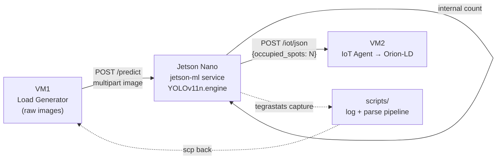

# edge_deploy / onJetson

This folder contains the artefacts that run **on the edge device** of the
Edge deployment slice of the multi-tier Digital-Twin Smart-Parking
experiment. It is the **only place in the entire deployment where a
neural network is executed on field hardware**: a FastAPI service that
loads a TensorRT-optimised YOLOv11n model on the **NVIDIA Jetson Nano
DevKit**, runs vehicle-counting inference on the raw parking images
received from VM1, and forwards the resulting occupancy count to the
IoT Agent on VM2.

The edge tier follows the same VM1+VM2 topology as the other three
deployment strategies (`mist`, `fog`, `cloud`). VM1 acts as the load
generator and orchestrator, VM2 runs the system under test
(Interface + Core + Infrastructure Monitoring), and Tailscale is the
mesh VPN that connects them. The edge-specific deviation is that
**VM1 sends raw parking images** (instead of pre-processed counts) to
the Jetson Nano at `http://<jetson_domain>/predict`, and the Jetson
returns the count, which is then forwarded to VM2 using the same
`POST /iot/json` shape used in the mist deployment:

```
http://<iot_agent_domain>/iot/json?i=<device_id>&k=<API_KEY>
```



## Hardware target

| Field | Value |
|---|---|
| Device | NVIDIA Jetson Nano DevKit |
| CPU | 64-bit Quad-Core ARM Cortex-A57 @ 1.43 GHz |
| GPU | 128-core NVIDIA Maxwell @ 921 MHz |
| Memory | 4 GB 64-bit LPDDR4 @ 1600 MHz |
| OS | JetPack 4.x (Ubuntu 18.04-based) |
| Storage | MicroSD card |
| NVIDIA runtime | JetPack 4.6.x (latest supported for this device) |

## Folder layout

```
onJetson/
├── compose.yml            # one-service stack: the FastAPI inference server
├── .env.example           # template for IOT_URL / IOT_KEY
├── .env                   # gitignored; real values
├── jetson-ml/             # the inference service itself (see its README)
│   ├── app.py             # FastAPI server: loads yolo11n.engine, /predict
│   ├── Dockerfile         # ultralytics/ultralytics:latest-jetson-jetpack4 + deps
│   ├── start.sh           # Gunicorn entry point (4 workers by default)
│   ├── yolo11n.engine     # TensorRT engine (device-locked; see below)
│   ├── test.jpg           # warmup image consumed at container start
│   └── README.md          # full reference for the inference service
└── scripts/               # tegrastats log capture + CSV parser (see its README)
    ├── log_tegrastats.sh
    ├── parse_tegrastats_to_csv.sh
    ├── process_jetson_logs.sh
    └── README.md          # full reference for the log pipeline
```

`jetson-ml/` and `scripts/` each have their own README with the
developer-level reference for what they do. This file is the overview
of the folder as a whole.

## Why TensorRT (and why only `yolo11n`)

The Jetson Nano's last supported environment is **JetPack 4.6.x**
(Ubuntu 18.04, Python 3.6). Within that constraint, several model
formats were tried and rejected:

- **PyTorch** (`.pt`), **ONNX** (`.onnx`), **TorchScript** — CPU
  execution is feasible, but GPU acceleration through the NVIDIA
  runtime is not achievable on JetPack 4.
- **OpenVINO**, **TensorFlow Lite** — incompatible with the JetPack 4
  GPU runtime.
- **TensorRT** (`.engine`) — the only format that combines a working
  GPU runtime with adequate performance.

Two caveats apply to TensorRT on this device:

1. The `.engine` file is **device-locked**. It must be exported on the
   same Jetson Nano where inference will run, because TensorRT bakes
   hardware-specific GPU/CPU capabilities into the engine during
   conversion. A `.engine` produced on an x86 desktop will not load
   on the Nano.
2. The 4 GB of memory constrains the exportable model size.
   **YOLOv11n (nano) is the only YOLOv11 variant that converts
   successfully** on this device; `yolo11s` and `yolo11m` both fail
   during the export step.

The full rationale, the `numpy==1.23.5` pin, and the inference-service
internals are documented in [`jetson-ml/README.md`](./jetson-ml/README.md).

## How to run

### 1. Configure environment

```bash
cp .env.example .env
# edit .env and set:
#   IOT_URL = http://<vm2-domain>:7896/iot/json
#   IOT_KEY = <IoT Agent service-group API key>
```

### 2. Export the TensorRT engine on the Jetson

> [!IMPORTANT]
> The `yolo11n.engine` shipped in this repo was exported on a specific
> Jetson Nano and is not portable. If you re-flash the device, change
> the JetPack minor version, or move the SD card to a different unit,
> you must re-export the engine on that exact hardware.

The export is done once, from the host, using the same Ultralytics
container that the inference service extends. See the official
[Ultralytics NVIDIA Jetson guide](https://docs.ultralytics.com/guides/nvidia-jetson/)
for the full procedure; the short version is:

```bash
t=ultralytics/ultralytics:latest-jetson-jetpack4
sudo docker pull $t && sudo docker run -it --ipc=host --runtime=nvidia $t
```

Inside the container, export and smoke-test:

```bash
yolo export model=yolo11n.pt format=engine   # creates yolo11n.engine
yolo predict model=yolo11n.engine source='https://ultralytics.com/images/bus.jpg'
```

Copy the resulting `yolo11n.engine` into `onJetson/jetson-ml/` so the
build context can pick it up.

### 3. Bring the inference service up

From this folder, on the Jetson:

```bash
docker compose up --build
```

The single `ultralytics-inference` service is built from
`jetson-ml/`, runs the Gunicorn entry point from `start.sh` with
`WORKERS` workers (default `1`), and exposes port `8000` on the host
under the `nvidia` runtime.

### 4. Smoke-test the endpoint

With the container running, a single image can be sent to the
`/predict` endpoint:

```bash
curl -X POST 'http://localhost:8000/predict' \
  -H 'accept: application/json' \
  -H 'Content-Type: multipart/form-data' \
  -F 'file=@./jetson-ml/test.jpg'
```

The service loads `yolo11n.engine` at startup, runs a warmup
prediction on `test.jpg` (so the first real request does not pay the
GPU-upload cost), and from then on answers each `POST /predict` with
an inference count.

## Integration with the rest of the edge tier

This folder is one of three pieces of the edge-tier pipeline:

- `../infra/` — the FIWARE stack on VM2 (Interface + Core + Monitoring).
- `../onGenScripts/` — the load generator and orchestrator on VM1.
- `./onJetson/` — **this folder**, the inference service on the Jetson Nano.

The full per-test pipeline, the random scenario schedule, and the
experimental design live in
[`../README.md`](../README.md) and
[`../onGenScripts/README.md`](../onGenScripts/README.md).
