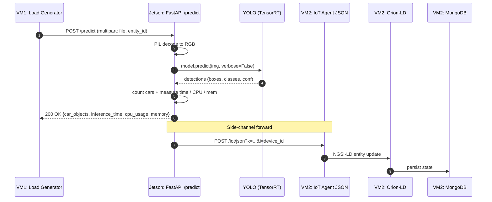
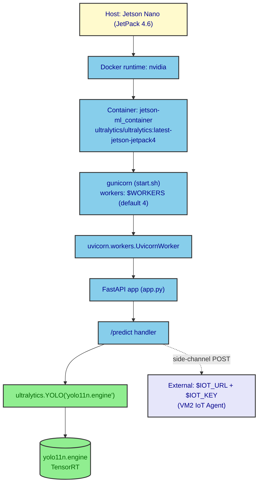
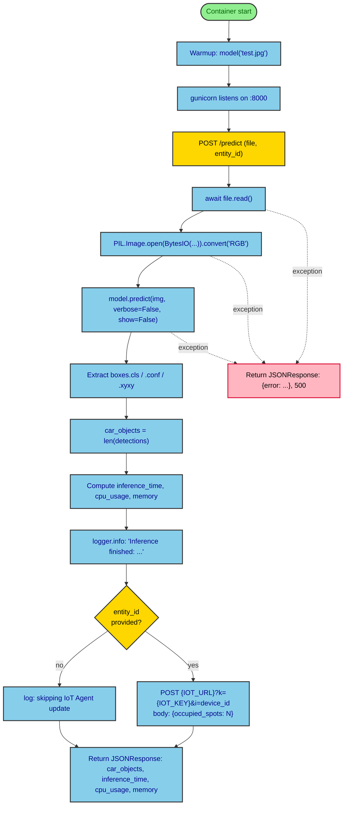

# jetson-ml

This folder is the **edge-tier inference service** of the multi-tier Digital-Twin Smart-Parking experiment. It is the artefact that runs on the **NVIDIA Jetson Nano DevKit** and the only place in the entire deployment where a model is executed on hardware. The FastAPI server in `app.py` loads a TensorRT-optimised YOLOv11n model, performs vehicle counting on the raw parking images sent by VM1, and forwards the resulting occupancy count to the IoT Agent on VM2.

The `mist` tier runs the equivalent workload without any model — VM1 itself produces the count. The `fog` and `cloud` tiers also run a model, but on different hardware. Only this folder targets the Jetson Nano specifically.

## Hardware

| Field | Value |
|---|---|
| Device | NVIDIA Jetson Nano DevKit |
| CPU | 64-bit Quad-Core ARM Cortex-A57 @ 1.43 GHz |
| GPU | 128-core NVIDIA Maxwell @ 921 MHz |
| Memory | 4 GB 64-bit LPDDR4 @ 1600 MHz |
| OS | JetPack 4.x (Ubuntu 18.04-based) |
| Storage | MicroSD card |
| NVIDIA runtime | JetPack 4.6.x (latest supported for this device) |

## Why TensorRT on Jetson

> [!IMPORTANT]
> The latest supported NVIDIA environment for the Jetson Nano is **JetPack 4.6.x** (Ubuntu 18.04-based). Bumping Python or `numpy` to recent versions cascades into dependency conflicts across the inference stack; the Dockerfile therefore pins `numpy==1.23.5` explicitly to land on a working combination.
>
> Within that constraint, several model formats were tried and rejected:
> - **PyTorch** (`.pt`), **ONNX** (`.onnx`), **TorchScript** — CPU execution is feasible, but GPU acceleration through the NVIDIA runtime is not achievable on JetPack 4.
> - **OpenVINO**, **TensorFlow Lite** — incompatible with the JetPack 4 GPU runtime.
>
> **TensorRT** (`.engine`) is the only format that combines a working GPU runtime with adequate performance. Two caveats apply:
> 1. The `.engine` file is **device-locked** — it must be exported on the same Jetson Nano where inference will run, because TensorRT bakes hardware-specific GPU/CPU capabilities into the engine during conversion.
> 2. The Jetson Nano's 4 GB of memory constrains the exportable model size. Only **YOLOv11n (nano)** converts successfully; **YOLOv11s (small)** and **YOLOv11m (medium)** both fail during the export step, very likely because the device cannot complete the conversion within its memory budget.

## File layout

| File | Role |
|---|---|
| `app.py` | FastAPI service. Loads `yolo11n.engine` at startup, runs a warmup prediction on `test.jpg`, exposes `POST /predict` for live inference, and forwards the `{"occupied_spots": N}` payload to the IoT Agent on VM2. |
| `Dockerfile` | Extends `ultralytics/ultralytics:latest-jetson-jetpack4`, pins `numpy==1.23.5` (the combination that avoids the dependency cascade above), installs `fastapi` / `uvicorn` / `gunicorn` / `python-multipart` / `pillow`, copies every artefact in this folder into `/ultralytics/`, exposes port `8000`. |
| `start.sh` | Gunicorn entry point. Defaults to **4 workers** with `UvicornWorker`, timeout `300 s`, bind `0.0.0.0:8000`. The worker count can be overridden with the `WORKERS` env var. |
| `test.jpg` | Sample parking image consumed by the warmup prediction at container start. The actual model weights have to be pre-loaded into GPU memory before the first real request so the first-request latency does not contaminate the measurements. |
| `yolo11n.engine` | The TensorRT engine exported from a trained YOLOv11n checkpoint. This file is **device-locked**; see the [Model export](#model-export) section below. |

## API

### `POST /predict`

Receives a single parking image plus an optional NGSI-LD entity identifier, runs YOLOv11n inference, and returns the count of detected vehicles plus timing, CPU, and memory metrics.

**Request** — `multipart/form-data`:

| Field | Type | Required | Description |
|---|---|---|---|
| `file` | binary | yes | The parking image (any format `PIL.Image.open` accepts). |
| `entity_id` | string | no | A NGSI-LD entity URN (e.g. `urn:ngsi-ld:OffStreetParking:001`) or a plain device id. The service uses the **last colon-separated segment** as the IoT Agent device id; if omitted, the side-channel forward is skipped. |

**Response** — `application/json`:

```json
{
  "car_objects": 2,
  "inference_time_seconds": 0.404425,
  "cpu_usage": 2.9,
  "memory": 3456.2
}
```

| Field | Description |
|---|---|
| `car_objects` | Number of vehicle detections in the image. |
| `inference_time_seconds` | Wall-clock time spent in `model.predict(...)`. |
| `cpu_usage` | System-wide CPU usage sampled at the time the response is built (`psutil.cpu_percent()`). |
| `memory` | Used virtual memory in **MB** at the time the response is built. |

**Error response** — any exception inside the handler returns a `500` with `{"error": "<message>"}`. The full traceback is also written to the container log.

### Side-channel forward

After the response is built, if `entity_id` was supplied, the service issues a synchronous `POST` to the IoT Agent on VM2:

```
POST {IOT_URL}?k={IOT_KEY}&i={device_id}
Content-Type: application/json

{"occupied_spots": <car_objects>}
```

This is the same shape used by the `mist` deployment, so the IoT Agent JSON translates it into a full NGSI-LD entity update and forwards it to the Orion-LD Context Broker.

## Environment variables

The container reads its runtime configuration from the env vars injected by the parent `compose.yml` (which in turn sources them from `../.env`).

| Variable | Default | Purpose |
|---|---|---|
| `IOT_URL` | `http://fiware-iot-agent:7896/iot/json` | Base URL of the IoT Agent JSON on VM2, reachable over the Tailscale mesh. Must include the path, e.g. `http://your-vm-domain:7896/iot/json`. |
| `IOT_KEY` | `12345` | API key used to authenticate the side-channel forward. |
| `WORKERS` | `4` | Number of Gunicorn workers started by `start.sh`. Lower this if you observe memory pressure on the Jetson — each worker holds its own copy of the model in GPU memory. |

A reference template is available at `../.env.example`.

## Model export

Because the `.engine` file is device-locked, it must be generated on the same Jetson Nano that will run inference. The export procedure is:

```bash
# 1. Pull the Ultralytics image that targets JetPack 4 and the Jetson Nano GPU runtime
docker pull ultralytics/ultralytics:latest-jetson-jetpack4

# 2. Run it interactively on the Jetson with the NVIDIA runtime enabled
sudo docker run -it --ipc=host --runtime=nvidia \
    ultralytics/ultralytics:latest-jetson-jetpack4
```

Inside the container, convert a YOLOv11n checkpoint to TensorRT:

```bash
yolo export model=yolo11n.pt format=engine
# creates 'yolo11n.engine' in the working directory
```

> [!WARNING]
> Only the **nano** variant (`yolo11n.pt`) converts successfully on the Jetson Nano. The **small** (`yolo11s.pt`) and **medium** (`yolo11m.pt`) variants both fail during the conversion step — the device cannot complete the export within its memory budget.

Copy the generated `yolo11n.engine` into this folder, rebuild the image, and the next container start will pick it up.

## Build and run

From the parent folder:

```bash
# 1. Create the local env file (never commit)
cp ../.env.example ../.env
$EDITOR ../.env                 # fill in IOT_URL and IOT_KEY

# 2. Build the image and start the container on the NVIDIA runtime
docker compose up --build
```

The service then listens on `http://<jetson_domain>:8000`.

### Smoke test

```bash
curl -X POST 'http://<jetson_domain>:8000/predict' \
     -H 'accept: application/json' \
     -H 'Content-Type: multipart/form-data' \
     -F 'file=@./test.jpg'
```

A successful response returns the JSON envelope described in the API section above. A 500 with `{"error": ...}` usually means the model failed to load — a sign that the `.engine` file was not generated on this hardware.

## End-to-end deployment

```mermaid
flowchart LR
    VM1["VM1: Load Generator Script"]
    TS1["Tailscale mesh VPN"]
    JET["Jetson Nano: jetson-ml service<br/>(this folder)"]
    TS2["Tailscale mesh VPN"]
    IOTA["VM2: IoT Agent JSON"]
    OCB["VM2: Orion-LD Context Broker"]
    MONGO[("VM2: MongoDB")]

    VM1 -- "POST /predict (image, entity_id)" --> TS1
    TS1 -- "encrypted tunnel" --> JET
    JET -- "side-channel POST {occupied_spots: N}" --> TS2
    TS2 --> IOTA
    IOTA -- "NGSI-LD entity update" --> OCB
    OCB -- "persist state" --> MONGO

    classDef client fill:#87CEEB,stroke:#333,stroke-width:2px,color:darkblue
    classDef interface fill:#FFFACD,stroke:#333,stroke-width:2px,color:darkblue
    classDef core fill:#90EE90,stroke:#333,stroke-width:2px,color:darkgreen
    classDef store fill:#FFB6C1,stroke:#DC143C,stroke-width:2px,color:black
    classDef inference fill:#E6E6FA,stroke:#333,stroke-width:2px,color:darkblue

    class VM1 client
    class JET inference
    class IOTA,OCB core
    class MONGO store
```



The arrow leaving the Jetson is a **side-channel**: the same `/predict` HTTP call returns the metrics to VM1 *and* triggers a second HTTP POST to the IoT Agent on VM2. The Load Generator never sees the count directly — it only sees the metrics envelope.

## `/predict` sequence



## Container internals



## `/predict` request lifecycle



## Glossary

| Term | Artefact |
|---|---|
| Edge device | This folder; the FastAPI service running on the Jetson Nano. |
| TensorRT engine | `yolo11n.engine` — the only model format that gives the Jetson Nano a working GPU runtime. |
| Load Generator Script | Runs on VM1; sends the raw images that arrive here. |
| IoT Agent JSON | Lives on VM2; receives the `{"occupied_spots": N}` side-channel POST. |
| NGSI-LD update | The normalised entity update produced by the IoT Agent and forwarded to the OLDCB. |
| Tailscale | The mesh VPN that connects VM1, the Jetson, and VM2. |
| Warmup prediction | The `model("test.jpg")` call at container start, used to load the model weights into GPU memory before the first real request. |
