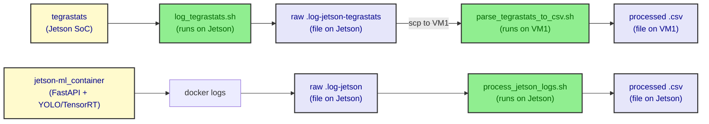

# onJetson/scripts

This folder holds the **log-capture and log-to-CSV helpers** that run
on and around the **NVIDIA Jetson Nano** edge device of the
[edge deployment](../README.md) campaign. The three scripts are the
last step of the per-test pipeline: they turn the raw bytes produced
by `tegrastats` and by the `jetson-ml_container` into CSV files that
the rest of the campaign consumes.

The full data-flow narrative, the per-phase orchestrator, and the
experimental design live in the parent
[`../README.md`](../README.md) and in the VM1 / load-generator
[`../onGenScripts/README.md`](../onGenScripts/README.md); this README
is a developer reference for the three scripts in this folder only.

## Pipeline at a glance

The three scripts form a small ETL: capture → parse. They are
invoked by `edge_deploy_runner.sh` from VM1 over SSH, and they write
their outputs into the per-run directory
`edge_deploy_test_M_{M}_N_{N}_seed_{seed}_alpha_{alpha}_beta_{beta}/`
under `onGenScripts/`.



The two parser paths are deliberately asymmetric: the `tegrastats`
parser is too slow to run on the Jetson itself, so the raw stream is
`scp`d back to the load-generator host (VM1) and parsed there. The
`jetson-ml` container log is small and is parsed on-device, in the
same SSH session that captures it. The `log_tegrastats.sh` script
runs in a `nohup` background process on the Jetson so the
orchestrator on VM1 can keep going with the rest of the pipeline; the
runner does not explicitly stop it, so the process keeps writing to
the per-run file until the OS is rebooted or it is killed manually
on the Jetson (e.g. `pkill tegrastats`).

## Where each script runs

| Script | Invoked from | Runs on | Purpose |
|---|---|---|---|
| `log_tegrastats.sh` | `edge_deploy_runner.sh`, Phase 1 (over SSH) | **Jetson** | Stream `tegrastats` to a file in the background. |
| `process_jetson_logs.sh` | `edge_deploy_runner.sh`, Phase 6 (over SSH) | **Jetson** | Extract `Inference finished: …` lines from the `jetson-ml_container` log into CSV. |
| `parse_tegrastats_to_csv.sh` | `edge_deploy_runner.sh`, Phase 6 (locally on VM1) | **VM1 (load-generator host)** | Convert the raw `tegrastats` stream into CSV. |

> All three scripts are pure shell, follow `set -euo pipefail`, accept
> long-option arguments, validate inputs, and print a usage banner on
> `-h` / `--help` or on a missing/invalid flag. None of them mutate
> global state outside the file they are writing.

## File reference

The subsections below are ordered by when each script runs at runtime.

### `log_tegrastats.sh`

```bash
./log_tegrastats.sh --output-file <path>
```

Streams the output of the Jetson `tegrastats` utility to `<path>`,
creating parent directories as needed. Behaviour:

- Verifies that the `tegrastats` binary is on `PATH`; exits non-zero
  with a clear error if it is missing (it is part of the JetPack
  userspace and is not always installed in stripped-down images).
- `mkdir -p`s the destination directory, then `tee`s `tegrastats` to
  the output file so the same stream is visible on stdout and on disk.
- The script does **not** background itself; the runner wraps the
  call in `nohup … &` so that the load generator on VM1 can continue
  while `tegrastats` keeps writing. The runner does not explicitly
  stop the process after the test, so the `tegrastats` background
  process keeps writing to the file until it is killed manually
  (e.g. `pkill tegrastats` on the Jetson) or the device reboots.

Sample invocation in the runner (`edge_deploy_runner.sh`, Phase 1):

```bash
nohup "$Jetson_dir/$onJetson_dir/scripts/log_tegrastats.sh" \
  --output-file "$Jetson_dir/$onJetson_dir/$DIRNAME/raw_logs_jetson_tegrastats_M${M}_N${N}_seeds${seed}_alpha${alpha}_beta${beta}.log-jetson-tegrastats" \
  > "$Jetson_dir/$onJetson_dir/$DIRNAME/tegrastats_stdout.log" 2>&1 &
```

A single `tegrastats` line looks like:

```text
RAM 1844/3964MB (lfb 246x4MB) SWAP 0/4952MB (cached 0MB) CPU [19%,18%,16%,20@1420,off,off,off] EMC_FREQ 0% GR3D_FREQ 0% PLL@45C CPU@46C PMIC@43C GPU@44C AO@45.5C thermal@45.25C
```

### `parse_tegrastats_to_csv.sh`

```bash
./parse_tegrastats_to_csv.sh --input-file <log> [--output-file <csv>]
```

Converts the raw `tegrastats` stream captured by `log_tegrastats.sh`
into a flat CSV. Behaviour:

- Defaults `--output-file` to `<input>.csv` (extension stripped) when
  not provided.
- Emits a 19-column header on the first line, then one CSV record per
  input line. The order and meaning of the columns is fixed and is the
  contract that the rest of the offline analysis depends on.
- Uses `grep -oP` per field, so missing or non-matching fields land as
  empty strings rather than aborting the row — useful when a partial
  `tegrastats` line slips through.

CSV column reference (in header order):

| # | Column | Source in `tegrastats` line | Unit |
|---|---|---|---|
| 1 | `ram_used_MB` | `RAM used/…` | MB |
| 2 | `ram_total_MB` | `RAM …/total` | MB |
| 3 | `lfb_free_contiguous_blocks` | `lfb Nx…` (largest free block count) | blocks |
| 4 | `lfb_block_size_MB` | `lfb …xMB` (block size) | MB |
| 5 | `swap_used_MB` | `SWAP used/…` | MB |
| 6 | `swap_total_MB` | `SWAP …/total` | MB |
| 7 | `swap_data_cached_MB` | `SWAP … (cached CACHEMB)` | MB |
| 8..11 | `cpu_0_percent`..`cpu_3_percent` | `CPU [a%,b%,c%,d@…,…]` (per-core, `@freq` stripped) | % |
| 12 | `external_memory_controller_percent` | `EMC_FREQ N%` | % |
| 13 | `gpu_workload_percent` | `GR3D_FREQ N%` | % |
| 14 | `phase_locked_loop_Celsius` | `PLL@N.NC` | °C |
| 15 | `cpu_temp_Celsius` | `CPU@N.NC` | °C |
| 16 | `pmic_temp_Celsius` | `PMIC@N.NC` | °C |
| 17 | `gpu_temp_Celsius` | `GPU@N.NC` | °C |
| 18 | `ao_temp_Celsius` | `AO@N.NC` | °C |
| 19 | `combined_system_temperature_estimate_Celsius` | `thermal@N.NNC` | °C |

> **Naming caveat.** Columns 12 and 13 carry the literal
> `EMC_FREQ` / `GR3D_FREQ` *percent* values that the JetPack build of
> `tegrastats` emits (not the underlying frequencies); the header
> names reflect the source token, not a unit conversion. Consumers
> of the CSV should treat them as the `tegrastats` percent figure.

### `process_jetson_logs.sh`

```bash
./process_jetson_logs.sh --input-file <log> [--output-file <csv>]
```

Pulls the per-request inference metrics out of the
`jetson-ml_container` log and writes a 4-column CSV. Behaviour:

- Defaults `--output-file` to `parsed_inference.csv` in the current
  directory when not provided.
- Greps for lines matching the `INFO:inference:Inference finished:`
  prefix emitted by the FastAPI service in
  [`../jetson-ml/app.py`](../jetson-ml/app.py) (line 68), then runs
  four `sed -E` substitutions per line to extract the values.
- Writes the header `inference_time_s,cars,cpu_usage_percent,mem_used_MB`
  followed by one record per matched line.

Sample matched line (as produced by `app.py`):

```text
INFO:inference:Inference finished:  0.404425 sec, cars=2, CPU=2.9%, MEM=3456.2MB
```

The four columns are:

| Column | Source token | Unit |
|---|---|---|
| `inference_time_s` | `Inference finished: T sec` | seconds |
| `cars` | `cars=N` | count |
| `cpu_usage_percent` | `CPU=N%` | % |
| `mem_used_MB` | `MEM=N.NMB` | MB |

Non-matching lines (container startup, model warm-up, `/predict`
warnings, forwarding failures) are silently skipped.

## Quick start

The three scripts are not meant to be run by hand during a normal
campaign — they are pieces of `edge_deploy_runner.sh`. Use them
directly only when iterating on the parser, replaying a captured log,
or re-processing an old run.

```bash
# 1. Capture tegrastats to a file (Ctrl+C to stop)
./log_tegrastats.sh --output-file /tmp/tegrastats.log

# 2. Convert a captured tegrastats stream to CSV
./parse_tegrastats_to_csv.sh \
  --input-file  /tmp/tegrastats.log \
  --output-file /tmp/tegrastats.csv

# 3. Extract inference metrics from a container log
./process_jetson_logs.sh \
  --input-file  /path/to/raw_logs_jetson-ml_container_*.log-jetson \
  --output-file /tmp/inference.csv
```

> Make sure `tegrastats` is on the `PATH` of the shell that runs
> `log_tegrastats.sh` — on a vanilla JetPack 4.x image it lives in
> `/usr/bin/tegrastats`.

## See also

- [`../README.md`](../README.md) — edge_deploy campaign overview,
  data-flow diagram, and experimental design.
- [`../onGenScripts/README.md`](../onGenScripts/README.md) — the
  orchestrator that invokes all three scripts in Phase 1 and Phase 6,
  and the per-run directory layout these scripts write into.
- [`../jetson-ml/README.md`](../jetson-ml/README.md) — the
  FastAPI + YOLO/TensorRT container whose `INFO:inference:` log lines
  feed `process_jetson_logs.sh`.
- [`../jetson-ml/app.py`](../jetson-ml/app.py) — exact format of
  the `Inference finished: …` log line that the parser expects.
- [`../compose.yml`](../compose.yml) — the Jetson-side Compose file
  that brings the inference service up; the runner starts it before
  kicking off `log_tegrastats.sh`.
