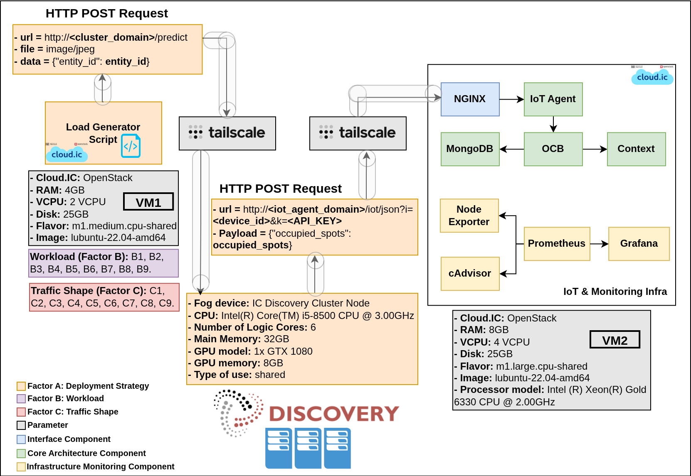

# fog_deploy

This folder contains the complete artefact set that implements the **Fog
deployment** of the multi-tier Digital-Twin Smart-Parking experiment. It
groups the dockerised FIWARE NGSI-LD stack that is brought up for each
load test, the load-generation harness that emulates the field devices,
the VM-side provisioning and measurement scripts, the GPU inference
service that runs on a node of the IC Discovery Lab cluster, and the
deterministic schedule of experiments that drove the campaign.

The fog deployment is one of the four deployment strategies evaluated in
the experiment (`mist`, `fog`, `edge`, `cloud`); the other three slices
live in the sibling `mist_deploy/`, `edge_deploy/` and `cloud_deploy/`
folders. The four strategies differ in **where the image processing for
vehicle counting is performed**, and consequently in what the Load
Generator Script sends on the wire:

- **mist** — the image is processed locally on the field device (a
  Raspberry Pi in the conceptual design; simulated by the Load Generator
  Script in this benchmark). Only the resulting payload
  (`{"occupied_spots": 10}`) is transmitted to the system.
- **edge** — the parking image is sent to a Jetson Nano co-located with
  the device, which performs the inference and returns the payload.
- **fog** — the parking image is sent to a GPU cluster in the fog tier,
  which performs the inference and returns the payload.
- **cloud** — the parking image is sent to a container in the cloud
  tier, which performs the inference and returns the payload.

In `edge`, `fog` and `cloud`, the Load Generator Script therefore sends
the parking image and the receiving component performs the inference.
The mist tier is the one exception: it sends the pre-processed count
directly with no inference step.

The fog experiment spans **two OpenStack VMs in the IC Cloud (cloud.ic)
plus a node of the IC Discovery Lab cluster**:

- **VM1** — load generator and orchestrator. Sends raw parking images
  to the cluster node.
- **IC Discovery Lab cluster node** — the fog tier's inference host.
  Runs the FastAPI service that loads the TensorRT-optimised
  **YOLOv11m** model and forwards the count to VM2.
- **VM2** — system under test: the FIWARE NGSI-LD stack (Interface +
  Core + Infrastructure Monitoring).

Communication between VM1, the cluster node, and VM2 is mediated by
**Tailscale**, the same software-defined peer-to-peer mesh VPN used by
the other tiers.



*Figure 1 — Fog deployment (official architecture view).*

## Deployment specifications

The two VMs are OpenStack virtual machines on the **IC Cloud
(cloud.ic)** of the Institute of Computing at UNICAMP. The cluster node
is a shared resource of the [IC Discovery Lab](https://discovery.ic.unicamp.br)
and is *not* a VM that the operator provisions.

> **Software required on VM1 and VM2 (and on the cluster node for the
> pieces that live there).** Before any scenario can be launched:
>
> - **Git** — used to clone this repository to the same path on VM1
>   and VM2.
> - **Tailscale** — the mesh VPN that lets VM1, VM2 and the cluster
>   node reach each other across the IC Cloud without manual firewall
>   rules; all three must be authenticated to the same Tailscale
>   network.
> - **Docker** (with the `docker compose` plugin) — VM2 uses it to
>   bring up the FIWARE stack via `infra/compose.yaml`; the cluster
>   node uses it to bring up the inference service via
>   `onCluster/compose.yml`.
>
> Detailed per-host setup is documented in the [Quick start](#quick-start)
> section and in the per-folder READMEs linked at the end of this file.

### VM1 — Load generator / orchestrator

| Field | Value |
|---|---|
| Cloud | IC Cloud / cloud.ic (OpenStack) |
| Flavor | `m1.medium.cpu-shared` |
| vCPU | 2 |
| RAM | 4 GB |
| Disk | 25 GB |
| Image | `ubuntu-22.04-amd64` |
| Role | Sends raw parking images to the cluster `/predict` endpoint; drives the orchestrated test pipeline. |
| Runs | `onGenScripts/` (orchestrator, load generator, metrics collector, Python venv). The `tests_execution_order/` CSV is consulted manually from VM1 to decide the order in which the experiments are launched. |

### IC Discovery Lab cluster node — Fog inference host

| Field | Value |
|---|---|
| Provider | [IC Discovery Lab](https://discovery.ic.unicamp.br) (shared) |
| CPU | Intel Core i5-8500 @ 3.00 GHz (6 cores) |
| RAM | 32 GB |
| GPU | NVIDIA GeForce GTX 1080, 8 GB |
| Stack | TensorRT 8.6 + CUDA 11.8 (newer stacks drop support for SM 6.1) |
| Model | YOLOv11m → TensorRT (`.engine`) |
| Role | FastAPI service that runs vehicle-counting inference and forwards the count to VM2. |
| Runs | `onCluster/` (Compose stack + GPU/container log capture). |

> The cluster has other GPU nodes available (RTX 5000, RTX 4090, RTX
> A6000, GTX 1080) — this thesis used the GTX 1080. The shared-shell
> constraint is what makes the cluster-side phases operator-driven; see
> `onCluster/README.md` for the manual checklist.

### VM2 — IoT & Monitoring infrastructure (system under test)

| Field | Value |
|---|---|
| Cloud | IC Cloud / cloud.ic (OpenStack) |
| Flavor | `m1.large.cpu-shared` |
| vCPU | 4 |
| RAM | 8 GB |
| Disk | 25 GB |
| Image | `ubuntu-22.04-amd64` |
| Processor | Intel(R) Xeon(R) Gold 6330 CPU @ 2.00 GHz |
| Role | Hosts the system under test: the Interface component, the IoT Agent JSON, the OLDCB, MongoDB, and the monitoring exporters. |
| Runs | `infra/` (Docker Compose stack) and `onVMScripts/` (provisioning, measurement, log processing). |

## Data flow

The Load Generator on VM1 sends a raw parking image to the cluster node's
FastAPI `/predict` endpoint, the cluster node runs YOLOv11m inference on
the GTX 1080 and returns the count, and the cluster node then forwards
the count to VM2 over the same IoT Agent endpoint used by the mist and
edge tiers:

```text
POST http://<iot_agent_domain>/iot/json?i=<device_id>&k=<API_KEY>
Content-Type: application/json

{"occupied_spots": N}
```

The IoT Agent JSON on VM2 translates the payload into a full NGSI-LD
entity update and forwards it to the OLDCB, which persists the new state
in MongoDB. The Infrastructure Monitoring component (Prometheus +
cAdvisor + Node Exporter + Grafana) collects and visualizes host- and
container-level metrics throughout the run.

```mermaid
flowchart LR
    LG["Load Generator Script (VM1)"]
    TS1["Tailscale mesh VPN"]
    CLU["Discovery cluster node<br/>FastAPI + YOLOv11m/TensorRT (GTX 1080)"]
    TS2["Tailscale mesh VPN"]
    NGX["Interface: NGINX reverse proxy (port 443)"]
    IOTA["IoT Agent JSON (port 4041 / 7896)"]
    OCB["OLDCB / Orion-LD Context Broker (port 1026)"]
    MONGO[("MongoDB (port 27017)")]

    LG -- "POST /predict<br/>raw image + entity_id" --> TS1
    TS1 -- "encrypted tunnel" --> CLU
    CLU -- "POST /iot/json<br/>{occupied_spots: N}" --> TS2
    TS2 -- "encrypted tunnel" --> NGX
    NGX -- "reverse proxy 443 to 7896" --> IOTA
    IOTA -- "NGSI-LD entity update" --> OCB
    OCB -- "persist state" --> MONGO

    classDef client fill:#87CEEB,stroke:#333,stroke-width:2px,color:darkblue
    classDef infer fill:#FFE4B5,stroke:#333,stroke-width:2px,color:darkblue
    classDef interface fill:#FFFACD,stroke:#333,stroke-width:2px,color:darkblue
    classDef core fill:#90EE90,stroke:#333,stroke-width:2px,color:darkgreen
    classDef store fill:#FFB6C1,stroke:#DC143C,stroke-width:2px,color:black

    class LG client
    class CLU infer
    class NGX interface
    class TS1,TS2,IOTA,OCB core
    class MONGO store
```



## Experimental design

The campaign is a **4 × 9 × 9 full-factorial design** that probes how the
FIWARE smart-parking stack behaves under different deployment
topologies, traffic intensities, and inter-arrival shapes. The fog folder
is the *fog* slice of that design.

| Factor | Levels | Count | Variable |
|---|---|---|---|
| **A — Deployment Strategy** | `mist`, `fog`, `edge`, `cloud` | 4 | Where the inference host and the IoT Agent / OLDCB / MongoDB stack live. *This folder holds the `fog` slice.* |
| **B — Workload** | 9 Beta-distribution pairs `(α, β)`: (1,1), (1,5), (5,1), (5,5), (2,5), (5,2), (2,2), (10,10), (100,100) | 9 | Shape used by `load_generator.py` to spread `M` requests across `N` seconds. Labelled B1..B9. |
| **C — Traffic Shape** | 9 `(M, N)` pairs: 136/30, 136/60, 136/120, 136/180, 136/240, 136/300, 250/60, 500/60, 1000/60 | 9 | `M` virtual devices, each posting every `N` seconds. Labelled C1..C9. |

The full design yields **4 × 9 × 9 = 324** experiments, of which
**81 (9 × 9) are the fog slice** driven by `tests_execution_order/`. For
each unitary experiment, **100 internal repetitions were performed** to
ensure statistical robustness.

The 81 fog scenarios are deterministically shuffled (seed 37) into the
committed file
[`randomized_load_test_scenario_seed_37.csv`](./tests_execution_order/randomized_load_test_scenario_seed_37.csv).
The shuffle is reproducible and independent from the seeds used by the
mist, edge and cloud tiers, since those tiers are operated on different
hardware. Full design details and the rationale for per-deployment
randomization are documented in
[`tests_execution_order/README.md`](./tests_execution_order/README.md).

## Folder layout and host assignment

| Folder | Runs on | Role |
|---|---|---|
| `infra/` | **VM2** | Docker Compose stack under test: the Interface component (NGINX), the IoT Agent JSON, the OLDCB (Orion-LD), MongoDB, the LD context broker, and the Prometheus / Grafana / cAdvisor / Node Exporter monitoring exporters. |
| `onVMScripts/` | **VM2** | Numbered shell + Python helpers executed inside VM2 by the orchestrator: health checks, Mongo index creation, service-group registration, device provisioning, verification, log capture, and log post-processing. |
| `onGenScripts/` | **VM1** | The orchestrator (`fog_deploy_runner.sh`), the load generator (`load_generator.py`), the post-test metrics collector (`get_metrics_posttest.py`), the configuration file (`fog_deploy.conf`) and the Python virtual environment. |
| `onCluster/` | **Discovery cluster node** | The FastAPI + YOLOv11m/TensorRT inference service (Tailscale sidecar + FastAPI container), plus the GPU/container telemetry ETL that the cluster side has to drive manually. |
| `tests_execution_order/` | **VM1** (consulted manually by the operator) | Generator and committed seed-37 list of the 81 `(M, N, α, β)` scenarios that make up the fog slice of the full-factorial campaign. |

```text
fog_deploy/
├── README.md                              ← this file
├── fog_deployment.png                     ← Figure 1 (architecture view)
├── AGENTS.md                              ← thesis excerpts for the fog tier (gitignored)
│
├── infra/                                 (VM2)
│   ├── README.md                          (stack details, deltas vs mist/edge, quick start)
│   ├── compose.yaml                       (Docker Compose aggregator)
│   ├── orion.yaml                         (OLDCB / Orion-LD)
│   ├── iot-agent.yaml                     (IoT Agent JSON)
│   ├── mongo.yaml                         (MongoDB back-end)
│   ├── context.yaml                       (LD @context server, Apache httpd)
│   ├── nginx-reverse-proxy.yaml           (Interface component)
│   ├── networks.yaml                      (Docker bridge network)
│   ├── volumes.yaml                       (named volumes)
│   ├── .env.example                       (DOMAIN_NAME, MONITOR_GRAFANA_ROOT_URL)
│   ├── certs/                             (self-signed SSL)
│   ├── conf/                              (Apache MIME types)
│   ├── data-models/                       (JSON-LD contexts)
│   ├── monitor-cloud/                     (Prometheus / Grafana / exporters)
│   └── nginx-reverse-proxy/               (TLS termination + reverse proxy)
│
├── onVMScripts/                           (VM2)
│   └── README.md                          (per-script reference)
│
├── onGenScripts/                          (VM1)
│   ├── README.md                          (orchestrator / load gen / metrics)
│   ├── fog_deploy_runner.sh               (main entry point)
│   ├── load_generator.py                  (sends raw images to /predict, then occupied_spots to VM2)
│   ├── get_metrics_posttest.py
│   ├── mean_inference_time.sh
│   ├── fog_deploy.conf                    (real VM credentials — never commit)
│   ├── fog_deploy.conf.example
│   ├── requirements.txt
│   ├── test.jpg                           (sample image used by smoke tests)
│   └── venv/
│
├── onCluster/                             (Discovery cluster node)
│   ├── README.md                          (FastAPI + YOLOv11m/TensorRT, manual checklist)
│   ├── compose.yml                        (Tailscale sidecar + fastapi-app)
│   ├── .env.example                       (IOT_URL, IOT_KEY, TS_AUTHKEY)
│   ├── cluster-ml/                        (FastAPI service, model export, API contract)
│   │   ├── README.md
│   │   ├── app.py
│   │   ├── Dockerfile
│   │   ├── start.sh
│   │   ├── yolo11m.engine                 (device-locked to the GTX 1080)
│   │   ├── test.jpg
│   │   └── requirements.txt
│   └── scripts/                           (cluster-side nvidia-smi + docker-logs ETL)
│       └── README.md
│
└── tests_execution_order/                 (VM1)
    ├── README.md                          (campaign schedule, seed-37 list)
    ├── generate_scenarios.sh              (seeded randomizer)
    └── randomized_load_test_scenario_seed_37.csv
```

## Glossary — thesis terminology → on-disk artifacts

| Thesis term | On-disk artefact |
|---|---|
| Interface component | `infra/nginx-reverse-proxy.yaml` + `infra/nginx-reverse-proxy/nginx.conf` |
| OLDCB (Orion-LD Context Broker) | `infra/orion.yaml` |
| IoT Agent JSON | `infra/iot-agent.yaml` |
| Context broker (LD context server) | `infra/context.yaml` + `infra/data-models/*.jsonld` |
| Monitoring infrastructure | `infra/monitor-cloud/*` (Prometheus, Grafana, cAdvisor, node-exporter) |
| Fog inference node | `onCluster/compose.yml` + `onCluster/cluster-ml/` (FastAPI + YOLOv11m/TensorRT) |
| Load Generator Script | `onGenScripts/load_generator.py` |
| Orchestrator | `onGenScripts/fog_deploy_runner.sh` |
| VM2 provisioning / measurement | `onVMScripts/*` |
| Experimental design / campaign schedule | `tests_execution_order/*` |
| Factor A (Deployment Strategy) | Held constant at `fog` for this folder. |
| Factor B (Workload, B1..B9) | The 9 `(α, β)` Beta-distribution pairs in `generate_scenarios.sh`. |
| Factor C (Traffic Shape, C1..C9) | The 9 `(M, N)` pairs in `generate_scenarios.sh`. |

## Quick start

The fog experiment has **three** hosts. Run the steps in this order.

### 1. Prepare VM1 and VM2

On **both** VMs, install Tailscale, Docker (with `docker compose`), and
git; clone the repo to the same path on both VMs. The path used here,
`~/IC-DT-Smart-Parking-Architecture/`, is the one referenced by the
`VM_dir` / `LM_dir` / `onVM_dir` / `onGen_dir` / `onInfra_dir` variables
in `fog_deploy.conf` — if you clone elsewhere, update those variables
accordingly.

### 2. Prepare VM2 (system under test)

```bash
# On VM2, from the repo root
cd multi-tier-deployment/fog_deploy/infra
cp .env.example .env && $EDITOR .env          # set DOMAIN_NAME
source .env
openssl req -x509 -nodes -days 365 -newkey rsa:2048 \
  -keyout certs/grafana.key -out certs/grafana.crt \
  -subj "/CN=${DOMAIN_NAME}"
# Edit nginx.conf to put DOMAIN_NAME on the two server_name lines.
docker compose up -d
```

Full per-step reference: [`infra/README.md`](./infra/README.md).

### 3. Prepare the cluster node (fog inference host)

```bash
# On the cluster node, from the repo root
cd multi-tier-deployment/fog_deploy/onCluster
cp .env.example .env && $EDITOR .env          # IOT_URL, IOT_KEY, TS_AUTHKEY
docker compose up --build
```

The `yolo11m.engine` shipped in this repo was exported on a specific
GTX 1080 and is **device-locked**. Re-export it on the cluster node
that will run the inference. Full procedure and the `torch==2.0.1+cu118`
pin: [`onCluster/cluster-ml/README.md`](./onCluster/cluster-ml/README.md).

### 4. Smoke-test the cluster endpoint

```bash
curl -X POST 'http://<cluster-tailscale-domain>:8000/predict' \
  -H 'accept: application/json' \
  -H 'Content-Type: multipart/form-data' \
  -F 'file=@./onCluster/cluster-ml/test.jpg' \
  -F 'entity_id=urn:ngsi-ld:OffStreetParking:001'
```

### 5. Run the campaign from VM1

```bash
# On VM1, from the repo root
cd multi-tier-deployment/fog_deploy/onGenScripts
cp fog_deploy.conf.example fog_deploy.conf
$EDITOR fog_deploy.conf                      # Tailscale + cluster + VM2 credentials
source venv/bin/activate

# (optional) regenerate the fog scenario list with a different seed
cd ../tests_execution_order
./generate_scenarios.sh --seed 37

# For each row of the CSV, invoke the runner manually
cd ../onGenScripts
./fog_deploy_runner.sh
```

The cluster-side telemetry pipeline (`nvidia-smi` + `docker logs` → CSV)
is operator-driven, not orchestrated from VM1. See
[`onCluster/scripts/README.md`](./onCluster/scripts/README.md) for the
`run_cluster_scripts.sh` checklist that runs alongside each scenario.

Each run creates a timestamped output directory under
`onGenScripts/fog_deploy_test_M_*_N_*_seed_*_alpha_*_beta_*/` that holds
the latency CSVs, the metrics CSVs, the load-generator logs, and the
`scp`d VM2 artefacts.

## Subfolder documentation

- [`infra/README.md`](./infra/README.md) — full VM2 stack reference, container versions, and the intentional deltas vs `mist_deploy/infra/` and `edge_deploy/infra/`.
- [`onGenScripts/README.md`](./onGenScripts/README.md) — orchestrator phases, load generator, and the metrics collector.
- [`onVMScripts/README.md`](./onVMScripts/README.md) — per-script reference for the VM2 provisioning and measurement pipeline.
- [`onCluster/README.md`](./onCluster/README.md) — the cluster-side FastAPI + YOLOv11m/TensorRT service, the Tailscale sidecar, and the operator's manual checklist.
- [`onCluster/cluster-ml/README.md`](./onCluster/cluster-ml/README.md) — model export, API contract, and the env-var reference for the inference service.
- [`onCluster/scripts/README.md`](./onCluster/scripts/README.md) — cluster-side GPU and container telemetry ETL.
- [`tests_execution_order/README.md`](./tests_execution_order/README.md) — full-factorial design, the 81 fog scenarios, and the rationale for the seed-37 ordering.
- [`infra/certs/README.md`](./infra/certs/README.md) — SSL certificate generation for the Interface component.
