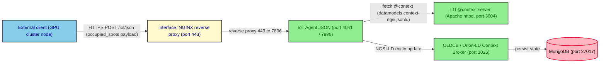

# fog_deploy/infra

This folder contains the **Docker Compose stack that runs on VM2** for the
**Fog deployment** of the multi-tier Digital-Twin Smart-Parking
experiment. It groups the FIWARE NGSI-LD services (Orion-LD Context
Broker, IoT Agent JSON, MongoDB, the LD `@context` server), the NGINX
Interface component that fronts them, and the Infrastructure Monitoring
stack (Prometheus, Grafana, cAdvisor, Node Exporter) used to observe the
system under test.

The fog deployment is one of the four deployment strategies evaluated in
the experiment (`mist`, `fog`, `edge`, `cloud`); the other three slices
live in the sibling `mist_deploy/`, `edge_deploy/` and `cloud_deploy/`
folders. The four strategies differ in **where the image processing for
vehicle counting is performed**, and consequently in what the Load
Generator Script sends on the wire:

- **mist** — the image is processed locally on the field device (a
  Raspberry Pi in the conceptual design; simulated by the Load Generator
  Script in this benchmark). Only the resulting payload
  (`{"occupied_spots": 10}`) is transmitted to the system.
- **edge** — the parking image is sent to a Jetson Nano co-located with
  the device, which performs the inference and returns the payload.
- **fog** — the parking image is sent to a GPU cluster in the fog tier,
  which performs the inference and returns the payload.
- **cloud** — the parking image is sent to a container in the cloud
  tier, which performs the inference and returns the payload.

The fog tier, like edge and cloud, shares the same
**image-in / count-out** contract with VM2: VM1 sends the raw parking
image to an external inference endpoint (in fog, a node of the
**IC Discovery Lab** GPU cluster) and the inference result is forwarded
back to VM2 over the standard IoT Agent endpoint. The mist tier is the
one exception — there, VM1 sends the pre-processed count directly to
VM2 with no inference step.

## Scope of the experimental deployment

The experimental deployment (mist, edge, fog, cloud) deliberately
excludes several components defined in the complete DT architecture:

- **Integration component** — omitted because it is a temporary
  mechanism for accessing legacy databases; in the target architecture
  IoT devices communicate directly through the Interface component.
- **Simulation component** — operates independently of the system's
  *operational behavior* and does not contribute to computational load
  under traffic or workload conditions.
- **Application Monitoring component** — focuses on domain-specific
  visualization of the IC-2 parking facility rather than
  infrastructure-level performance metrics; out of scope for the
  evaluation.

The stack shipped in this folder therefore retains only:

- **Interface component** — NGINX reverse proxy.
- **Core component** — Orion-LD Context Broker, IoT Agent JSON,
  MongoDB, and the LD `@context` server (Apache httpd).
- **Infrastructure Monitoring component** — Prometheus, Grafana,
  cAdvisor, Node Exporter.

This streamlined configuration isolates the system's fundamental data
ingestion, state management, and processing layers, so the evaluation
precisely measures how different deployment tiers impact the system
under varying workloads and traffic patterns. By excluding
non-essential components, the observed metrics directly capture the
impact of the multi-tier deployment strategy, and experimental
complexity is reduced.

## Stack identity with mist and edge

The stack in this folder is **deliberately identical to the VM2 stacks
shipped under `mist_deploy/infra/` and `edge_deploy/infra/`**. Holding
the VM2 side constant across tiers is what makes the 4 × 9 × 9
full-factorial campaign comparable: only the inference host changes
between tiers, so the latency and resource measurements collected on
VM2 reflect the deployment strategy under test rather than incidental
stack drift.

A small set of configuration deltas is intentional and is documented
under [Differences from mist and edge](#differences-from-mist-and-edge)
below. They are part of the experiment's reproducibility envelope and
**must not be reverted** as part of unrelated cleanup.

## What runs here — VM2, the system under test

Everything in this folder runs on **VM2**, the system under test. VM1
(load generator + orchestrator) and the GPU cluster node (inference
endpoint) live in their own folders (`../onGenScripts/` and
`../onCluster/` respectively) and are documented in the parent
`fog_deploy/` README (forthcoming).

| Component | Thesis term | Container | Image | Port(s) | Service file |
|---|---|---|---|---|---|
| NGINX reverse proxy | Interface | `nginx-reverse-proxy` | `nginx:1.28.0` | `80`, `443` | `nginx-reverse-proxy.yaml` |
| IoT Agent JSON | Core (north port) | `fiware-iot-agent` | `quay.io/fiware/iotagent-json:3.7.0` | `4041`, `7896` | `iot-agent.yaml` |
| Orion-LD Context Broker | OLDCB / Core | `fiware-orion` | `quay.io/fiware/orion-ld:1.6.0` | `1026` | `orion.yaml` |
| MongoDB | Core (back-end) | `db-mongo` | `mongo:6.0` | `27017` | `mongo.yaml` |
| LD `@context` server | Core (LD context) | `fiware-ld-context` | `httpd:alpine` | `3004` | `context.yaml` |
| Prometheus | Infrastructure Monitoring | `prometheus-monitor` | `prom/prometheus:v3.3.0` | `9090` | `monitor-cloud/prometheus-monitor.yaml` |
| Grafana | Infrastructure Monitoring | `monitor-grafana` | `grafana/grafana:8.5.27` | `3001` | `monitor-cloud/monitor-grafana.yaml` |
| cAdvisor | Infrastructure Monitoring | `cadvisor` | `gcr.io/cadvisor/cadvisor:v0.49.1` | `8080` | `monitor-cloud/cadvisor.yaml` |
| Node Exporter | Infrastructure Monitoring | `node-exporter` | `prom/node-exporter:v1.9.1` | `9100` | `monitor-cloud/node-exporter.yaml` |

> **Pinned versions are part of the experiment.** The container images
> above are pinned to specific versions to keep the four
> `multi-tier-deployment/<tier>/infra/` stacks comparable. Do not bump
> them as part of routine cleanup — version drift across tiers would
> invalidate the full-factorial campaign.

## Data flow

Externally, an inference node on the IC Discovery Lab cluster posts the
count back to VM2 using the same IoT Agent endpoint as the mist and
edge tiers. Inside VM2, a single request traverses the following
components:



The Interface component is implemented by the NGINX reverse proxy
(`nginx-reverse-proxy.yaml` + `nginx-reverse-proxy/nginx.conf`), the
OLDCB is the FIWARE Orion-LD Context Broker (`orion.yaml`), and the
IoT Agent JSON is the `quay.io/fiware/iotagent-json:3.7.0` service
(`iot-agent.yaml`).

The Infrastructure Monitoring stack sits alongside the request path and
does not participate in it: Prometheus scrapes cAdvisor and Node
Exporter on a 5-second interval (see `monitor-cloud/prometheus.yml`),
and Grafana reads Prometheus to render the host- and container-level
dashboards during each load-test run.

## Differences from mist and edge

A `diff -r` between this folder and `mist_deploy/infra/` (which is
byte-identical to `edge_deploy/infra/`) returns a small, intentional
set of configuration deltas. They are part of the fog experiment's
reproducibility envelope and **must not be reverted** as part of
unrelated cleanup:

| File | Delta | Why it is intentional |
|---|---|---|
| `iot-agent.yaml` | `depends_on: orion` added | The IoT Agent explicitly waits for the OLDCB to come up before starting, avoiding early-startup race conditions with the `mongo` indices script. |
| `iot-agent.yaml` | `IOTA_AMQP_DISABLED=true` and `IOTA_MQTT_DISABLED=true` added | The fog experiment never uses AMQP/MQTT transports; disabling them shortens the IoT Agent startup path. |
| `iot-agent.yaml` | `healthcheck.interval: 10s` (was `600s`) | Faster healthcheck polling aligns with the post-test container validation step run by `onVMScripts/0_healthy_waiting.sh`. |
| `mongo.yaml` | `healthcheck.interval: 5s` (was `600s`) | Same rationale: the validation step converges in seconds rather than minutes. |
| `orion.yaml` | `healthcheck.interval: 10s` (was `600s`) | Same rationale. |
| `.env.example` | Section header comment | "Multi-Tier Fog Deploy" instead of "Multi-Tier Mist Deploy" — a label, not a config change. |
| `certs/README.md` | Extra "Setup" section | Documents the `cp .env.example .env` step explicitly; this README was the template for the other tiers. |

The on-disk layout, all pinned container versions, the network
subnet, the named volumes, the NGINX configuration, the data-models
JSON-LD files, the Prometheus scrape configuration, and the Grafana
dashboards are all identical to the mist and edge stacks.

## Folder layout

```text
fog_deploy/infra/
├── README.md                              ← this file
├── compose.yaml                           (Docker Compose aggregator)
├── .env.example                           (DOMAIN_NAME, MONITOR_GRAFANA_ROOT_URL)
│
├── orion.yaml                             (OLDCB / Orion-LD)
├── iot-agent.yaml                         (IoT Agent JSON)
├── mongo.yaml                             (MongoDB back-end)
├── context.yaml                           (LD @context server, Apache httpd)
├── nginx-reverse-proxy.yaml               (Interface component)
├── networks.yaml                          (Docker bridge network, 172.18.1.0/24)
├── volumes.yaml                           (named volumes)
│
├── certs/                                 (self-signed SSL)
│   ├── README.md                          (cert generation, see Quick start)
│   ├── grafana.crt
│   └── grafana.key
│
├── conf/
│   └── mime.types                         (Apache MIME types for the @context server)
│
├── data-models/                           (JSON-LD @context files)
│   ├── datamodels.context-ngsi.jsonld
│   ├── json-context.jsonld
│   ├── ngsi-context.jsonld
│   └── user-context.jsonld
│
├── monitor-cloud/                         (Prometheus / Grafana / exporters)
│   ├── cadvisor.yaml
│   ├── monitor-grafana.yaml
│   ├── node-exporter.yaml
│   ├── prometheus-monitor.yaml
│   └── prometheus.yml
│
└── nginx-reverse-proxy/
    └── nginx.conf                         (TLS termination + reverse proxy)
```

## Glossary — thesis terminology → on-disk artifacts

| Thesis term | On-disk artefact |
|---|---|
| Interface component | `nginx-reverse-proxy.yaml` + `nginx-reverse-proxy/nginx.conf` |
| OLDCB (Orion-LD Context Broker) | `orion.yaml` |
| IoT Agent JSON | `iot-agent.yaml` |
| LD `@context` server (Context broker) | `context.yaml` + `data-models/*.jsonld` |
| MongoDB back-end | `mongo.yaml` |
| Infrastructure Monitoring | `monitor-cloud/*` (Prometheus, Grafana, cAdvisor, Node Exporter) |
| Docker Compose aggregator | `compose.yaml` (top-level `include:` of every other `*.yaml`) |
| Environment template | `.env.example` (DOMAIN_NAME, MONITOR_GRAFANA_ROOT_URL) |
| SSL material for the Interface | `certs/grafana.crt` + `certs/grafana.key` |
| Reverse proxy configuration | `nginx-reverse-proxy/nginx.conf` |

## Quick start

The stack in this folder is brought up on **VM2 only**. The load
generator and the cluster-side inference service live elsewhere; see
the parent `fog_deploy/` README for the end-to-end workflow (VM1 +
VM2 + cluster).

### Prerequisites on VM2

- **Docker** (with the `docker compose` plugin) and the operating user
  in the `docker` group so `docker compose` can run without `sudo`.
- **Git** (only if you have not already cloned this repository onto
  VM2).

### Bring the stack up

```bash
# On VM2, from the repo root
cd multi-tier-deployment/fog_deploy/infra

# 1. Create your local environment file (never commit)
cp .env.example .env
$EDITOR .env                       # set DOMAIN_NAME to your Tailscale domain

# 2. Generate the self-signed SSL certificate for NGINX
#    (see ./certs/README.md for the full procedure)
source .env
openssl req -x509 -nodes -days 365 -newkey rsa:2048 \
  -keyout certs/grafana.key -out certs/grafana.crt \
  -subj "/CN=${DOMAIN_NAME}"

# 3. NOTE: NGINX does not support environment variable substitution
#    in config files. Replace the literal "DOMAIN_NAME" on the two
#    `server_name` lines of ./nginx-reverse-proxy/nginx.conf with the
#    value of DOMAIN_NAME from your .env.

# 4. Bring the stack up
docker compose up -d
```

After the stack is up, the health endpoints below should answer
`200 OK`:

| Service | Health URL |
|---|---|
| Orion-LD | `http://localhost:1026/version` |
| IoT Agent JSON | `http://localhost:4041/iot/about` |
| MongoDB | `localhost:27017` (via `mongosh`) |
| LD `@context` | `http://localhost:3004/datamodels.context-ngsi.jsonld` |
| Prometheus | `http://localhost:9090/-/healthy` |
| Grafana | `http://localhost:3001/api/health` |

> The full end-to-end validation (including the 20-retry × 5-second
> container healthcheck loop and the entity/subscription bootstrap) is
> automated by the scripts in `../onVMScripts/`. They are driven from
> VM1 by `../onGenScripts/fog_deploy_runner.sh`; the per-script
> reference lives in the parent `fog_deploy/` README.

## Subfolder documentation

- [`certs/README.md`](./certs/README.md) — SSL certificate generation
  for the Interface component, including the `cp .env.example .env`
  step.

## Related documentation

- The parent `fog_deploy/` README documents the
  end-to-end fog experiment: VM1 (load generator), VM2 (this stack),
  and the GPU cluster node (inference service).
- The companion tier READMEs ship the same VM2 stack under different
  per-tier config deltas: `../mist_deploy/README.md`,
  `../edge_deploy/README.md`, and `../cloud_deploy/README.md`.
- The per-folder `AGENTS.md` (gitignored, root of the project) holds
  the relevant thesis excerpts for the fog tier, including the
  hardware specification of the IC Discovery Lab cluster node used
  for inference and the rationale for the YOLOv11m → TensorRT 8.6 +
  CUDA 11.8 pinning.
