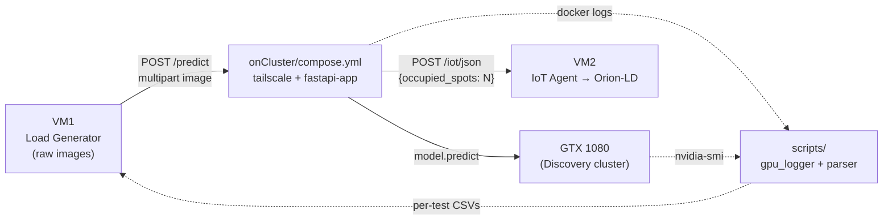

# fog_deploy / onCluster

This folder contains the artefacts that run on the **IC Discovery Lab
cluster node** of the Fog deployment slice of the multi-tier
Digital-Twin Smart-Parking experiment. It is the **only place in the
fog tier where a neural network is executed on field hardware**: a
FastAPI service that loads a **TensorRT-optimised YOLOv11m** model on
an **NVIDIA GTX 1080** GPU, runs vehicle-counting inference on the
raw parking images received from VM1, and forwards the resulting
occupancy count to the IoT Agent on VM2. A sidecar pipeline captures
GPU and container telemetry for the duration of each test.

The fog tier follows the same VM1+VM2 topology as the other three
deployment strategies (`mist`, `edge`, `cloud`). VM1 is the load
generator and orchestrator, VM2 runs the system under test
(Interface + Core + Infrastructure Monitoring), and Tailscale is the
mesh VPN that connects them. The fog-specific deviation is that
**VM1 sends raw parking images** to the cluster node at
`http://<cluster_domain>/predict`, and the cluster returns the count,
which is then forwarded to VM2 using the same `POST /iot/json`
contract used in the mist and edge tiers:

```
http://<iot_agent_domain>/iot/json?i=<device_id>&k=<API_KEY>
```



## Folder layout

```text
onCluster/
├── compose.yml       # one-stack: tailscale sidecar + fastapi-app service
├── .env.example      # template for IOT_URL / IOT_KEY / TS_AUTHKEY
├── .env              # gitignored; real values
├── cluster-ml/       # the FastAPI + YOLOv11m service (see its README)
│   ├── app.py
│   ├── Dockerfile
│   ├── start.sh
│   ├── yolo11m.engine   # TensorRT engine, device-locked to the GTX 1080
│   ├── test.jpg
│   └── README.md
└── scripts/          # gpu_logger + docker-logs ETL (see its README)
    ├── gpu_logger.sh
    ├── process_cluster_logs.sh
    ├── run_cluster_scripts.sh
    ├── collect_cluster_logs.sh
    └── README.md
```

| Path | Role |
|---|---|
| `compose.yml` | Two-service stack: a Tailscale sidecar (`tailscale`) and the FastAPI inference service (`fastapi-app`). The latter runs in the `nvidia` runtime and shares the Tailscale container's network namespace so it is reachable from the rest of the experiment over the mesh VPN. |
| `.env.example` / `.env` | Template and real values for `IOT_URL` (VM2 IoT Agent endpoint, port `:7896`, path `/iot/json`), `IOT_KEY` (service-group API key) and `TS_AUTHKEY` (Tailscale sidecar). |
| `cluster-ml/` | Build context for the inference service. Owns the FastAPI app, the TensorRT engine export, the standalone-run instructions, the API contract, and the env-var reference. **See [`cluster-ml/README.md`](./cluster-ml/README.md) for everything inside this folder.** |
| `scripts/` | Per-test GPU (`nvidia-smi`) and container (`docker logs`) capture + CSV conversion pipeline. Lives on the cluster node because the VM1 runner cannot SSH into a shared cluster shell. **See [`scripts/README.md`](./scripts/README.md) for the full ETL and the operator's checklist.** |

> [!IMPORTANT]
> The cluster node is a **shared** resource of the
> [IC Discovery Lab](https://discovery.ic.unicamp.br) — the operator
> does not have full VM control over it. Tailscale itself runs as a
> container *inside* the cluster, so the VM1-side orchestrator
> (`fog_deploy_runner.sh`) cannot drive the cluster-side phases. The
> `scripts/` folder is therefore the **operator's manual checklist**
> for the cluster-side steps of one experiment; everything else in
> this folder is automated by `docker compose`.

## Hardware target

| Field | Value |
|---|---|
| Device | IC Discovery Lab cluster node (shared) |
| GPU | NVIDIA GeForce GTX 1080, 8 GB |
| Model | YOLOv11m → TensorRT (`.engine`) |
| Stack | TensorRT 8.6 + CUDA 11.8 (newer stacks drop support for SM 6.1) |

Full hardware table, model rationale, and the export/regeneration
procedure live in [`cluster-ml/README.md`](./cluster-ml/README.md).

## How to run

### 1. Configure environment

```bash
cp .env.example .env
# edit .env and set:
#   IOT_URL  = http://<vm2-domain>:7896/iot/json
#   IOT_KEY  = <IoT Agent service-group API key>
#   TS_AUTHKEY = <Tailscale auth key for gpu-yolo-node>
```

### 2. Export the TensorRT engine on the cluster

The `yolo11m.engine` shipped in this repo was exported on a specific
GTX 1080 and is **device-locked** (TensorRT bakes GPU/CPU capabilities
into the engine). Re-export it on the cluster node that will run the
inference. The full procedure and the `torch==2.0.1+cu118` pin are
documented in [`cluster-ml/README.md`](./cluster-ml/README.md#model--yolov11m--tensorrt).

### 3. Bring the inference stack up

From this folder, on the cluster node:

```bash
docker compose up --build
```

This starts the `tailscale` sidecar (joins the cluster node to the
mesh VPN as `gpu-yolo-node`) and the `fastapi-app` service, which
shares the Tailscale container's network namespace and is therefore
reachable as `<cluster-tailscale-domain>:8000` from VM1 and VM2.

### 4. Smoke-test the endpoint

```bash
curl -X POST 'http://localhost:8000/predict' \
  -H 'accept: application/json' \
  -H 'Content-Type: multipart/form-data' \
  -F 'file=@./cluster-ml/test.jpg' \
  -F 'entity_id=urn:ngsi-ld:OffStreetParking:001'
```

### 5. Capture GPU + container logs for the test

The cluster-side telemetry pipeline (`nvidia-smi` + `docker logs` →
CSV) is operator-driven, not orchestrated from VM1. See
[`scripts/README.md`](./scripts/README.md) for the
`run_cluster_scripts.sh` checklist.

## Integration with the rest of the fog tier

This folder is one of four pieces of the fog-tier pipeline; the others
live in the sibling folders of `fog_deploy/`:

- `../infra/` — the FIWARE stack on **VM2** (Interface + Core + Monitoring).
- `../onGenScripts/` — the load generator and orchestrator on **VM1**.
- `../onCluster/` (this folder) — the inference service on the
  cluster GPU node, plus the cluster-side log + post-processing
  pipeline.
- `../tests_execution_order/` — the per-tier scenario schedule.

The full per-test pipeline, the random scenario schedule, and the
experimental design live in [`../README.md`](../README.md) and the
fog-tier [`../onGenScripts/README.md`](../onGenScripts/README.md).
