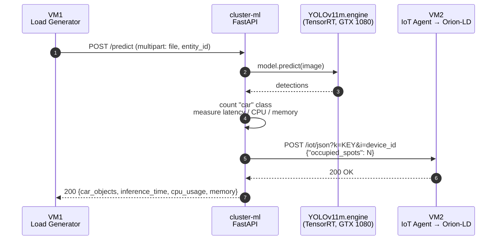
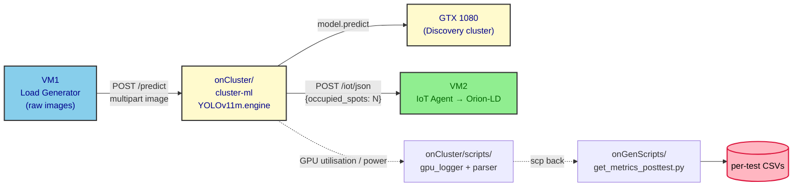

# fog_deploy / onCluster / cluster-ml

This folder contains the **vehicle-counting inference service** for the
**Fog** deployment slice of the multi-tier Digital-Twin Smart-Parking
experiment. It is the only place in the fog tier where a neural network
is executed: a FastAPI service that loads a **TensorRT-optimised
YOLOv11m** model on a **GPU-enabled node of the IC Discovery Lab
cluster**, runs inference on the raw parking images received from VM1,
and forwards the resulting occupancy count to the IoT Agent on VM2.

The fog tier follows the same VM1+VM2 topology as the other three
deployment strategies (`mist`, `edge`, `cloud`). VM1 acts as the load
generator and orchestrator, VM2 runs the system under test
(Interface + Core + Infrastructure Monitoring), and Tailscale is the
mesh VPN that connects them. The fog-specific deviation is that
**VM1 sends raw parking images** to a cluster node, and the cluster
returns the count, which is then forwarded to VM2 using the same
`POST /iot/json` shape used in the mist and edge tiers:

```
http://<iot_agent_domain>/iot/json?i=<device_id>&k=<API_KEY>
```

The service is **stateless** between requests: each `POST /predict`
is fully self-contained, the model is loaded once at startup, and the
inference result is forwarded to the IoT Agent in the same request
lifecycle.

## Hardware target

| Field | Value |
|---|---|
| Device | IC Discovery Lab cluster node (shared) |
| CPU | Intel Core i5-8500 @ 3.00 GHz (6 cores) |
| RAM | 32 GB |
| GPU | NVIDIA GeForce GTX 1080, 8 GB |
| OS | Ubuntu 22.04 LTS |
| Container runtime | Docker with the `nvidia` runtime |
| Discovery cluster | <https://discovery.ic.unicamp.br> |

> The Discovery cluster exposes other GPU nodes (RTX 5000, RTX 4090,
> RTX A6000, GTX 1080); this experiment pinned to the GTX 1080.

## Folder contents

```text
cluster-ml/
├── app.py             # FastAPI server: /predict endpoint + IoT Agent forwarding
├── Dockerfile         # nvcr.io/nvidia/tensorrt:23.09-py3 (TensorRT 8.6 + CUDA 11.8)
├── requirements.txt   # torch (cu118), ultralytics, fastapi, gunicorn, ...
├── start.sh           # Gunicorn entry point (configurable WORKERS)
├── yolo11m.engine     # TensorRT engine for YOLOv11m (device-locked; see below)
├── test.jpg           # warmup image consumed at container start
└── README.md          # this file
```

| File | Role |
|---|---|
| `app.py` | Defines the `FastAPI` app. Loads `yolo11m.engine` at startup, runs a dummy prediction on a black image so `model.names` is populated, then serves `POST /predict`. Each call measures inference latency, counts `car` detections, and forwards `{"occupied_spots": N}` to `IOT_URL`. Returns `{car_objects, inference_time, cpu_usage, memory}` to the caller. |
| `Dockerfile` | Builds on `nvcr.io/nvidia/tensorrt:23.09-py3` (TensorRT 8.6 + CUDA 11.8), installs system libs (`libgl1`, `libglib2.0-0`) plus the Python dependencies from `requirements.txt`, and starts the service via `./start.sh`. |
| `requirements.txt` | Pins `torch==2.0.1+cu118`, `ultralytics==8.3.0`, `fastapi==0.110.1`, `psutil==5.9.8`, plus `numpy<2`, `gunicorn`, `uvicorn`, `python-multipart`, `networkx==3.1`. The `torch` wheel is fetched from the cu118 extra index. |
| `start.sh` | Launches Gunicorn with the `uvicorn` worker class, `$WORKERS` workers (default `4`), `--timeout 300`, bound to `0.0.0.0:8000`. |
| `yolo11m.engine` | TensorRT engine file, exported on the **GTX 1080** that runs the inference. Like every TensorRT engine, it is **device-locked** and must be regenerated if the GPU or driver stack changes. |
| `test.jpg` | Local image used by the orchestrator scripts (and useful for a quick smoke test via `curl`). The service itself does not require this file at runtime — it warms up on a black `640x480` `PIL.Image`. |

## Model — YOLOv11m → TensorRT

The edge deployment established that **TensorRT is the best fit for
NVIDIA hardware** under the experiment's latency constraints. The fog
tier runs on a substantially more capable GPU (GTX 1080, 8 GB) than
the Jetson Nano, so the **medium YOLOv11 variant** (`yolo11m`) is
used instead of the nano one — the GTX 1080 has enough headroom to
load and run it.

### Why TensorRT 8.6 + CUDA 11.8

The GTX 1080 is a **legacy** device with constrained driver/runtime
support. To make TensorRT work on it, the deployment pins to:

- **TensorRT 8.6**
- **CUDA 11.8**

The base image `nvcr.io/nvidia/tensorrt:23.09-py3` ships exactly that
combination, and the matching `torch` wheel (`torch==2.0.1+cu118`)
is pinned in `requirements.txt`. Newer TensorRT/CUDA stacks drop
support for the GTX 1080's compute capability (SM 6.1).

> If a more recent NVIDIA device were available, the
> [NVIDIA Triton Inference Server](https://www.nvidia.com/en-us/ai/dynamo-triton/)
> would be the natural choice. Triton is an open-source
> inference-serving platform that deploys AI models at production
> scale across multiple frameworks — TensorRT, PyTorch, TensorFlow,
> ONNX. The GTX 1080 cannot run a recent enough Triton, which is why
> the deployment falls back to plain FastAPI.

## API contract

`POST /predict` — multipart form upload, returns the detected car
count, the inference time, and host-level resource snapshots.

| Field | Type | Required | Description |
|---|---|---|---|
| `file` | `UploadFile` (multipart) | yes | Parking image, RGB. Any resolution; the model resizes internally. |
| `entity_id` | form field (string) | no | NGSI-LD entity URN (e.g. `urn:ngsi-ld:OffStreetParking:001`) or a plain device id. When provided, the service extracts the last colon-separated segment and forwards the count to the IoT Agent under that device id. |

### Response

```json
{
  "car_objects": 7,
  "inference_time": 0.041823,
  "cpu_usage": 12.4,
  "memory": 612.8
}
```

| Field | Type | Description |
|---|---|---|
| `car_objects` | int | Number of `car` detections returned by the YOLOv11m model. |
| `inference_time` | float | Wall-clock inference time in seconds (model.predict start → end). |
| `cpu_usage` | float | Process CPU usage in percent (psutil snapshot, single sample). |
| `memory` | float | Resident memory in MB (psutil virtual memory used). |

`POST /predict` also returns a side effect — when `entity_id` is
provided, the service POSTs the count to the IoT Agent:

```text
POST {IOT_URL}?k={IOT_KEY}&i={device_id}
Content-Type: application/json

{"occupied_spots": N}
```

If the upstream `requests.post` fails, the error is logged and the
`/predict` response is **still returned to the caller** — inference
succeeds locally, the upstream forwarding is best-effort.

## Request flow



## Configuration

The service reads the following environment variables. The parent
`onCluster/compose.yml` sets them at deploy time; for a standalone
run, pass them with `docker run -e KEY=value ...`.

| Variable | Default | Purpose |
|---|---|---|
| `MODEL_DIR` | `yolo11m.engine` | Path to the TensorRT engine baked into the image. |
| `IOT_URL` | `http://fiware-iot-agent:7896/iot/json` | Base URL of the IoT Agent's JSON north-port. |
| `IOT_KEY` | `12345` | IoT Agent service-group API key. |
| `WORKERS` | `4` (in `start.sh`) / `2` (in `compose.yml`) | Number of Gunicorn workers. The compose file overrides the script default to match the single-GPU resource budget. |
| `NVIDIA_VISIBLE_DEVICES` | `all` | Standard NVIDIA runtime knob. |
| `TS_AUTHKEY` | _(unset)_ | Tailscale auth key, consumed by the sibling `tailscale` service in `compose.yml`. |

`IOT_URL` and `IOT_KEY` are **deployment-specific**: in the fog
compose file they point at the VM2 tailnet domain, e.g.
`http://<vm2-tailnet-domain>:7896/iot/json`. When running the
container standalone, point `IOT_URL` at whichever IoT Agent you want
the count to land in, or omit `entity_id` on the request to skip
forwarding entirely.

## How to run

The inference service is meant to be brought up through the parent
`onCluster/compose.yml`, which also wires a Tailscale sidecar so the
container is reachable from the rest of the experiment over the mesh
VPN. A standalone run is still useful for smoke tests.

### Standalone

From this folder:

```bash
# Build the image
docker build --no-cache -t yolov11-api .

# Run with GPU access and the IoT Agent target on VM2
docker run --rm -p 8000:8000 \
  --runtime=nvidia \
  -e NVIDIA_VISIBLE_DEVICES=all \
  -e WORKERS=2 \
  -e IOT_URL=http://<vm2-domain>:7896/iot/json \
  -e IOT_KEY=<service-group-api-key> \
  yolov11-api
```

### Smoke test

With the container running (standalone or compose):

```bash
curl -X POST 'http://localhost:8000/predict' \
  -H 'accept: application/json' \
  -H 'Content-Type: multipart/form-data' \
  -F 'file=@./test.jpg' \
  -F 'entity_id=urn:ngsi-ld:OffStreetParking:001'
```

The service:

1. Decodes the upload into a PIL `RGB` image.
2. Runs `model.predict(...)` against `yolo11m.engine`.
3. Counts detections whose class id matches the `car` entry in
   `model.names`.
4. (When `entity_id` is set) POSTs `{"occupied_spots": N}` to the
   IoT Agent and logs the upstream status.
5. Returns the JSON response shown above.

## Re-exporting the TensorRT engine

> [!IMPORTANT]
> The `yolo11m.engine` shipped in this repo was exported on the
> **specific GTX 1080** that runs the inference, with the exact
> **TensorRT 8.6 + CUDA 11.8** stack pinned in the Dockerfile. The
> engine is **device-locked**: it must be re-exported if the GPU,
> the driver, or the TensorRT/CUDA versions change. An engine
> produced on a different card will not load on the GTX 1080.

The export is done once, on the same cluster node where inference
will run, using the same base image the service extends:

```bash
docker run --rm -it --runtime=nvidia \
  -v "$PWD":/work -w /work \
  nvcr.io/nvidia/tensorrt:23.09-py3 \
  bash -lc '
    pip install -U ultralytics==8.3.0 torch==2.0.1+cu118
    yolo export model=yolo11m.pt format=engine
  '
```

Copy the resulting `yolo11m.engine` into `cluster-ml/` so the build
context picks it up, then rebuild the image with `docker build`.

## Integration with the rest of the fog tier

This folder is **one of three** pieces of the fog-tier pipeline; the
others live in the sibling folders of `fog_deploy/`:

- `../infra/` — the FIWARE stack on **VM2** (Interface + Core +
  Monitoring).
- `../onGenScripts/` — the load generator and orchestrator on **VM1**.
- `../onCluster/` (this parent folder) — the inference service on
  the cluster GPU node, with `cluster-ml/` as its image build
  context and `scripts/` as the GPU-side log + post-processing
  pipeline.
- `../tests_execution_order/` — the per-tier scenario schedule.



The full per-test pipeline, the random scenario schedule, and the
experimental design live in [`../README.md`](../README.md) and the
fog-tier `onGenScripts/README.md`.
