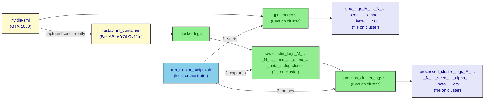

# onCluster/scripts

This folder holds the **GPU and container log-capture + log-to-CSV
helpers** that run on the **IC Discovery Lab cluster** node of the
[fog deployment](../README.md) campaign. The four scripts are the last
step of the per-test pipeline: they turn the raw bytes produced by
`nvidia-smi` and by the `fastapi-ml_container` into CSV files that the
rest of the campaign consumes.

The full data-flow narrative, the per-phase orchestrator, and the
experimental design live in the parent
[`../README.md`](../README.md) and in the VM1 / load-generator
[`../onGenScripts/README.md`](../onGenScripts/README.md); this README
is a developer reference for the four scripts in this folder only.

## Why these scripts run manually

The cluster node is a **shared** resource of the
[IC Discovery Lab](https://discovery.ic.unicamp.br) — the operator does
not have full VM control on it. Tailscale itself runs as a container
*inside* the cluster, so the VM1-side orchestrator
(`fog_deploy_runner.sh`) cannot SSH into a cluster shell to drive
`docker compose`, `nvidia-smi`, or `docker logs` from the load
generator. The runner on VM1 explicitly bails out of the cluster-side
phases — the only VM-side work it automates is the FIWARE stack and
the IoT Agent log collection on VM2.

> Excerpt from `../onGenScripts/fog_deploy_runner.sh`:
>
> ```bash
> # -----------------CLUSTER SIDE-------------
> # It's gone
> # -----------------CLUSTER SIDE------------
> ```

The four scripts in this folder are therefore the **operator's manual
checklist for one experiment on the cluster node**: before the load
generator starts, run `run_cluster_scripts.sh` to capture GPU and
container telemetry for the duration of the test; after the test,
copy the per-test output directory back to VM1 alongside the
VM2-side artefacts (or just leave it on the cluster — the cluster
local FS is the source of truth for the GPU traces).

## Pipeline at a glance

The three leaf scripts form a small ETL: capture → parse. The fourth
script, `run_cluster_scripts.sh`, is a **local orchestrator** that
chains the three together for a single experiment and stamps the
output filenames with the same `M / N / seed / α / β` token that the
rest of the campaign uses. The operator invokes
`run_cluster_scripts.sh` from a shell on the cluster node for each
row of the scenario CSV; the three leaf scripts are only run
individually when iterating on a parser, replaying a captured log, or
re-processing an old run.



Both captures run **concurrently** during the test: the GPU trace
follows the cluster's idle / inference load for the whole experiment
duration, while the container log accumulates one `INFO:inference:`
line per `POST /predict` call. The leaf scripts do not coordinate
with each other — they are joined only by the `run_cluster_scripts.sh`
wrapper that calls them in order and stamps the same `M / N / seed /
α / β` token into every output filename.

## Where each script runs

| Script | Invoked by | Runs on | Purpose |
|---|---|---|---|
| `run_cluster_scripts.sh` | the operator, once per experiment | **Cluster node** | Local orchestrator: chains `gpu_logger.sh` → `collect_cluster_logs.sh` → `process_cluster_logs.sh` and stamps the `M_N_seed_alpha_beta` token into all three output filenames. |
| `gpu_logger.sh` | `run_cluster_scripts.sh` (or by hand for debugging) | **Cluster node** | Stream `nvidia-smi --query-gpu=…` into a CSV, one row per second, for a configurable duration. |
| `collect_cluster_logs.sh` | `run_cluster_scripts.sh` (or by hand for debugging) | **Cluster node** | Capture `docker logs <fastapi-ml_container>` into a `.log-cluster` file. |
| `process_cluster_logs.sh` | `run_cluster_scripts.sh` (or by hand for replay) | **Cluster node** | Extract the `INFO:inference:Inference finished: …` lines out of the raw container log and write a 4-column CSV. |

> All four scripts are pure shell, follow `set -euo pipefail`, accept
> long-option arguments, validate inputs, and print a usage banner on
> `-h` / `--help` or on a missing/invalid flag. None of them mutate
> global state outside the file they are writing.

## File reference

The subsections below are ordered by how the scripts compose at
runtime: the orchestrator first, then the three leaf scripts in the
order `run_cluster_scripts.sh` calls them.

### `run_cluster_scripts.sh`

```bash
./run_cluster_scripts.sh \
  --duration <time> --directory <dir> \
  --M <value> --N <value> --seed <value> --alpha <value> --beta <value>
```

The local orchestrator for a single experiment. Behaviour:

- Requires **all seven** flags; the argument count is checked up front
  (`[[ $# -lt 14 ]]`) and the script exits with the usage banner if
  any is missing. There are no defaults for the `M` / `N` / `seed` /
  `α` / `β` factors — they must match the row of
  `randomized_load_test_scenario_seed_37.csv` that the test
  corresponds to.
- Creates `./results/${DIRECTORY}/` (with `mkdir -p`) and writes all
  three outputs there. The `$DIRECTORY` value is intended to be the
  per-test directory name — usually the same
  `fog_deploy_test_M_{M}_N_{N}_seed_{seed}_alpha_{alpha}_beta_{beta}`
  token that VM1 uses, so the cluster and VM1 outputs end up with
  the **same prefix** and can be `scp`-merged without renaming.
- Stamps the canonical `M_{M}_N_{N}_seed_{SEED}_alpha_{ALPHA}_beta_{BETA}`
  token into the three output filenames (see below).
- Calls the three leaf scripts in order, in the same shell, with
  `set -euo pipefail` active — any leaf failure aborts the wrapper.

The three output filenames are:

| File | Variable | Filled by |
|---|---|---|
| `${RESULTS_DIR}/gpu_logs_M_${M}_N_${N}_seed_${SEED}_alpha_${ALPHA}_beta_${BETA}.csv` | `GPU_LOG_FILE` | `gpu_logger.sh` |
| `${RESULTS_DIR}/cluster_logs_M_${M}_N_${N}_seed_${SEED}_alpha_${ALPHA}_beta_${BETA}.log-cluster` | `CLUSTER_LOG_FILE` | `collect_cluster_logs.sh` |
| `${RESULTS_DIR}/processed_cluster_logs_M_${M}_N_${N}_seed_${SEED}_alpha_${ALPHA}_beta_${BETA}.csv` | `PROCESSED_LOG_FILE` | `process_cluster_logs.sh` |

> The `--directory` flag is the **container** (the parent directory
> under `results/`); the `M / N / seed / α / β` flags are the
> **suffix** stamped into the per-test filenames. The two are
> independent so the operator can re-use the same directory across
> several restarts, or partition a long run by date.

### `gpu_logger.sh`

```bash
./gpu_logger.sh [output_file.csv] [--duration <seconds|Xm|Xh>]
```

Streams `nvidia-smi --query-gpu=…` to a CSV at 1-second cadence for a
configurable duration. Behaviour:

- Defaults `OUTPUT_FILE` to `gpu_log.csv` in the current directory
  when not given as a positional argument; the flag-form
  `--output-file` is **not** supported — the script uses the
  positional slot for the file name and treats `--duration` as the
  only long option.
- Parses `--duration` as plain seconds (`30`), seconds with the `s`
  suffix (`30s`), minutes with the `m` suffix (`10m`), or hours with
  the `h` suffix (`1h`). Anything else aborts with a clear error.
- Emits the header
  `time,load_percentage,temp_Celsius,power_W,memory_MiB` on the first
  line, then one CSV record per second:

  ```text
  time, load_percentage, temp_Celsius, power_W, memory_MiB
  Jul 08 2026 14:23:01,  87, 71, 142.34, 6128
  Jul 08 2026 14:23:02,  91, 72, 148.10, 6204
  ```

  The five columns come from `nvidia-smi
  --query-gpu=utilization.gpu,temperature.gpu,power.draw,memory.used
  --format=csv,noheader,nounits`, prefixed with a `date "+%b %d %Y
  %H:%M:%S"` timestamp.
- Runs **synchronously** in the foreground. The caller (typically
  `run_cluster_scripts.sh`) must run it for the **whole** duration of
  the test; the `sleep 1` is built in. When `--duration` is omitted,
  the script loops until the operator hits `Ctrl+C`.

> `nvidia-smi` must be on the `PATH` of the shell that runs
> `gpu_logger.sh`. On the Discovery cluster node it ships with the
> NVIDIA driver; no extra install is required.

### `collect_cluster_logs.sh`

```bash
./collect_cluster_logs.sh [--output-file <path>]
```

Dumps `docker logs <fastapi-ml_container>` to a single file. Behaviour:

- Defaults `OUTPUT_FILE` to `./results/cluster_logs.log-cluster` (the
  `results/` subdirectory is created with `mkdir -p` on demand).
- Matches the target container by name with
  `docker ps -a --format '{{.Names}}' | grep 'fastapi-ml_container'`
  — the same string the cluster-ml compose file uses. If no
  container matches (for example because the operator forgot to
  bring the inference service up), the script prints a warning and
  exits 0, **without** aborting the wrapping experiment. The
  orchestrator treats this as a non-fatal skip rather than a
  failure.
- When the container is found, runs `docker logs "$container_name" >
  "$output_file" 2>&1` (stderr is folded into the same file so the
  rare crash trace is preserved) and then `sync; sleep 1` to make
  sure the file is fully flushed before the next script reads it.

> The script picks the **first** container whose name contains
> `fastapi-ml_container`. On a node that is running multiple
> inference replicas this is a known limitation — for the fog
> campaign there is only one, so it is safe.

### `process_cluster_logs.sh`

```bash
./process_cluster_logs.sh --input-file <log> [--output-file <csv>]
```

Pulls the per-request inference metrics out of the
`fastapi-ml_container` log and writes a 4-column CSV. Behaviour:

- Defaults `OUTPUT_FILE` to `parsed_inference.csv` in the current
  directory when not provided.
- Greps for lines matching the `INFO:inference:Inference finished:`
  prefix emitted by the FastAPI service in
  [`../cluster-ml/app.py`](../cluster-ml/app.py), then runs four
  `sed -E` substitutions per line to extract the values. The parser
  is **identical in shape** to the Jetson-side
  `process_jetson_logs.sh` — both extract the same tokens from the
  same log line shape.
- Writes the header
  `inference_time_s,cars,cpu_usage_percent,mem_used_MB` followed by
  one record per matched line.

Sample matched line (as produced by `cluster-ml/app.py`):

```text
INFO:inference:Inference finished:  0.404425 sec, cars=2, CPU=2.9%, MEM=3456.2MB
```

The four columns are:

| Column | Source token | Unit |
|---|---|---|
| `inference_time_s` | `Inference finished: T sec` | seconds |
| `cars` | `cars=N` | count |
| `cpu_usage_percent` | `CPU=N%` | % |
| `mem_used_MB` | `MEM=N.NMB` | MB |

Non-matching lines (container startup, model warm-up, `/predict`
warnings, forwarding failures, `tail`-style truncation) are silently
skipped.

## Quick start

The four scripts are not meant to be wired into the VM1-side
orchestrator — they are the **cluster-side operator's checklist** for
one experiment. Use them through `run_cluster_scripts.sh`, and only
fall through to the leaf scripts when iterating on a parser,
replaying a captured log, or re-processing an old run.

```bash
# 1. SSH / shell into the Discovery cluster node, from this folder:
cd ~/<repo>/multi-tier-deployment/fog_deploy/onCluster/scripts

# 2. Make sure the cluster-ml service is up:
docker compose -f ../compose.yml up -d

# 3. Run the cluster-side capture for the duration of the test.
#    The five M / N / seed / alpha / beta values must match the row
#    of tests_execution_order/randomized_load_test_scenario_seed_37.csv
#    that the current experiment corresponds to.
./run_cluster_scripts.sh \
  --duration   10m \
  --directory  fog_deploy_test_M_136_N_60_seed_37_alpha_1_beta_1 \
  --M 136 --N 60 --seed 37 --alpha 1 --beta 1

# 4. (in a separate VM1 shell) start the load generator that drives
#    this experiment, pointing at the cluster's /predict endpoint.
#    See ../onGenScripts/README.md for the VM1-side flow.

# 5. Once the test is over, scp the three artefacts back to VM1 and
#    drop them next to the VM2-side files with the same prefix.
```

Iterating on a parser or replaying an old run:

```bash
# Stream GPU stats ad hoc (Ctrl+C to stop)
./gpu_logger.sh /tmp/gpu.csv

# Stream GPU stats for a fixed duration
./gpu_logger.sh /tmp/gpu.csv --duration 10m

# Capture the container log once (e.g. for a quick smoke test)
./collect_cluster_logs.sh --output-file /tmp/cluster.log-cluster

# Re-parse an already-captured log
./process_cluster_logs.sh \
  --input-file  /tmp/cluster.log-cluster \
  --output-file /tmp/inference.csv
```

## See also

- [`../README.md`](../README.md) — fog_deploy campaign overview,
  data-flow diagram, and experimental design.
- [`../onGenScripts/README.md`](../onGenScripts/README.md) — the
  VM1-side orchestrator (`fog_deploy_runner.sh`) that drives the
  VM2 stack and the load generator, and the per-run directory layout
  the cluster-side outputs have to be `scp`-merged into.
- [`../cluster-ml/README.md`](../cluster-ml/README.md) — the
  FastAPI + YOLOv11m/TensorRT container whose `INFO:inference:`
  log lines feed `process_cluster_logs.sh`.
- [`../cluster-ml/app.py`](../cluster-ml/app.py) — exact format of
  the `Inference finished: …` log line that the parser expects.
- [`../compose.yml`](../compose.yml) — the cluster-side Compose file
  that brings the inference service up; the operator starts it
  manually before kicking off `run_cluster_scripts.sh`.
