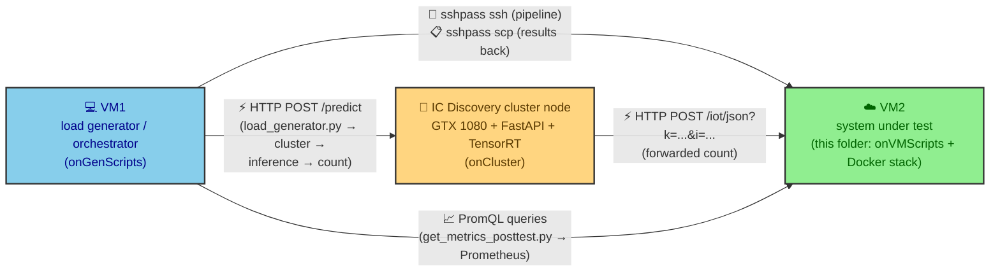
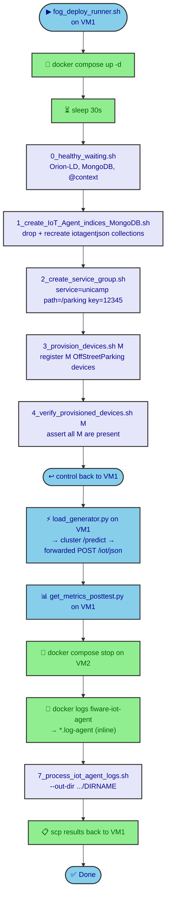
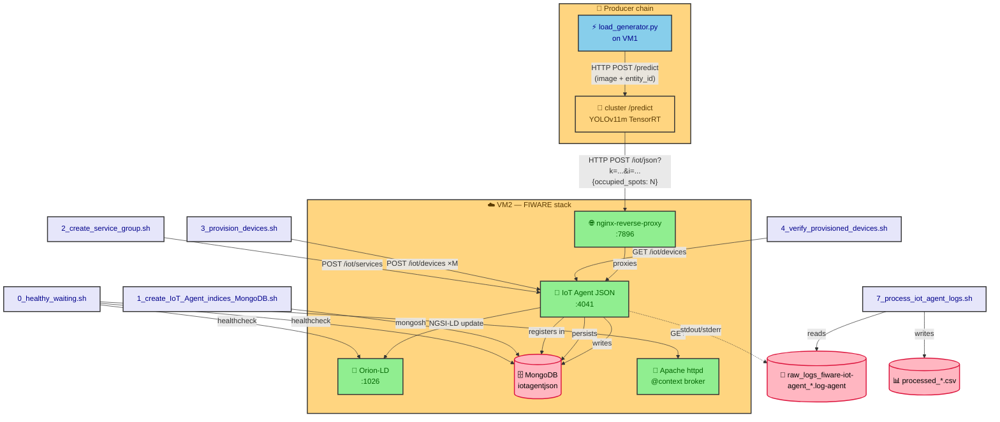

# onVMScripts — VM2 provisioning & measurement scripts

This directory holds the scripts that are executed **inside VM2**, the
remote VM that hosts the Docker Compose stack (Orion-LD, IoT Agent JSON,
MongoDB, Prometheus, etc.) during a fog-tier load test. The companion
orchestrator `../onGenScripts/fog_deploy_runner.sh` runs on **VM1** (the
load-generator host) and invokes these scripts over SSH as part of
the end-to-end test pipeline.

The scripts are intentionally numbered (`0_`…`4_`, `7_`) so the
orchestrator can run them in the correct order; the two unnumbered
files (`collector_logs.sh` and `cpu_baseline.sh`) are independent
utilities.

> **TL;DR** — `0` waits for the stack to be healthy, `1` prepares Mongo,
> `2`/`3`/`4` register and verify the IoT devices, and `7` converts the
> raw IoT Agent log into a CSV once the test finishes. `cpu_baseline.sh`
> is meant to be run on VM2 **before** each test run: after resetting
> VM2, it captures a CPU baseline so that the different test scenarios
> being compared are not biased by hardware / virtualization noise.
> `collector_logs.sh` is a standalone utility for dumping a container's
> log to a file with a canonical filename — the orchestrator does an
> equivalent `docker logs` step inline, so you do not need to invoke it
> during a normal test run.

## Table of contents

- [How this folder fits in the fog topology](#how-this-folder-fits-in-the-fog-topology)
- [Execution order](#execution-order)
- [Architecture map — which script touches which component](#architecture-map--which-script-touches-which-component)
- [Script reference](#script-reference)
  - [0. `0_healthy_waiting.sh`](#0-0_healthy_waitingsh)
  - [1. `1_create_IoT_Agent_indices_MongoDB.sh`](#1-1_create_iot_agent_indices_mongodbsh)
  - [2. `2_create_service_group.sh`](#2-2_create_service_groupsh)
  - [3. `3_provision_devices.sh`](#3-3_provision_devicessh)
  - [4. `4_verify_provisioned_devices.sh`](#4-4_verify_provisioned_devicessh)
  - [5. `7_process_iot_agent_logs.sh`](#5-7_process_iot_agent_logssh)
  - [6. `collector_logs.sh`](#6-collector_logssh)
  - [7. `cpu_baseline.sh`](#7-cpu_baselinesh)
- [Log processing data flow](#log-processing-data-flow)
- [Running the scripts by hand](#running-the-scripts-by-hand)
- [Outputs produced on VM2](#outputs-produced-on-vm2)
- [Troubleshooting](#troubleshooting)

## How this folder fits in the fog topology

Unlike the mist tier (where the load generator on VM1 sends a
pre-computed count directly to VM2), the **fog tier inserts a third
hop**: a **GPU-enabled node of the IC Discovery Lab cluster** running
the YOLOv11m/TensorRT inference service. VM1 still issues the
`HTTP POST /predict` against the cluster, the cluster returns the
inferred count, and that count is then posted to VM2's IoT Agent using
the **same** `http://<iot_agent_domain>/iot/json?i=<id>&k=<key>` shape
as the mist tier.



The scripts in this folder are unaware of the cluster node — they
interact only with VM2's Docker stack. The cluster side is driven
manually (the runner comment explains that the cluster VM is shared
and not under the runner's SSH control) and the corresponding
artefacts live in `../onCluster/`.

## Execution order

The numbered prefix on each script is the order in which the
orchestrator runs them. The flowchart below mirrors the exact call
sequence in `fog_deploy_runner.sh`.



> **Why the gap between 4 and 7?** There are no `5_` and `6_` scripts on
> disk. The pipeline was restructured at some point (steps that used to
> live in their own files were either folded into another step or
> dropped entirely), but the numeric prefixes of the remaining files
> were left untouched so that the calling code in
> `fog_deploy_runner.sh` did not have to be modified.
>
> **Why is there no streaming log collector?** The mist tier launches a
> Python collector in the background that tails `docker logs -f` for
> the whole test. The fog runner instead does a **one-shot** `docker
> logs <container>` at the end of the test, after `docker compose
> stop` has quiesced the IoT Agent. The output file uses a `.log-agent`
> extension, which is what `7_process_iot_agent_logs.sh` looks for.
> `collector_logs.sh` is a standalone manual replacement for that
> inline step.

## Architecture map — which script touches which component



## Script reference

### 0. `0_healthy_waiting.sh`

**Purpose:** Block until every external dependency is actually serving
traffic, not just *up*. Without this step, `2_create_service_group.sh`
and `3_provision_devices.sh` would race against container startup and
fail with connection-refused errors.

**What it waits for:**

| Dependency | How it checks | Endpoint |
|---|---|---|
| Orion-LD container | Docker healthcheck status | `docker inspect fiware-orion` |
| MongoDB container | Docker healthcheck status | `docker inspect db-mongo` |
| NGSI-LD core `@context` | HTTP `200` from ETSI | `https://uri.etsi.org/ngsi-ld/v1/ngsi-ld-core-context-v1.8.jsonld` |
| User `@context` (Apache) | HTTP `200` via curl in `quay.io/curl/curl` | `http://context/user-context.jsonld` |

**Notes**

- Assumes the default Docker network is named `default` (it uses
  `docker run --network default` for the curl probes).
- `set -e` is **not** active — failures fall through to retries rather
  than aborting the whole pipeline.
- Prints a friendly progress dot every 3 seconds so you can see it is
  alive.

**Parameters:** none.

### 1. `1_create_IoT_Agent_indices_MongoDB.sh`

**Purpose:** Prepare the `iotagentjson` MongoDB database the first time
the stack is brought up. Idempotent only in the sense that it is meant
to be run once; on a non-empty database it **drops every collection
first** and recreates the two required ones (`devices`, `groups`) with
the correct indexes.

> [!WARNING]
> Running this on a populated database wipes all registered devices and
> service groups. Only do this on a fresh stack or when you explicitly
> want to start over.

**What it does:**

1. `mongosh` into the `iotagentjson` DB.
2. Drop every collection (`getCollectionNames().forEach(c => db[c].drop())`).
3. Recreate `devices` with three indexes:
   - `{_id.service, _id.id, _id.type}` (compound)
   - `{_id.type}`
   - `{_id.id}`
4. Recreate `groups` with two indexes:
   - `{_id.resource, _id.apikey, _id.service}` (compound)
   - `{_id.type}`
5. Wait for the IoT Agent to report `healthy` (defensive check before
   the next step provisions devices).

**Parameters:** none.

### 2. `2_create_service_group.sh`

**Purpose:** Register the FIWARE service / subservice / API-key triple
that the IoT Agent uses to route incoming `iot/json` payloads to the
right Orion-LD context broker.

**Hard-coded values** (edit the script if you need to change them):

| Variable | Value |
|---|---|
| `IOTA_HOST` | `http://localhost:4041` |
| `FIWARE_SERVICE` | `unicamp` |
| `FIWARE_SERVICEPATH` | `/parking` |
| `API_KEY` | `12345` |
| `CBROKER` | `http://orion:1026` |
| `ENTITY_TYPE` | `OffStreetParking` |
| `RESOURCE` | `/iot/json` |

**What it does:**

1. `POST /iot/services` to the IoT Agent with the JSON body shown in
   the file, declaring the `apikey`/`cbroker`/`entity_type`/`resource`
   quadruple.
2. `GET /iot/services` to confirm the registration, printing the
   response to stdout.

**Parameters:** none.

### 3. `3_provision_devices.sh`

**Purpose:** Pre-register `M` virtual parking entities with the IoT
Agent so that the load generator on VM1 (and the cluster node, in the
fog case) can `POST /iot/json?k=12345&i=NN` for each one without the
IoT Agent having to lazily create entities on the fly.

**Why `OffStreetParking` and not `ParkingSensor`?** To keep the test
simple, the device is provisioned as a single `OffStreetParking`
entity and the load generator posts the *number of detected cars*
directly to it. There is no intermediate `ParkingSensor` entity: in a
real setup a `ParkingSensor` would report the presence of a single
parking spot, and the IoT Agent would then propagate the update to a
parent `OffStreetParking` entity (which would itself trigger a chain
of further updates). For benchmarking, that chain is unnecessary — a
single camera snapshot already counts the total number of vehicles in
the lot, so posting that count straight into `OffStreetParking` is
enough and lets us measure the IoT Agent / Orion-LD pipeline in
isolation.

**Usage**

```bash
./3_provision_devices.sh <M>
```

- `M` — number of devices to provision. They are numbered with leading
  zeros (`001`, `002`, …, `0M`).
- Each `device_id` maps to a `urn:ngsi-ld:OffStreetParking:<id>`
  entity.
- Each device exposes a single attribute: `occupiedSpotNumber`
  (object id `occupied_spots`, NGSI-LD `Property`).

**Loop output:** every iteration prints the HTTP status code returned
by `POST /iot/devices` (e.g. `201` on success).

**Parameters:** `M` (positional, required).

### 4. `4_verify_provisioned_devices.sh`

**Purpose:** Sanity-check that all `M` devices provisioned by
`3_provision_devices.sh` are actually present in the IoT Agent
registry. The runner aborts on failure because of `set -euo pipefail`.

**Usage**

```bash
./4_verify_provisioned_devices.sh <M>
```

- Validates that `M` is a positive integer (exits `2` if not).
- Fetches every device with `GET /iot/devices` and greps the JSON for
  each expected `device_id`, printing `[✔]` / `[✘]` per device.
- Exits `0` if all are present, otherwise prints how many are missing
  and exits `0` (the orchestrator relies on the printed summary, not
  the exit code, for the verdict — it has its own `set -e` at a higher
  level).

**Parameters:** `M` (positional, required).

### 5. `7_process_iot_agent_logs.sh`

**Purpose:** After the test finishes, walk the raw IoT Agent log
produced by the runner's inline `docker logs` step and emit a tidy CSV
with one row per processed update, joining the three pieces of
information that the IoT Agent logs in different lines:

| Field | Source in the log |
|---|---|
| `correlationID` | `corr=<uuid>` |
| `entity_id` | `"id": "urn:ngsi-ld:OffStreetParking:..."` |
| `observedAt` | `"observedAt": "2026-..."` |
| `response_time_ms` | `response-time: <integer>` |

**Usage**

```bash
./7_process_iot_agent_logs.sh --out-dir ./fog_deploy_test_M_136_N_30_seeds_2_alpha_5_beta_5
```

- Picks the **first** file matching `*.log-agent` in `--out-dir` and
  produces `processed_<basename>.csv` next to it. (The mist-tier
  counterpart of this script matches the older
  `raw_docker_logs_fiware-iot-agent_M_*.log` glob instead; the fog
  runner writes files with a `.log-agent` extension, hence the
  different glob.)
- Uses two associative arrays (`ENTITY`, `OBSERVED`) keyed by the
  current `correlationID` so the final row is emitted only when *all
  three* fields have been seen for that correlation.
- Exits `1` if no matching raw log is found.

**Output columns**

```
correlationID,entity_id,observedAt,response_time_ms
```

**Parameters:** `--out-dir <dir>` (optional, defaults to `.`).

### 6. `collector_logs.sh`

**Purpose:** Standalone utility that dumps a Docker container's
stdout/stderr to a file whose name is built from the test parameters.
The runner already does an equivalent `docker logs … > *.log-agent`
step inline at the end of the pipeline, so this script is **not**
required during a normal test run — it exists for the cases where you
want to re-collect a container's log out of band (e.g. debugging a
specific container between runs).

**Usage**

```bash
./collector_logs.sh \
  --container fiware-iot-agent \
  --M 136 --N 30 --seeds 2 --alpha 5 --beta 5 \
  --out-dir ./fog_deploy_test_M_136_N_30_seeds_2_alpha_5_beta_5
```

**Arguments**

| Flag | Default | Meaning |
|---|---|---|
| `--container` | required | Docker container name or ID to collect logs from. |
| `--M` | required | Value for `M` — used in the filename suffix. |
| `--N` | required | Value for `N` — used in the filename suffix. |
| `--seeds` | required | Value for `seeds` — used in the filename suffix. |
| `--alpha` | required | Value for `alpha` — used in the filename suffix. |
| `--beta` | required | Value for `beta` — used in the filename suffix. |
| `--out-dir` | `./results` | Output directory (created if missing). |

**Output file**

```
raw_logs_<container>_M<M>_N<N>_seeds<seeds>_alpha<alpha>_beta<beta>.log
```

Note the `seeds` (plural) part of the filename — the fog runner
builds the equivalent file as `raw_logs_<container>_M<M>_N<N>_seeds…log-agent`
with a `.log-agent` extension. The naming is consistent as long as you
stick to the conventions.

### 7. `cpu_baseline.sh`

**Purpose:** Run this on VM2 **before** a test scenario to capture a
host-side CPU baseline (lscpu, sysbench single- and multi-thread,
`openssl speed`, `mpstat` for `%steal`, a small Python FP microbench,
and current `cpu MHz`). The intent is that, when comparing different
test scenarios against each other, VM2 is reset between runs and this
script is used to confirm that the underlying CPU performance is
comparable — i.e. to rule out hardware / virtualization noise as a
confounding factor in the comparison.

**Usage**

```bash
./cpu_baseline.sh [OUTDIR]   # default: ./baseline_results
```

Each run produces a timestamped prefix `host_<UTC-timestamp>.txt` and
drops several sibling files next to it.

**Files written**

| File | Contents |
|---|---|
| `host_<ts>.txt.lscpu` | Full `lscpu` output. |
| `host_<ts>.txt.model` | First `model name` line from `/proc/cpuinfo`. |
| `host_<ts>.txt.cpuinfo` | Full `/proc/cpuinfo`. |
| `host_<ts>.txt.sysbench_s1` | 10 s sysbench CPU run, 1 thread. |
| `host_<ts>.txt.sysbench_mt` | 10 s sysbench CPU run, `nproc` threads. |
| `host_<ts>.txt.openssl` | `openssl speed aes-128-cbc`. |
| `host_<ts>.txt.mpstat` | 3 × 1 s `mpstat -P ALL` samples. |
| `host_<ts>.txt.cpumhz_before` | First 4 `cpu MHz` lines. |
| `host_<ts>.txt.pybench` | 2 000 000 Python `math.sqrt` calls. |

**Dependencies**

- `sysbench` (auto-installed via `apt-get` if missing).
- `sysstat` (auto-installed for `mpstat`).
- `openssl` and `python3` (only used if present).
- `sudo` is required for the apt-get calls — run as a sudoer or
  preinstall the packages.

**Parameters:** `OUTDIR` (positional, optional, default
`./baseline_results`).

## Log processing data flow

`7_process_iot_agent_logs.sh` is the only consumer of the IoT Agent
log in this folder; there is no streaming collector. The runner does
a one-shot `docker logs <container>` after the test has finished and
the stack has been stopped, and `7_process_iot_agent_logs.sh` parses
the resulting file.

```mermaid
flowchart LR
    subgraph Capture["Stage 1 — capture (after test, by runner)"]
        Container[🐳 fiware-iot-agent<br/>stdout/stderr]
        RunStep["docker logs (stopped container) → file<br/>(inline in fog_deploy_runner.sh)"]
        Raw[(📝 raw_logs_…log-agent)]
        Container --> RunStep --> Raw
    end

    subgraph Process["Stage 2 — process (after test)"]
        Raw --> Parse[🔍 7_process_iot_agent_logs.sh<br/>regex on each line]
        Parse -->|corr= uuid| State[(🧠 in-memory bash assoc arrays<br/>ENTITY, OBSERVED)]
        State -->|"response-time: N<br/>flush + reset"| CSV[(📊 processed_*.csv)]
    end

    CSV -->|scp to VM1| Analysis[📈 correlation with<br/>response_times_*.csv]

    classDef stage fill:#90EE90,stroke:#333,stroke-width:2px,color:darkgreen
    classDef store fill:#FFB6C1,stroke:#DC143C,stroke-width:2px,color:black
    classDef step fill:#E6E6FA,stroke:#333,stroke-width:2px,color:darkblue

    class Capture,Process stage
    class Raw,CSV,State store
    class RunStep,Parse,Analysis step
```



## Running the scripts by hand

You rarely need to invoke these directly —
`fog_deploy_runner.sh` does it for you — but if you are debugging,
here is the exact order. Run each on VM2, **after** `docker compose -f
infra/compose.yaml up -d`:

```bash
# 0. wait for everything to be ready
./0_healthy_waiting.sh

# 1. prepare Mongo (CAUTION: drops existing collections in iotagentjson)
./1_create_IoT_Agent_indices_MongoDB.sh

# 2. register the service group
./2_create_service_group.sh

# 3. provision M devices
./3_provision_devices.sh 136

# 4. verify they are all there
./4_verify_provisioned_devices.sh 136

# (load generator runs from VM1 → cluster /predict → forwarded POST /iot/json)

# After the test:
mkdir -p ./fog_deploy_test_M_136_N_30_seeds_2_alpha_5_beta_5
container=$(docker ps -a --format '{{.Names}}' | grep 'fiware-iot-agent' | head -n1)
docker logs "$container" > "./fog_deploy_test_M_136_N_30_seeds_2_alpha_5_beta_5/raw_logs_${container}_M136_N30_seeds2_alpha5_beta5.log-agent"

# 7. convert the raw log
./7_process_iot_agent_logs.sh \
  --out-dir ./fog_deploy_test_M_136_N_30_seeds_2_alpha_5_beta_5
```

> **Prerequisites inside VM2**
> - `docker` on the path and the user in the `docker` group.
> - `curl` (or just rely on the `quay.io/curl/curl` image, which is
>   what `0_healthy_waiting.sh` does).
> - `mongosh` reachable through the `db-mongo` container
>   (`docker exec db-mongo mongosh`).
> - `python3` on the host for `cpu_baseline.sh`.

## Outputs produced on VM2

For a single test run with parameters `M=136 N=30 seeds=2 alpha=5
beta=5` VM2 ends up with this directory:

```
onVMScripts/fog_deploy_test_M_136_N_30_seeds_2_alpha_5_beta_5/
└── raw_logs_fiware-iot-agent_M136_N30_seeds2_alpha5_beta5.log-agent
    (created by the inline `docker logs` step in the runner)
```

After `7_process_iot_agent_logs.sh` has run, the processed CSV lives
in the same directory:

```
onVMScripts/fog_deploy_test_M_136_N_30_seeds_2_alpha_5_beta_5/
├── raw_logs_fiware-iot-agent_M136_N30_seeds2_alpha5_beta5.log-agent
└── processed_raw_logs_fiware-iot-agent_M136_N30_seeds2_alpha5_beta5.csv
```

The `fog_deploy_runner.sh` script then `scp`s the whole directory back
to VM1's `onGenScripts/`.

## Troubleshooting

| Symptom | Likely cause | Fix |
|---|---|---|
| `0_healthy_waiting.sh` hangs on `@context HTTP state: 000` | The VM has no outbound internet access to `uri.etsi.org`, or the Apache httpd context broker container is not running. | Confirm `docker ps` shows the context broker up; if you are in an air-gapped environment, pre-cache the JSON-LD contexts. |
| `2_create_service_group.sh` returns `404` | The IoT Agent container is not on the `default` network, or you are not running from VM2. | Run from inside VM2 (`ssh` then execute), and confirm `docker network inspect default` lists `fiware-iot-agent`. |
| `3_provision_devices.sh` reports non-`201` codes | Service group from step 2 is missing, or `M` is `0`/non-numeric. | Re-run `2_create_service_group.sh`. The script does not validate its argument. |
| `4_verify_provisioned_devices.sh` says devices are missing | IoT Agent limit reached for very large `M`, or provision step silently failed. | Check step 3's HTTP status output. The script greps the whole response, so very large `M` may need splitting provisioning into batches. |
| `7_process_iot_agent_logs.sh` exits with `No matching log file found` | The inline `docker logs` step in the runner did not run, or `--out-dir` does not match what was passed. | Confirm a file with the `.log-agent` extension exists in the directory you pass to `--out-dir`. |
| `cpu_baseline.sh` aborts on `apt-get` | The user cannot `sudo`. | Preinstall `sysbench` and `sysstat`, or run the script as root. |
| Load generator times out against the cluster | The YOLOv11m/TensorRT service on the cluster node is not running, or the cluster has no Tailscale route to VM1. | Verify the FastAPI service is up on the cluster node and that the AuthKey on the cluster's Tailscale container has not expired. See `../onCluster/README.md`. |
