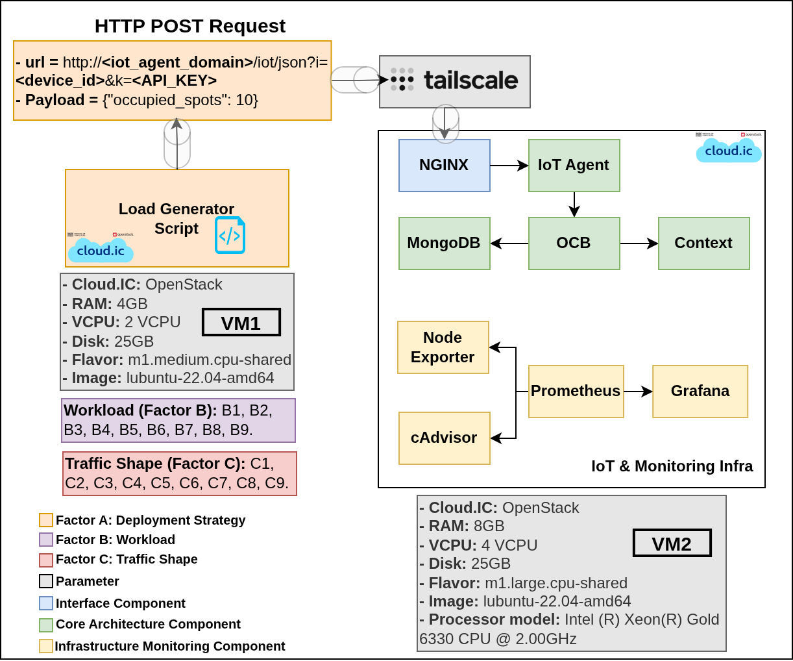

# mist_deploy

This folder contains the complete artifact set that implements the **Mist
deployment** of the multi-tier Digital-Twin Smart-Parking experiment. It
groups the dockerised FIWARE NGSI-LD stack that is brought up for each
load test, the load-generation harness that emulates the field devices, the
VM-side provisioning and measurement scripts, and the deterministic
schedule of experiments that drove the campaign.

The mist deployment is one of the four deployment strategies evaluated in
the experiment (`mist`, `fog`, `edge`, `cloud`); the other three slices
live in the sibling `fog_deploy/`, `edge_deploy/` and `cloud_deploy/`
folders. The four strategies differ in **where the image processing for
vehicle counting is performed**, and consequently in what the Load
Generator Script sends on the wire:

- **mist** — the image is processed locally on the field device (a
  Raspberry Pi in the conceptual design; simulated by the Load Generator
  Script in this benchmark). Only the resulting payload
  (`{"occupied_spots": 10}`) is transmitted to the system.
- **edge** — the parking image is sent to a Jetson Nano co-located with
  the device, which performs the inference and returns the payload.
- **fog** — the parking image is sent to a GPU cluster in the fog tier,
  which performs the inference and returns the payload.
- **cloud** — the parking image is sent to a container in the cloud
  tier, which performs the inference and returns the payload.

In the mist deployment, the Load Generator Script therefore sends the
already-processed payload directly. In `edge`, `fog` and `cloud`, the
Load Generator Script sends the parking image and the receiving
component performs the inference.

The experiment spans **two Virtual Machines (VM1 and VM2)**, both
provisioned on the **IC Cloud (cloud.ic)** — the OpenStack cloud of the
Institute of Computing at UNICAMP. VM1 acts as the load generator and
orchestrator; VM2 hosts the system under test (the FIWARE stack plus the
monitoring exporters). Communication between the two VMs is mediated by a
**Tailscale** mesh VPN, a software-defined networking layer that
establishes a secure peer-to-peer tunnel between cloud instances without
manual firewall configuration.



*Figure 1 — Mist deployment (official architecture view).*

## Deployment specifications

The two VMs (VM1 and VM2) are OpenStack virtual machines provisioned on
the **IC Cloud (cloud.ic)** of the Institute of Computing at UNICAMP. The
sections below make explicit which folder of this repository runs on
which VM.

> **Software required on both VM1 and VM2.** Before any scenario can be
> launched, the following must be installed and configured on **each**
> of the two VMs:
>
> - **Git** — used to clone this repository to the same path on both VMs.
> - **Tailscale** — the mesh VPN that lets VM1 reach VM2 across the IC
>   Cloud without manual firewall rules; both VMs must be authenticated
>   to the same Tailscale network.
> - **Docker** (with the `docker compose` plugin) — VM2 uses it to bring
>   up the FIWARE stack via `infra/compose.yaml`; VM1 uses it implicitly
>   through the SSH-driven workflow.
>
> Detailed installation steps are listed in the [Quick start /
> Prerequisites](#prerequisites--on-both-vm1-and-vm2) section.

### VM1 — Load generator / orchestrator

| Field | Value |
|---|---|
| Cloud | IC Cloud / cloud.ic (OpenStack) |
| Flavor | `m1.medium.cpu-shared` |
| vCPU | 2 |
| RAM | 4 GB |
| Disk | 25 GB |
| Image | `ubuntu-22.04-amd64` |
| Role | Executes the Load Generator Script that simulates the field devices. |
| Runs | `onGeneratorScripts/` (orchestrator, load generator, metrics collector, Python venv). The `tests_execution_order/` CSV is consulted manually from VM1 to decide the order in which the experiments are launched. |

### VM2 — IoT & Monitoring infrastructure (system under test)

| Field | Value |
|---|---|
| Cloud | IC Cloud / cloud.ic (OpenStack) |
| Flavor | `m1.large.cpu-shared` |
| vCPU | 4 |
| RAM | 8 GB |
| Disk | 25 GB |
| Image | `ubuntu-22.04-amd64` |
| Processor | Intel(R) Xeon(R) Gold 6330 CPU @ 2.00 GHz |
| Role | Hosts the system under test: the Interface component, the IoT Agent JSON, the OLDCB, MongoDB, and the monitoring exporters. |
| Runs | `infra/` (Docker Compose stack) and `onVMScripts/` (provisioning, measurement, log processing). |

### Field devices

The mist deployment assumes **more than 100 parking facilities at the
UNICAMP campus**. In the conceptual design, each parking would be
associated with a Raspberry Pi running local image processing for vehicle
counting; only the resulting count would be transmitted to the system. In
the benchmark harness used in this experiment, no Raspberry Pi is
actually deployed: every field device is **simulated** by the Load
Generator Script running on VM1.

## Data flow

The Load Generator Script, executing on VM1, emulates a device by sending
an HTTP `POST` request whose URL identifies the corresponding entity and
whose API key authenticates the device. The simplified payload contains
only the number of occupied spots — the IoT Agent JSON translates it into
a complete entity update request that is forwarded to the OLDCB.

The payload is **constant for every simulated device**: all devices send
the same value (`{"occupied_spots": 10}`), and the OLDCB overwrites the
entity in MongoDB with the latest value received for each one regardless
of whether the payload is identical to the previous one. Using a constant
payload standardises the requests and avoids any bias in the latency
measurements that varying body sizes would otherwise introduce.

```text
POST http://<iot_agent_domain>/iot/json?i=<device_id>&k=<API_KEY>
Content-Type: application/json

{"occupied_spots": 10}
```

End-to-end, a single request traverses the following components:

```mermaid
flowchart LR
    LG["Load Generator Script"]
    TS["Tailscale mesh VPN"]
    NGX["Interface: NGINX reverse proxy (port 443)"]
    IOTA["IoT Agent JSON (port 4041 / 7896)"]
    OCB["OLDCB / Orion-LD Context Broker (port 1026)"]
    MONGO[("MongoDB (port 27017)")]

    LG -- "HTTP POST /iot/json (occupied_spots payload)" --> TS
    TS -- "encrypted tunnel" --> NGX
    NGX -- "reverse proxy 443 to 7896" --> IOTA
    IOTA -- "NGSI-LD entity update" --> OCB
    OCB -- "persist state" --> MONGO

    classDef client fill:#87CEEB,stroke:#333,stroke-width:2px,color:darkblue
    classDef interface fill:#FFFACD,stroke:#333,stroke-width:2px,color:darkblue
    classDef core fill:#90EE90,stroke:#333,stroke-width:2px,color:darkgreen
    classDef store fill:#FFB6C1,stroke:#DC143C,stroke-width:2px,color:black

    class LG client
    class NGX interface
    class TS,IOTA,OCB core
    class MONGO store
```



The Interface component is implemented by the NGINX reverse proxy
(`infra/nginx-reverse-proxy/`), the OLDCB is the FIWARE Orion-LD Context
Broker (`infra/orion.yaml`), and the IoT Agent JSON is the
`quay.io/fiware/iotagent-json:3.7.0` service (`infra/iot-agent.yaml`).

## Experimental design

The campaign is a **4 × 9 × 9 full-factorial design** that probes how the
FIWARE smart-parking stack behaves under different deployment topologies,
traffic intensities, and inter-arrival shapes. The mist folder is the
*mist* slice of that design.

| Factor | Levels | Count | Variable |
|---|---|---|---|
| **A — Deployment Strategy** | `mist`, `fog`, `edge`, `cloud` | 4 | Where the IoT Agent / OLDCB / MongoDB stack lives. *This folder holds the `mist` slice.* |
| **B — Workload** | 9 Beta-distribution pairs `(α, β)`: (1,1), (1,5), (5,1), (5,5), (2,5), (5,2), (2,2), (10,10), (100,100) | 9 | Shape used by `load_generator.py` to spread `M` requests across `N` seconds. Labelled B1..B9. |
| **C — Traffic Shape** | 9 `(M, N)` pairs: 136/30, 136/60, 136/120, 136/180, 136/240, 136/300, 250/60, 500/60, 1000/60 | 9 | `M` virtual devices, each posting every `N` seconds. Labelled C1..C9. |

The full design yields **4 × 9 × 9 = 324** experiments, of which
**81 (9 × 9) are the mist slice** driven by `tests_execution_order/`. For
each unitary experiment, **100 internal repetitions were performed** to
ensure statistical robustness.

The 81 mist scenarios are deterministically shuffled (seed 27) into the
committed file
[`randomized_load_test_scenario_seed_27.csv`](./tests_execution_order/randomized_load_test_scenario_seed_27.csv).
The shuffle is reproducible and independent from the seeds used by the
fog, edge and cloud tiers, since those tiers are operated on different
hardware. Full design details and the rationale for per-deployment
randomization are documented in
[`tests_execution_order/README.md`](./tests_execution_order/README.md).

## Folder layout and VM assignment

| Folder | Runs on | Role |
|---|---|---|
| `infra/` | **VM2** | Docker Compose stack under test: the Interface component (NGINX), the IoT Agent JSON, the OLDCB (Orion-LD), MongoDB, the LD context broker, and the Prometheus / Grafana / cAdvisor / Node Exporter monitoring exporters. |
| `onVMScripts/` | **VM2** | Numbered shell + Python helpers executed inside VM2 by the orchestrator: health checks, Mongo index creation, service-group registration, device provisioning, verification, log capture, and log post-processing. |
| `onGeneratorScripts/` | **VM1** | The orchestrator (`mist_deploy_runner.sh`), the load generator (`load_generator.py`), the post-test metrics collector (`get_metrics_posttest.py`), the configuration file (`mist_deploy.conf`) and the Python virtual environment. |
| `tests_execution_order/` | **VM1** (consulted manually by the operator) | Generator and committed seed-27 list of the 81 `(M, N, α, β)` scenarios that make up the mist slice of the full-factorial campaign. The CSV is the source of truth for the order in which the experiments are launched; the operator reads the rows manually and invokes `mist_deploy_runner.sh` for each one. |

```text
mist_deploy/
├── README.md                              ← this file
├── mist_deployment.png                    ← Figure 1 (architecture view)
│
├── infra/                                 (VM2)
│   ├── compose.yaml                       (Docker Compose aggregator)
│   ├── orion.yaml                         (OLDCB / Orion-LD)
│   ├── iot-agent.yaml                     (IoT Agent JSON)
│   ├── mongo.yaml                         (MongoDB back-end)
│   ├── context.yaml                       (LD @context server, Apache httpd)
│   ├── nginx-reverse-proxy.yaml           (Interface component)
│   ├── networks.yaml                      (Docker bridge network)
│   ├── volumes.yaml                       (named volumes)
│   ├── .env.example                       (DOMAIN_NAME, MONITOR_GRAFANA_ROOT_URL)
│   ├── certs/                             (self-signed SSL)
│   │   ├── README.md
│   │   ├── grafana.crt
│   │   └── grafana.key
│   ├── conf/
│   │   └── mime.types                     (Apache MIME types)
│   ├── data-models/                       (JSON-LD contexts)
│   │   ├── datamodels.context-ngsi.jsonld
│   │   ├── json-context.jsonld
│   │   ├── ngsi-context.jsonld
│   │   └── user-context.jsonld
│   ├── monitor-cloud/                     (Prometheus / Grafana / exporters)
│   │   ├── cadvisor.yaml
│   │   ├── monitor-grafana.yaml
│   │   ├── node-exporter.yaml
│   │   ├── prometheus-monitor.yaml
│   │   └── prometheus.yml
│   └── nginx-reverse-proxy/
│       └── nginx.conf                     (TLS termination + reverse proxy)
│
├── onVMScripts/                           (VM2)
│   ├── README.md                          (per-script reference)
│   ├── 0_healthy_waiting.sh
│   ├── 1_create_IoT_Agent_indices_MongoDB.sh
│   ├── 2_create_service_group.sh
│   ├── 3_provision_devices.sh
│   ├── 4_verify_provisioned_devices.sh
│   ├── 7_process_iot_agent_logs.sh
│   ├── cpu_baseline.sh
│   └── docker_logs_collector.py
│
├── onGeneratorScripts/                    (VM1)
│   ├── README.md                          (orchestrator / load gen / metrics)
│   ├── mist_deploy_runner.sh              (main entry point)
│   ├── load_generator.py
│   ├── get_metrics_posttest.py
│   ├── mist_deploy.conf                   (real VM credentials — never commit)
│   ├── mist_deploy.conf.example
│   ├── requirements.txt
│   └── venv/                              (pre-built Python venv)
│
└── tests_execution_order/                 (VM1)
    ├── README.md                          (campaign schedule)
    ├── generate_scenarios.sh              (seeded randomizer)
    └── randomized_load_test_scenario_seed_27.csv
```


## Glossary — thesis terminology → on-disk artifacts

| Thesis term | On-disk artefact |
|---|---|
| Interface component | `infra/nginx-reverse-proxy.yaml` + `infra/nginx-reverse-proxy/nginx.conf` |
| OLDCB (Orion-LD Context Broker) | `infra/orion.yaml` |
| IoT Agent JSON | `infra/iot-agent.yaml` |
| Context broker (LD context server) | `infra/context.yaml` + `infra/data-models/*.jsonld` |
| Monitoring infrastructure | `infra/monitor-cloud/*` (Prometheus, Grafana, cAdvisor, node-exporter) |
| Load Generator Script | `onGeneratorScripts/load_generator.py` |
| Orchestrator | `onGeneratorScripts/mist_deploy_runner.sh` |
| VM2 provisioning / measurement | `onVMScripts/*` |
| Experimental design / campaign schedule | `tests_execution_order/*` |
| Factor A (Deployment Strategy) | Held constant at `mist` for this folder. |
| Factor B (Workload, B1..B9) | The 9 `(α, β)` Beta-distribution pairs in `generate_scenarios.sh`. |
| Factor C (Traffic Shape, C1..C9) | The 9 `(M, N)` pairs in `generate_scenarios.sh`. |

## Quick start

### Prerequisites — on both VM1 and VM2

The two VMs must be prepared identically before any scenario can run:

1. Install **Tailscale** and authenticate both VMs to the same Tailscale
   network. This is the mesh VPN that lets VM1 reach VM2 across the IC
   Cloud without manual firewall rules, and it is also what
   `mist_deploy.conf` references via `VM_tailscale_domain_name` /
   `VM_tailscale_IPv4`.
2. Install **Docker** (with the `docker compose` plugin) and add the
   operating user to the `docker` group so `docker compose` can run
   without `sudo`. VM2 needs Docker because `infra/compose.yaml` is
   brought up there.
3. Install **git** and clone this repository to the same path on both
   VMs. The path used here, `~/IC-DT-Smart-Parking-Architecture/`, is
   the one referenced by the `VM_dir` / `LM_dir` / `onVM_dir` /
   `onGen_dir` / `onInfra_dir` variables in `mist_deploy.conf` — if you
   clone to a different location, update those variables accordingly.
4. On VM1 only, also install the Python dependencies required by the
   orchestrator (the `venv/` directory in `onGeneratorScripts/` ships a
   pre-built virtual environment that already satisfies
   `requirements.txt`).

### Running the campaign — on VM1

```bash
# On VM1, from the repo root
cd multi-tier-deployment/mist_deploy/onGeneratorScripts

# 1. Create your local config (never commit)
cp mist_deploy.conf.example mist_deploy.conf
$EDITOR mist_deploy.conf            # fill in Tailscale VM2 credentials

# 2. Activate the Python virtual environment
source venv/bin/activate

# 3. (optional) regenerate the mist scenario list with a different seed
cd ../tests_execution_order
./generate_scenarios.sh --seed 27   # produces the committed file

# 4. For each row of the CSV, invoke the runner manually
cd ../onGeneratorScripts
./mist_deploy_runner.sh
```

Each run creates a timestamped output directory under
`onGeneratorScripts/mist_deploy_test_M_*_N_*_seed_*_alpha_*_beta_*/` that
holds the latency CSVs, the metrics CSVs, the load-generator logs, and the
`scp`d VM2 artefacts.

## Subfolder documentation

- [`onGeneratorScripts/README.md`](./onGeneratorScripts/README.md) — full reference for the runner, load generator and metrics collector.
- [`onVMScripts/README.md`](./onVMScripts/README.md) — full reference for the VM2 provisioning and measurement scripts, including troubleshooting.
- [`tests_execution_order/README.md`](./tests_execution_order/README.md) — full-factorial design, the 81 mist scenarios, and the rationale for the seed-27 ordering.
- [`infra/certs/README.md`](./infra/certs/README.md) — SSL certificate generation for the Interface component.
