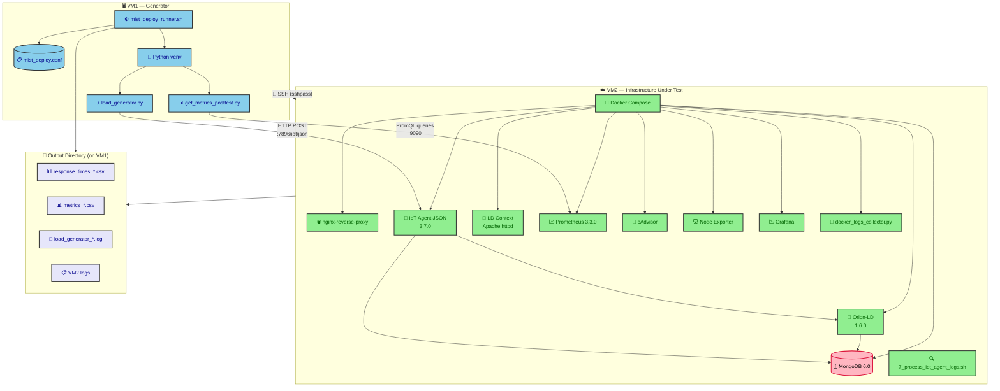

# Load Generator Scripts

This directory contains the load testing scripts used to benchmark the FIWARE-based mist tier infrastructure. The workflow is orchestrated by `mist_deploy_runner.sh` and spans two machines:

- **VM1** — the generator/controller virtual machine that runs `mist_deploy_runner.sh`, `load_generator.py`, and `get_metrics_posttest.py`
- **VM2** — the remote infrastructure machine that hosts the Docker Compose stack (Orion-LD, IoT Agent, MongoDB, Prometheus, etc.) under test

`mist_deploy_runner.sh` orchestrates the pipeline: it deploys Docker containers on VM2, runs a configurable HTTP load generator from VM1 against the IoT Agent on VM2, and collects system metrics from Prometheus for post-test analysis.

## Files

### Configuration

| File | Purpose |
|---|---|
| `mist_deploy.conf` | Real VM credentials and test parameters. **Never commit.** |
| `mist_deploy.conf.example` | Template with sample values. Copy to `mist_deploy.conf` and edit. |

### Orchestration

**`mist_deploy_runner.sh`** — Main entry point. It:

1. Sources `mist_deploy.conf` for test parameters and VM2 credentials
2. Creates a timestamped output directory named `mist_deploy_test_M_{M}_N_{N}_seed_{seed}_alpha_{alpha}_beta_{beta}`
3. SSHes from VM1 into VM2 using `sshpass` (password auth) and runs the VM2-side pipeline:
   - Starts Docker Compose infrastructure (`docker compose up -d`)
   - Waits 30s for service stabilization
   - Runs health checks via `0_healthy_waiting.sh`
   - Creates MongoDB indices via `1_create_IoT_Agent_indices_MongoDB.sh`
   - Registers IoT Agent service group via `2_create_service_group.sh`
   - Provisions M devices via `3_provision_devices.sh`
   - Verifies provisioning via `4_verify_provisioned_devices.sh`
   - Launches `docker_logs_collector.py` in background on VM2
4. Activates the Python virtual environment on VM1
5. Runs `load_generator.py` on VM1, targeting VM2's IoT Agent endpoint
6. Runs `get_metrics_posttest.py` on VM1 to fetch Prometheus metrics from VM2
7. SSHes into VM2 again to process IoT Agent logs via `7_process_iot_agent_logs.sh`
8. Copies all VM2-side results back to VM1 via SCP

### Load Generation

**`load_generator.py`** — Generates HTTP POST requests to the FIWARE IoT Agent following a configurable Beta-distributed arrival pattern.

Key parameters:

| Parameter | Default | Description |
|---|---|---|
| `--M` | required | Number of virtual IoT devices |
| `--N` | required | Number of seconds per seed cycle |
| `--seeds` | required | Number of Beta-distribution draws (cycles) |
| `--alpha` | `5.0` | Shape parameter of the Beta distribution |
| `--beta` | `5.0` | Shape parameter of the Beta distribution |
| `--url` | `http://localhost:7896/iot/json` | Target IoT Agent URL |
| `--key` | `12345` | IoT Agent API key for the `k` query parameter |
| `--max-workers` | `100` | Thread pool size for concurrent requests |
| `--timeout` | `60` | Request timeout in seconds |
| `--out-dir` | `.` | Output directory for CSV and log files |

For each seed cycle, the script:

1. Allocates M requests across N seconds using a Beta-distribution PDF
2. Sends requests in parallel using a `ThreadPoolExecutor`, each posting `{"occupied_spots": 10}` to the IoT Agent
3. Records per-request: seed, timestamp, device ID, entity ID, HTTP status, and response time (ms)
4. Sleeps 1s between seconds to match the allocation window

Output files:

- `response_times_M_{M}_N_{N}_seed_{S}_alpha_{A}_beta_{B}.csv` — Per-request latency records
- `load_generator_M_{M}_N_{N}_seed_{S}_alpha_{A}_beta_{B}.log` — Debug-level log

### Metrics Collection

**`get_metrics_posttest.py`** — Post-test Prometheus data collector. It:

1. Scans the output directory for `response_times_M_*.csv` files
2. For each file, computes the test window (first timestamp - 10s to last timestamp + 10s)
3. Queries Prometheus `query_range` with 1s resolution for:
   - Host-level metrics: CPU, memory, disk I/O, network (from Node Exporter)
   - Container-level metrics: per-container CPU, memory, network, block I/O, filesystem (from cAdvisor)
4. Splits large time windows into chunks to respect Prometheus's max data point limit
5. Writes `metrics_M_{M}_N_{N}_seed_{S}_alpha_{A}_beta_{B}.csv` with one row per second

| Argument | Default | Description |
|---|---|---|
| `--out-dir` | `./results` | Directory with response CSV files |
| `--prom-url` | `http://localhost:9090` | Prometheus base URL |
| `--step` | `1s` | Query resolution step |
| `--max-points` | `11000` | Max data points per timeseries chunk |

### Dependencies

**`requirements.txt`** — Python packages required by the scripts:

```
numpy==1.26.4
requests==2.31.0
scipy==1.13.1
pandas
```

## Architecture

### Test Pipeline Workflow

The following diagram illustrates the end-to-end workflow orchestrated by `mist_deploy_runner.sh`:

```mermaid
flowchart TD
    Start([🚀 Start]) --> LoadConf[⚙️ Load mist_deploy.conf]
    LoadConf --> CreateDir[📁 Create output directory]
    CreateDir --> SSHVMI{🔗 SSH from VM1 to VM2}

    SSHVMI -->|sshpass| StartContainers[🐳 Docker Compose up -d]
    StartContainers --> Wait30[⏳ Wait 30s stabilization]
    Wait30 --> HealthCheck[❤️ Health checks]
    HealthCheck --> MongoIdx[🗄️ Create Mongo indices]
    MongoIdx --> ServiceGroup[🔌 Create IoT Agent Service Group]
    ServiceGroup --> Provision[📟 Provision M devices]
    Provision --> Verify[✅ Verify provisioning]
    Verify --> LogCollector[📝 Start docker_logs_collector.py]

    LogCollector --> VMReturn[↩️ Back on VM1]
    VMReturn --> ActivateVenv[🐍 Activate Python venv]
    ActivateVenv --> LoadGen[⚡ Run load_generator.py]
    LoadGen --> Metrics[📊 Run get_metrics_posttest.py]

    Metrics --> SSHVMI2{🔗 SSH from VM1 to VM2 again}
    SSHVMI2 --> ProcessLogs[🔍 Process IoT Agent logs]
    ProcessLogs --> SCP[📋 Copy VM2 results to VM1 via SCP]
    SCP --> Done([✅ Done])

    classDef vm1 fill:#87CEEB,stroke:#333,stroke-width:2px,color:darkblue
    classDef vm2 fill:#90EE90,stroke:#333,stroke-width:2px,color:darkgreen
    classDef action fill:#E6E6FA,stroke:#333,stroke-width:2px,color:darkblue

    class Start,Done,ActivateVenv,LoadGen,Metrics,CreateDir,LoadConf,VMReturn vm1
    class SSHVMI,SSHVMI2,StartContainers,Wait30,HealthCheck,MongoIdx,ServiceGroup,Provision,Verify,LogCollector,ProcessLogs,SCP vm2
    class LoadConf,CreateDir action
```



### Architecture Overview

The load testing setup spans two machines — **VM1** (generator/controller) and **VM2** (infrastructure under test):



## Setting Up the Virtual Environment

The runner script activates a Python virtual environment located at `onGeneratorScripts/venv/` (line 111 of `mist_deploy_runner.sh`):

```bash
source "${LM_dir}/${onGen_dir}/venv/bin/activate"
```

To set it up:

```bash
# From this directory (onGeneratorScripts)
python3 -m venv venv

# Activate the environment
source venv/bin/activate

# Install dependencies
pip install -r requirements.txt

# Verify key packages are installed
python3 -c "import numpy; import requests; import scipy; print('All dependencies OK')"
```

## Usage

```bash
# 1. Configure VM credentials and test parameters
cp mist_deploy.conf.example mist_deploy.conf
# Edit mist_deploy.conf with your VM details

# 2. Activate the virtual environment
source venv/bin/activate

# 3. Run the full test pipeline
./mist_deploy_runner.sh
```

The runner creates timestamped output directories under `onGeneratorScripts/` with names like `mist_deploy_test_M_136_N_30_seed_2_alpha_5_beta_5/`.
