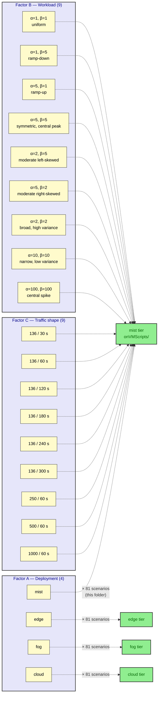

# tests_execution_order

This folder holds the artifacts that **decide *which* of the 81 load-test
scenarios per deployment type is executed, and in *which* order**, for the
**mist** tier of the multi-tier Digital-Twin Smart-Parking experiment.

The two files are:

| File | Role |
|---|---|
| `generate_scenarios.sh` | Generator. Takes a `--seed` and emits a CSV with all 81 scenarios shuffled into a deterministic random order. |
| `randomized_load_test_scenario_seed_27.csv` | The actual ordered list used to drive the mist-tier run (seed = 27). One row per scenario, columns `M,t,alpha,beta`. |

## Why this folder exists

The experiment is a **4 × 9 × 9 full-factorial design** that probes how
the FIWARE smart-parking stack behaves under different deployment
topologies, traffic intensities, and inter-arrival shapes. The full
design is **4 × 9 × 9 = 324 experiments**; the `mist` deployment
contributes **9 × 9 = 81** of them, and this folder is where the *order*
in which those 81 are run is defined.

## The factorial design

| Factor | Levels | Count | What it varies |
|---|---|---|---|
| **A — Deployment type** | `mist`, `edge`, `fog`, `cloud` | **4** | Where the IoT Agent / Orion-LD / MongoDB stack lives. This folder is the *mist* slice. |
| **B — Workload (α, β)** | `(1,1)`, `(1,5)`, `(5,1)`, `(5,5)`, `(2,5)`, `(5,2)`, `(2,2)`, `(10,10)`, `(100,100)` | **9** | Shape of the Beta distribution used by `load_generator.py` to spread `M` requests across `N` seconds. See the [distribution names](#factor-b-shape-catalog) below. |
| **C — Traffic shape (M / t)** | `136/30`, `136/60`, `136/120`, `136/180`, `136/240`, `136/300`, `250/60`, `500/60`, `1000/60` | **9** | `M` virtual parking devices, each posting every `t` seconds. The first six hold `M=136` (the real lot) and vary the cadence; the last three hold `t=60s` and push `M` up to stress the stack. |

> [!NOTE]
> The factor sizes as written inside the source code (`generate_scenarios.sh`)
> are 4 × 9 × 9 = **324** total scenarios, **81** per deployment. The shorthand
> "4 × 4 × 9" sometimes used in notes refers to the same structure but
> groups the nine (α, β) shapes into four *qualitative* families
> (uniform, skewed, bell-shaped, sharply-peaked).



### Factor B shape catalog

The nine `(α, β)` pairs in the order they appear in
`generate_scenarios.sh` are:

| # | (α, β) | Shape name |
|---|---|---|
| B1 | (1, 1) | uniform traffic distribution |
| B2 | (1, 5) | ramp-down traffic distribution |
| B3 | (5, 1) | ramp-up traffic distribution |
| B4 | (5, 5) | symmetric distribution with a central peak |
| B5 | (2, 5) | moderate left-skewed distribution |
| B6 | (5, 2) | moderate right-skewed distribution |
| B7 | (2, 2) | broad distribution with high variance |
| B8 | (10, 10) | narrow distribution with low variance |
| B9 | (100, 100) | highly concentrated central spike |

## Why randomize at all

The 81 unitary experiments are randomized to avoid any bias related to the order of execution.
The 81 mist scenarios are not run in any particular
*subject* order; they are shuffled with a seeded random permutation and
walked in that order. The seed makes the shuffle fully reproducible, so
a later reader can always re-create the exact sequence and trace any
anomaly in the data back to a specific row of the schedule.

## Why randomization is **per deployment**, not global

The ideal would be a single 324-scenario schedule in which every
`(M, t, α, β)` cell of the full factorial is interleaved with every
other cell, regardless of which deployment tier it belongs to. In
practice the four deployment tiers are operated independently — they
live on different hardware, are prepared by different setup procedures,
and are not interchangeable — so the schedule is split per tier. Each
of the four deployment types gets its own independent 81-row shuffled
list, produced with its own seed. Within each list the factors B and C
are fully interleaved; between lists the orders are independent.

## How the random order is produced

`generate_scenarios.sh` is a small Bash script. Internally it hard-codes
the 81 scenarios as a heredoc of `M,t,alpha,beta` lines, then runs:

```bash
echo "$SCENARIOS" | awk -v seed="$SEED" \
  'BEGIN { srand(seed) }
   { print rand(), $0 }' | sort -n | cut -d" " -f2-
```

That is: assign each row a uniformly-distributed random number keyed
on the supplied seed, sort by that number, and drop the random column.
The output is a CSV with header `M,t,alpha,beta` containing the same 81
scenarios in a deterministic-per-seed order.

```bash
# Regenerate this exact list
./generate_scenarios.sh --seed 27
# → randomized_load_test_scenario_seed_27.csv  (the file in this folder)

# Or pick a different seed for a different ordering
./generate_scenarios.sh --seed 42 --output my_order.csv
```

The script self-checks the scenario count and warns if it is not 81.

## How the CSV is consumed

The orchestrator (`../onGeneratorScripts/mist_deploy_runner.sh`) is
invoked **once per row** of the CSV. For each row `(M, t, α, β)` it
performs the full pipeline against VM2 — `docker compose up`, healthy
wait, Mongo indices, service group, provision `M` devices, verify, then
launch `load_generator.py` with `--M M --N t --seeds S --alpha α --beta β`
on VM1 — collects Prometheus metrics, and `scp`s the results back. The
rows are walked in CSV order (top to bottom), so **row 1 in
`randomized_load_test_scenario_seed_27.csv` is the first mist
experiment that was actually run**.

The seed-27 list in this folder starts with:

```
M,t,alpha,beta
136,180,5,5
136,30,5,5
250,60,5,2
136,30,1,5
136,30,5,1
...
```

i.e. the first three experiments are `(136, 180, 5, 5)`, `(136, 30, 5, 5)`
and `(250, 60, 5, 2)`.

## Why the CSV order is *almost* the execution order

The duration of a single scenario is driven by its `(M, t)` pair. A
short `(M, t)` cell finishes in tens of minutes, while a cell on the
opposite end of the matrix can run for more than eight hours. The
operating rule is simple: when the end of the working day is
approaching and the next row of the CSV is a *short* scenario, starting
it would only consume a few minutes of useful time and then leave the
night window idle. In that case the operator looks further down the CSV
for a *long* scenario that is still ahead in the list, starts that one
instead, and lets it run through the evening and the night, unattended.

If, on the other hand, the next row of the CSV is itself a long
scenario and there is still enough working time left in the day to run
it, it is simply started during the day — there is no reason to delay
it. The deviation from the CSV order is therefore not a "skip the long
ones" rule and not a "re-sort by duration" rule; it is a single
end-of-day swap, decided at the moment the working window is about to
close, that trades a short row for a long one so the night is not
wasted. The randomized ordering is what makes this swap safe: the
remaining rows are not grouped by duration, so picking "the next long
one" does not bias the factor levels that are still pending.

## Summary

- **Design:** 4 (deployment) × 9 (α, β) × 9 (M, t) = 324 full-factorial
  experiments; **81 per deployment**.
- **This folder:** the *mist* slice. Drives the order in which the
  81 mist experiments are launched.
- **Randomization:** seeded shuffle (seed 27) so order is reproducible
  and uncorrelated with the 81 (M, t, α, β) cells.
- **Per-deployment scope:** mist / edge / fog / cloud each have their
  own shuffled list with its own seed; full global interleaving is not
  practical because the physical hardware changes per tier.
- **Execution deviation:** the CSV order is followed top-to-bottom. The
  single exception is the last scenario started before the end of the
  working day: if the next CSV row is short, the operator skips forward
  to a long row so the night window is not wasted; if the next CSV row
  is long and there is still time to run it, it is simply started
  during the day. Randomization makes the end-of-day swap safe.
- **Driver:** `generate_scenarios.sh --seed <N>` regenerates the CSV
  for any seed; the seed-27 list committed here is the one that was
  used to schedule the actual mist-tier measurement campaign.
